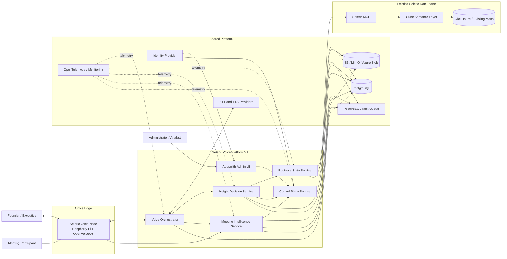
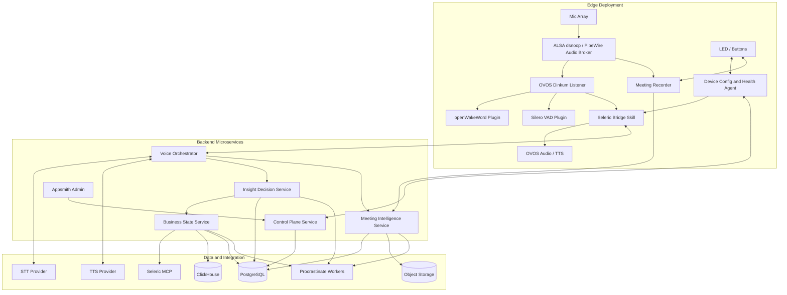
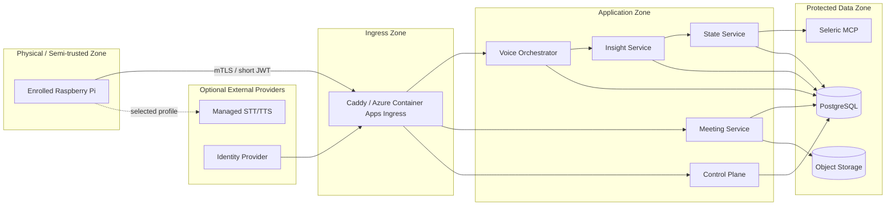
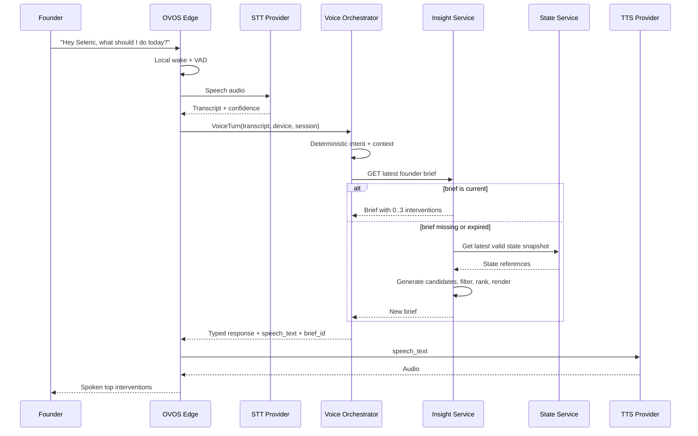
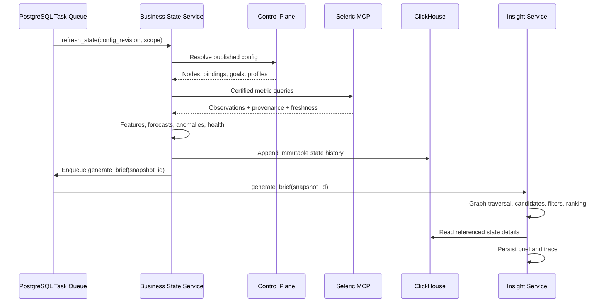
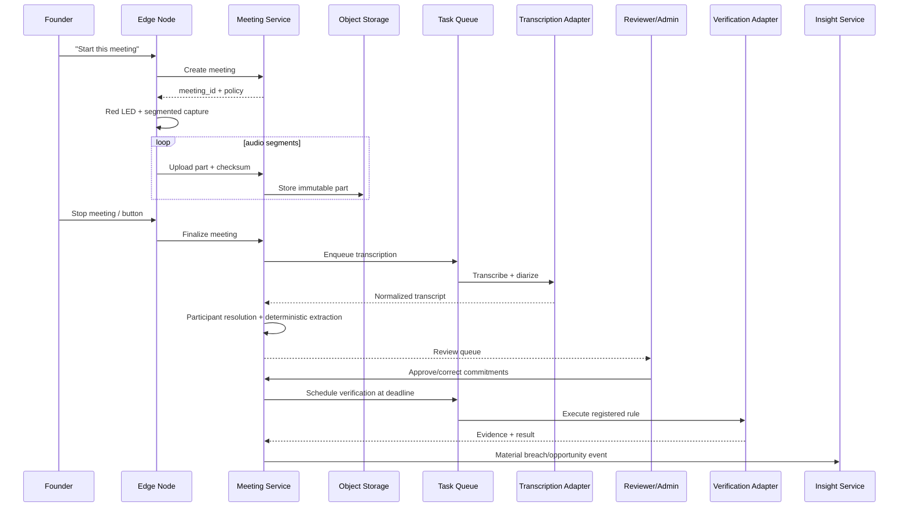
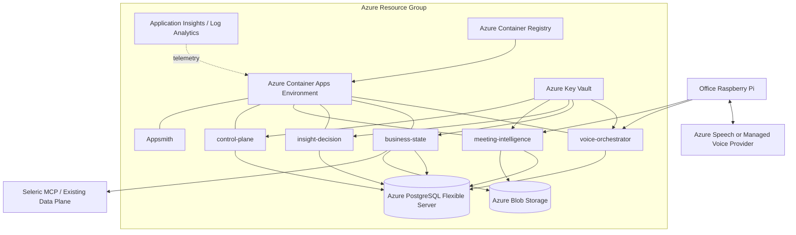
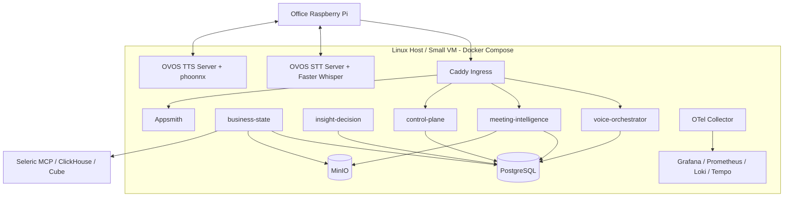

# High-Level Design

## 1. Architectural objective

The platform must preserve the entire V1 feature set while avoiding duplicate orchestration, data and ML infrastructure. The chosen HLD has six logical services plus existing Seleric data systems. Each service owns a cohesive business capability and can be deployed, scaled and replaced independently.

The HLD intentionally separates:

- real-time voice interaction
- continuous state computation
- deterministic decisioning
- long-running meeting processing
- administrative configuration
- existing certified analytics

## 2. System context

## 3. Service boundaries

### 3.1 Edge Voice Node

**Why it is separate:** It owns physical audio, wake word, buttons, LEDs, offline state and local recording. Its release and failure lifecycle differs from cloud services.

**Reused platform:** OpenVoiceOS.

**Custom code:** Seleric bridge skill, device enrollment client, LED/button integration, meeting recorder, config agent and health reporter.

### 3.2 Voice Orchestrator Service

**Why it is separate:** It is latency-sensitive and stateless apart from short dialogue references. It converts transcripts into allowlisted business commands and returns typed voice responses. It should not contain state-model training or meeting processing.

**Responsibilities:**

- device/session validation
- deterministic intent recognition
- slot and context resolution
- command-handler invocation
- `WHY` reference state
- voice-safe response envelope
- proactive notification stream

### 3.3 Business State Service

**Why it is separate:** It performs scheduled, CPU/data-intensive computations and has different scaling from real-time voice. It is the only service allowed to transform certified metrics into derived state and model outputs.

**Responsibilities:**

- active configuration resolution
- metric binding validation
- Seleric MCP queries
- feature calculation
- forecasting and anomaly strategies
- health computation
- state materialization
- model/backtest registry

### 3.4 Insight Decision Service

**Why it is separate:** It owns business decision policy, ontology traversal, candidate eligibility, founder prioritization and explanations. Keeping it separate prevents voice implementation from becoming the business brain.

**Responsibilities:**

- ontology graph load and validation
- unhealthy/positive node selection
- suspected root-driver attribution
- intervention template matching
- precondition and eligibility rules
- root-key consolidation
- deterministic ranking
- founder brief persistence
- evidence-backed explanation
- Jinja2 NLG
- proactive alert creation

### 3.5 Meeting Intelligence Service

**Why it is separate:** Audio files, batch transcription, diarization, extraction, review and deadlines are long-running and potentially GPU-backed. They should not affect interactive voice availability.

**Responsibilities:**

- meeting lifecycle API
- resumable audio ingest
- physical and online capture adapters
- transcript normalization
- diarization and participant resolution
- semantic extraction
- review queue
- commitment lifecycle
- verification scheduling and execution

### 3.6 Control Plane Service

**Why it is separate:** It is the only configuration-write boundary and must enforce schema, version, approval and audit policies. Runtime services consume published immutable revisions.

**Responsibilities:**

- typed configuration CRUD
- graph and reference validation
- metric-catalogue validation
- historical simulation
- approval and publication
- effective-date resolution
- rollback
- device registry
- audit/event outbox

### 3.7 Appsmith Admin UI

**Why it is separate:** It accelerates admin implementation while keeping business rules in the Control Plane API. The UI is replaceable and never becomes a source of truth.

## 4. Logical service architecture

## 5. Synchronous and asynchronous paths

### Synchronous paths

- device heartbeat/config fetch
- transcript -> intent -> command
- latest health/brief retrieval
- explanation retrieval
- meeting start/stop acknowledgement
- admin reads and validation preview

### Asynchronous paths

- metric/state refresh
- forecast training/backtesting
- state recomputation after config publish
- founder brief refresh
- proactive notification delivery
- audio upload finalization
- transcription/diarization
- extraction
- commitment verification
- retention/deletion

All asynchronous paths use the PostgreSQL task queue. An API request returns a job/reference rather than holding a long HTTP connection.

## 6. Data ownership

| Data | Authoritative owner | Read consumers |
|---|---|---|
| Certified business metrics | Existing Seleric MCP/Cube/ClickHouse | State Service |
| Ontology, goals and policies | Control Plane/PostgreSQL | State, Insight, Voice, Meeting |
| Observation snapshots | Business State Service/ClickHouse | State, Insight, Admin |
| Derived states and forecasts | Business State Service/ClickHouse + metadata in PostgreSQL | Insight, Voice, Admin |
| Intervention candidates/briefs/traces | Insight Decision Service/PostgreSQL | Voice, Admin, Meeting verification |
| Voice dialogue references | Voice Orchestrator/PostgreSQL with short retention | Voice only |
| Audio/transcript artifacts | Meeting Service/Object Storage | Meeting review and authorized audit |
| Meetings/commitments/verification | Meeting Service/PostgreSQL | Insight, Voice, Admin |
| Config revisions and audit | Control Plane/PostgreSQL | All runtimes |

No service writes directly into another service’s owned tables. Cross-service changes use APIs and outbox/task events.

## 7. Runtime trust zones

## 8. Communication contracts

| Connection | Protocol | Notes |
|---|---|---|
| Edge -> Control Plane | HTTPS JSON | Enrollment, config, heartbeat, revocation |
| Edge -> Voice Orchestrator | HTTPS JSON; optional WebSocket for notifications | Transcript and typed response, not raw SQL |
| Edge -> Meeting Service | HTTPS multipart/resumable upload | Content hash and idempotency key per audio part |
| OVOS -> STT/TTS | OVOS plugin API/HTTP provider adapter | Profile-selected local/on-prem/cloud provider |
| Voice -> Insight | Internal HTTPS JSON | Latest brief/health/explanation APIs |
| Insight -> State | Internal HTTPS JSON | Immutable state snapshot references |
| State -> Seleric MCP | MCP transport through approved adapter | Certified metrics only |
| Services -> task queue | PostgreSQL | At-least-once, idempotent handlers |
| Admin -> Control Plane | HTTPS JSON | No direct database writes |
| Runtime -> observability | OTLP | Traces, metrics and logs |

## 9. HLD sequence: executive query

## 10. HLD sequence: state refresh

## 11. HLD sequence: meeting loop

## 12. Azure deployment HLD

## 13. On-prem deployment HLD

## 14. Why this is the minimum viable microservice split

| Potential merge | Why not merge now |
|---|---|
| Voice + State | Voice is low-latency and stateless; state runs scheduled data/model jobs. A failed training job must not affect voice availability. |
| State + Insight | State owns factual transformations; Insight owns business policy. Independent validation and release cycles are important. |
| Meeting + Voice | Meeting is file/GPU/long-job heavy and handles sensitive artifacts; voice is interactive. |
| Control Plane + runtime service | Configuration writers require stronger authorization and immutable publication boundaries. |
| Admin UI + direct database | Direct writes would bypass validation, simulation, audit and referential integrity. |

A later scale event may split worker processes from their APIs without changing domain contracts. Conversely, local development may run all services in one Compose project; microservice contracts remain intact.

## 15. Critical failure behavior

| Failure | Required behavior |
|---|---|
| Wake word unavailable | Device enters visible degraded mode; physical meeting button remains functional. |
| STT unavailable | Use configured fallback; otherwise announce speech service unavailable. |
| Control Plane unavailable | Device may use last signed non-sensitive config until expiry. |
| Seleric MCP unavailable | Serve only a still-valid precomputed brief and disclose its age; otherwise refuse business answer. |
| State job partly fails | Persist valid node states, mark failed nodes unknown and prevent affected candidates. |
| Forecast model fails | Fall back to approved baseline strategy and mark model status degraded. |
| Insight generation fails | Return latest valid brief if within TTL; never synthesize priorities in Voice Service. |
| TTS unavailable | Use local fallback voice or show/emit text response through companion admin; do not lose trace. |
| Audio upload interrupted | Keep encrypted parts locally and resume by checksum. |
| Diarization uncertain | Send to review with unresolved speakers. |
| Verification integration unavailable | Retry; after policy threshold mark verification pending/system-error, not breached. |
