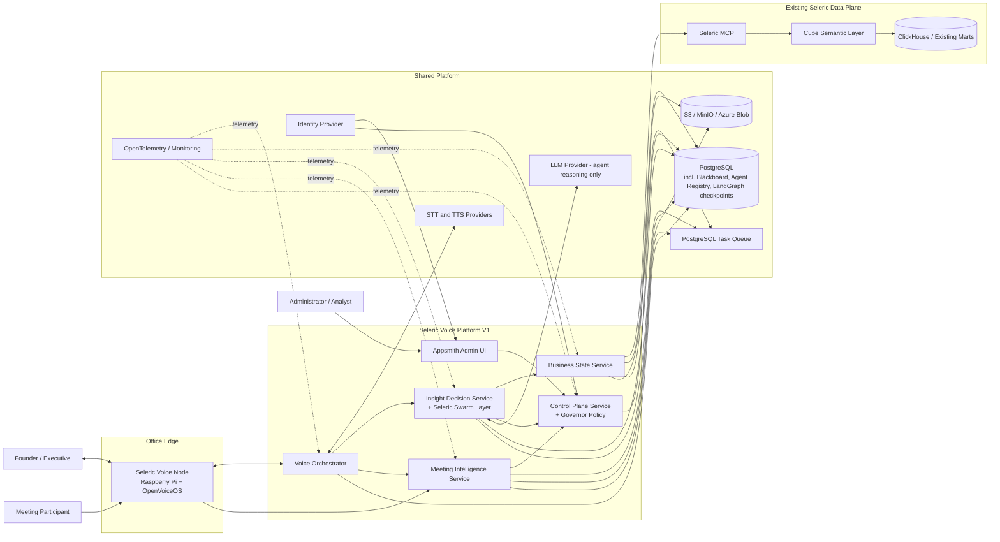
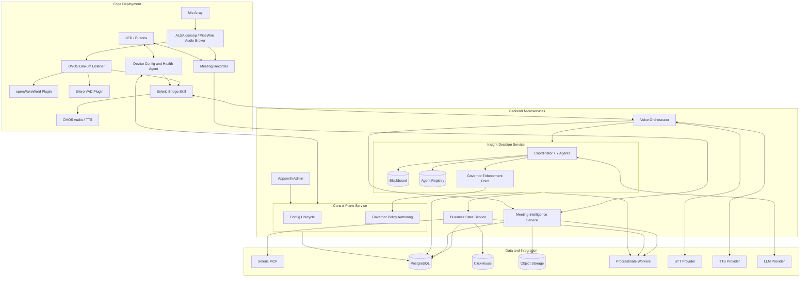
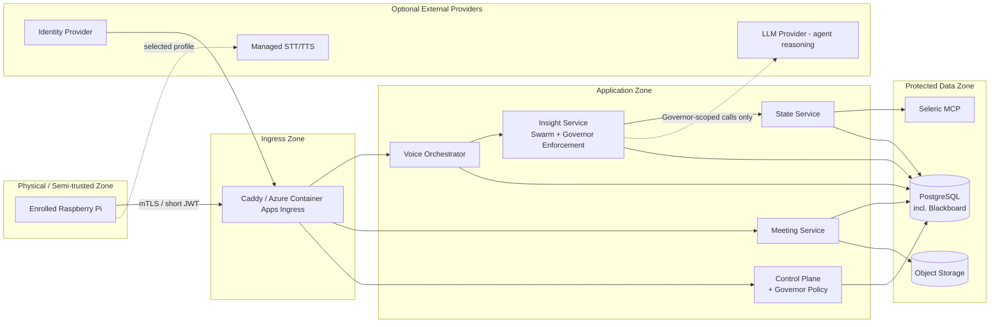
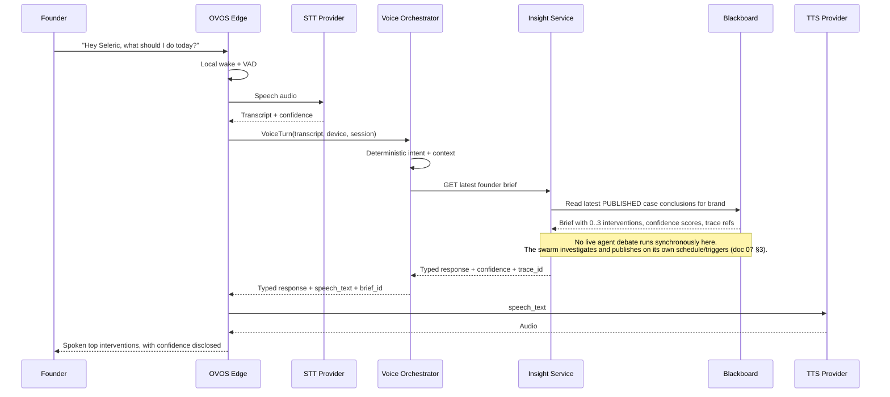
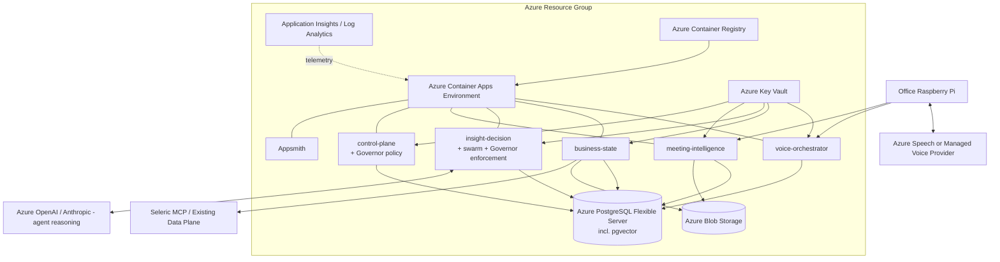
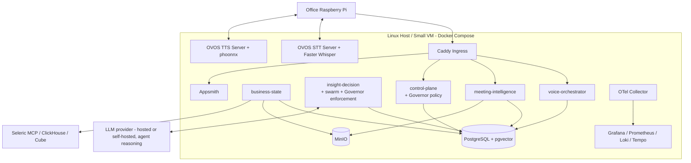

# High-Level Design

## 1. Architectural objective

The platform must preserve the entire V1 feature set while avoiding duplicate orchestration, data and ML infrastructure. The chosen HLD still has six logical services plus existing Seleric data systems. Each service owns a cohesive business capability and can be deployed, scaled and replaced independently.

**2026-08-31 change:** business reasoning inside Insight Decision Service is no longer a deterministic pipeline; it is an LLM agent swarm governed by a non-recruitable Seleric Governor. This section documents where that swarm and that Governor live in the service topology, and why neither becomes a new service.

The HLD intentionally separates:

- real-time voice interaction *(unchanged, deterministic)*
- continuous state computation *(unchanged, deterministic)*
- agent-swarm decisioning under Governor control *(changed — was deterministic decisioning)*
- long-running meeting processing *(unchanged, deterministic)*
- administrative configuration, including Governor policy authoring *(extended)*
- existing certified analytics *(unchanged)*

## 2. System context



The only new external dependency is an LLM provider used exclusively for agent reasoning inside Insight Decision Service, reached through the same kind of replaceable provider adapter used for STT/TTS (doc 04). It never has direct MCP, database, or production-write access — every capability an agent can invoke is a typed tool port the Governor explicitly grants (§7a).

## 3. Service boundaries

### 3.1 Edge Voice Node — unchanged

Owns physical audio, wake word, buttons, LEDs, offline state and local recording.

### 3.2 Voice Orchestrator Service — unchanged

Latency-sensitive, deterministic intent routing. It reads the swarm's latest published `FounderBrief`/`CompanyHealthSummary` the same way it used to read the deterministic pipeline's output — the contract at this boundary (typed DTO in, typed DTO out) did not change, only what produces the DTO on the other side.

### 3.3 Business State Service — unchanged

Still the only service that transforms certified MCP metrics into derived state, forecasts, anomalies, and health snapshots. It remains fully deterministic and is not part of the swarm — it is the swarm's evidence source. Agents read Business State's output as Blackboard evidence; they cannot bypass it to query MCP directly (§7a, doc 05 §33).

### 3.4 Insight Decision Service — reasoning path replaced, boundary preserved

**Why it stays one service, and why the swarm lives here rather than becoming a seventh:**

The original justification for Insight Decision Service was that it "owns business decision policy, ontology traversal, candidate eligibility, founder prioritization and explanations" and keeping it separate "prevents voice implementation from becoming the business brain." That justification is about *what* the service is responsible for, not *how* it computes the answer. The swarm changes the *how* (agent debate instead of a ranking formula); it does not change *what* the service is accountable for — it still owns ontology traversal, candidate generation, prioritization, and explanation, and it still returns the same typed briefs to Voice Orchestrator. Splitting the swarm into its own service would duplicate the ontology/state-client wiring this service already has, add a network hop into every agent-to-agent handoff, and buy no independent scaling, security, or lifecycle benefit — the same "why not merge" test in §14 applies in reverse here as a "why not split" test, and it fails for the same reasons a Voice+State merge would fail: no distinct latency, security, scaling, or failure-lifecycle profile.

**Responsibilities (updated):**

- ontology graph load and validation *(unchanged — now also the swarm's shared grounding model, §7)*
- state and evidence retrieval from Business State Service *(unchanged mechanism, now feeds Blackboard case evidence instead of a candidate generator)*
- **Seleric Blackboard**: persistent case records (doc 05 §34, doc 14 §10a)
- **Swarm Coordinator**: LangGraph-based handoff orchestration, no permanent leader (doc 05 §35)
- **Agent Registry**: capability/tool/cost/reputation advertising, internal-only in V1 (doc 05 §36)
- **Task market**: case postings, agent bids, Coordinator selection (doc 05 §35.3)
- the seven initial agents: Observer, Anomaly, Diagnostic, Prediction, Strategy, Experiment, Skeptic (doc 05 §37-39)
- **Governor enforcement point**: every tool call, spawn, spend, PII access, external-communication attempt, and production write an agent attempts is checked against Governor policy fetched from Control Plane before it executes (doc 05 §40)
- founder brief persistence, evidence-backed explanation, NLG rendering *(unchanged contract; source of the content changed)*
- proactive alert creation *(unchanged)*

### 3.5 Meeting Intelligence Service — unchanged

Not part of the swarm. Rule-based extraction, commitment lifecycle, and verification remain fully deterministic, as instructed — this workstream is untouched by the reasoning-model change.

### 3.6 Control Plane Service — extended, not replaced

**Why Governor policy is authored here rather than in a new service:** Governor policy (tool permissions, spend limits, PII-access rules, approval gates, iteration caps, agent-spawning limits) is configuration with exactly the same lifecycle needs every other policy object in this service already has — draft, validate, simulate, approve, publish, immutable versioning, rollback. Building a separate "Governor service" would duplicate that lifecycle machinery for no benefit; Control Plane already is "the only configuration-write boundary" (doc 03 §3.6 original responsibility), and Governor policy is configuration. What's new is the object types (`GovernorPolicy`, `ToolPermission`, `SpendLimit`, `ApprovalGate`, `AgentSpawnLimit` — doc 08 §3.17) and that publishing one now flows to the Governor enforcement point inside Insight Decision Service the same way any other published bundle flows to its consuming service.

**Responsibilities (added):**

- Governor policy CRUD, validation, simulation, approval, publish, rollback
- `AgentDefinition` configuration objects (adding/retiring an agent role is a config change, not a code change, once the base agent-execution machinery exists)

### 3.7 Appsmith Admin UI — extended, not replaced

Adds a Governor policy editor and a swarm case/debate inspector (doc 08 §3.17-3.18), through the same API-only-writes boundary as every other admin surface. Still never gets direct database access.

## 4. Logical service architecture



## 5. Synchronous and asynchronous paths

### Synchronous paths

- device heartbeat/config fetch
- transcript -> intent -> command
- latest health/brief retrieval *(reads the latest completed swarm case; does not wait on a live debate)*
- explanation retrieval *(reads the Blackboard debate trace for the cited case)*
- meeting start/stop acknowledgement
- admin reads and validation preview

### Asynchronous paths — added: swarm case investigation

- metric/state refresh
- forecast training/backtesting
- state recomputation after config publish
- **swarm case investigation** (Observer notices a candidate problem -> case opened -> agent debate -> conclusion -> brief published) — this is the reasoning-path replacement for the old "founder brief refresh" step, and it is asynchronous for the same latency reason doc 01 §2.10 always gave: a live debate is not a sub-second operation. Voice Orchestrator never triggers a case synchronously; it reads whatever the swarm has already concluded.
- proactive notification delivery
- audio upload finalization
- transcription/diarization
- extraction
- commitment verification
- retention/deletion

All asynchronous paths use the PostgreSQL task queue and/or LangGraph's own checkpointed graph execution (also PostgreSQL-backed). An API request returns a job/reference rather than holding a long HTTP connection.

## 6. Data ownership

| Data | Authoritative owner | Read consumers |
|---|---|---|
| Certified business metrics | Existing Seleric MCP/Cube/ClickHouse | State Service |
| Ontology, goals and policies | Control Plane/PostgreSQL | State, Insight (incl. swarm agents), Voice, Meeting |
| **Governor policy** | **Control Plane/PostgreSQL** | **Insight Decision Service Governor enforcement point** |
| Observation snapshots | Business State Service/ClickHouse | State, Insight, Admin |
| Derived states and forecasts | Business State Service/ClickHouse + metadata in PostgreSQL | Insight (as Blackboard evidence), Voice, Admin |
| **Seleric Blackboard (cases, hypotheses, messages, tasks/bids, proposed actions)** | **Insight Decision Service/PostgreSQL** | **Voice (published briefs only), Admin (full debate inspector), Meeting verification** |
| **Agent registry and reputation** | **Insight Decision Service/PostgreSQL** | **Coordinator, Admin** |
| Voice dialogue references | Voice Orchestrator/PostgreSQL with short retention | Voice only |
| Audio/transcript artifacts | Meeting Service/Object Storage | Meeting review and authorized audit |
| Meetings/commitments/verification | Meeting Service/PostgreSQL | Insight (as case evidence for commitment-risk cases), Voice, Admin |
| Config revisions and audit | Control Plane/PostgreSQL | All runtimes |

No service writes directly into another service's owned tables. Cross-service changes use APIs and outbox/task events. This rule is unchanged and applies to the Blackboard exactly as it applied to the old decision tables — Voice Orchestrator and Admin read published brief/case projections through APIs, never the raw Blackboard tables.

## 7. Runtime trust zones



The LLM provider sits in the same "optional external provider" trust tier as managed STT/TTS: no standing credential to PostgreSQL, MCP, or object storage, no ability to reach anything except the prompt/response channel Insight Decision Service opens for a specific agent turn under Governor-granted scope.

## 7a. The Seleric Governor — cross-cutting, not a service, not an agent

The Governor is not a node in the service diagram above because it is not a deployable unit; it is a policy (authored in Control Plane, doc 08 §3.17) enforced by a library that every tool call, spawn request, spend event, PII access, external-communication attempt, and production write inside Insight Decision Service's swarm runtime must pass through before it executes. Full design in doc 05 §40 and doc 09 §5a. The properties that make it a governor rather than a participant:

- **Not recruitable.** No agent message, hypothesis, or debate outcome can invoke Governor logic as a tool or ask it to "join" an investigation. It has no `agent_id` in the registry.
- **Not overridable.** A Governor denial is terminal for that action in that turn — no swarm-side retry-with-different-wording path exists; a denied action can only proceed if a human approver grants an explicit exception through the existing config-approval workflow (doc 08).
- **Reconciles with, does not duplicate, doc 08/doc 09.** The pre-existing config approval workflow (draft -> validate -> simulate -> approve -> publish) is reused as the mechanism for *changing* Governor policy. The pre-existing security trust-zone model (doc 09 §3) is extended, not replaced, by adding the swarm's tool-call boundary as a new enforcement point inside the already-defined Application Zone.

## 8. Communication contracts

| Connection | Protocol | Notes |
|---|---|---|
| Edge -> Control Plane | HTTPS JSON | Enrollment, config, heartbeat, revocation |
| Edge -> Voice Orchestrator | HTTPS JSON; optional WebSocket for notifications | Transcript and typed response, not raw SQL |
| Edge -> Meeting Service | HTTPS multipart/resumable upload | Content hash and idempotency key per audio part |
| OVOS -> STT/TTS | OVOS plugin API/HTTP provider adapter | Profile-selected local/on-prem/cloud provider |
| Voice -> Insight | Internal HTTPS JSON | Latest brief/health/explanation APIs — reads published swarm output only |
| Insight -> State | Internal HTTPS JSON | Immutable state snapshot references, consumed as Blackboard evidence |
| **Insight (agents) -> LLM provider** | **HTTPS, Governor-scoped per turn** | **Reasoning calls only; provider never receives MCP credentials, DB access, or write capability** |
| **Insight -> Control Plane (Governor policy)** | **Internal HTTPS JSON** | **Fetch active Governor policy bundle, same caching/versioning as any runtime bundle** |
| State -> Seleric MCP | MCP transport through approved adapter | Certified metrics only |
| Services -> task queue | PostgreSQL | At-least-once, idempotent handlers |
| Admin -> Control Plane | HTTPS JSON | No direct database writes |
| Runtime -> observability | OTLP | Traces, metrics and logs — swarm debates emit one trace per case |

## 9. HLD sequence: executive query (swarm-aware)



## 10. HLD sequence: swarm case investigation (replaces the deterministic state-refresh-to-brief sequence)

```mermaid
sequenceDiagram
    participant Q as PostgreSQL Task Queue
    participant S as Business State Service
    participant BB as Blackboard
    participant Obs as Observer Agent
    participant Coord as Swarm Coordinator
    participant Ag as Recruited Agents
    participant Gov as Governor
    participant I as Insight Decision Service

    Q->>S: refresh_state(config_revision, scope)
    S->>S: Compute deterministic state/health (unchanged)
    S-->>Q: BusinessStateRefreshed event
    Q->>BB: open_or_update_case(trigger=state_change)
    BB->>Obs: New/changed evidence available
    Obs->>BB: Post OBSERVATION message
    Obs->>Coord: Recruit request (candidate problem found)
    Coord->>BB: Post swarm_task (case investigation)
    Ag->>BB: Submit bids (confidence, cost, expected info gain)
    Coord->>Coord: Select bid(s); may open coalition for broad problems
    loop Debate
        Ag->>BB: Post HYPOTHESIS / CHALLENGE / VOTE messages
        Ag->>Gov: Tool call / spend / write request
        Gov-->>Ag: Grant or deny (policy-checked)
        Ag->>Ag: Handoff to next agent (LangGraph Command)
    end
    Coord->>BB: Mark case CONVERGED with confidence + evidence refs
    Coord->>I: Publish FounderBrief / RiskBrief / OpportunityBrief
    I->>I: Persist trace linking every message in the debate
```

## 11. HLD sequence: meeting loop — unchanged

Meeting capture, transcription, extraction, review, and verification are untouched by this change; see doc 07 §10-14 for the full sequence (identical to the prior baseline).

## 12. Azure deployment HLD



## 13. On-prem deployment HLD



## 14. Why this is still the minimum viable microservice split

| Potential merge/split | Why not now |
|---|---|
| Voice + State | Voice is low-latency and stateless; state runs scheduled data/model jobs. A failed training job must not affect voice availability. |
| State + Insight | State owns factual transformations; Insight owns business policy (now agent-executed). Independent validation and release cycles matter more, not less, now that Insight's output is non-deterministic. |
| Meeting + Voice | Meeting is file/GPU/long-job heavy and handles sensitive artifacts; voice is interactive. |
| Control Plane + runtime service | Configuration writers (including Governor policy) require stronger authorization and immutable publication boundaries than runtime read paths. |
| Admin UI + direct database | Direct writes would bypass validation, simulation, audit and referential integrity — now including Governor policy integrity. |
| **Swarm as a new seventh service** | **No distinct latency/security/scaling/lifecycle profile from the rest of Insight Decision Service; would duplicate ontology/state-client wiring and add a network hop to every agent handoff (§3.4).** |
| **Governor as a new service** | **It is policy + an enforcement library, not a workload with its own scaling/lifecycle needs; splitting it out would require re-implementing Control Plane's config lifecycle a second time (§3.6, §7a).** |

A later scale event may split worker processes from their APIs without changing domain contracts. Conversely, local development may run all services in one Compose project; microservice contracts remain intact.

## 15. Critical failure behavior

| Failure | Required behavior |
|---|---|
| Wake word unavailable | Device enters visible degraded mode; physical meeting button remains functional. |
| STT unavailable | Use configured fallback; otherwise announce speech service unavailable. |
| Control Plane unavailable | Device may use last signed non-sensitive config until expiry. |
| Seleric MCP unavailable | Serve only a still-valid precomputed brief and disclose its age; otherwise refuse business answer. |
| State job partly fails | Persist valid node states, mark failed nodes unknown and prevent affected candidates/cases. |
| Forecast model fails | Fall back to approved baseline strategy and mark model status degraded. |
| **LLM provider unavailable or rate-limited** | **Swarm investigation for affected cases pauses (LangGraph checkpoint preserved); Voice Orchestrator continues serving the latest already-published brief with disclosed age; no case is force-concluded without its normal debate.** |
| **Governor policy fetch fails** | **Fail closed: no tool call, spawn, spend, or write is permitted without a successfully fetched, current Governor policy bundle. Agents may continue read-only reasoning against already-fetched evidence.** |
| Insight generation fails | Return latest valid brief if within TTL; never synthesize priorities in Voice Service. |
| TTS unavailable | Use local fallback voice or show/emit text response through companion admin; do not lose trace. |
| Audio upload interrupted | Keep encrypted parts locally and resume by checksum. |
| Diarization uncertain | Send to review with unresolved speakers. |
| Verification integration unavailable | Retry; after policy threshold mark verification pending/system-error, not breached. |
