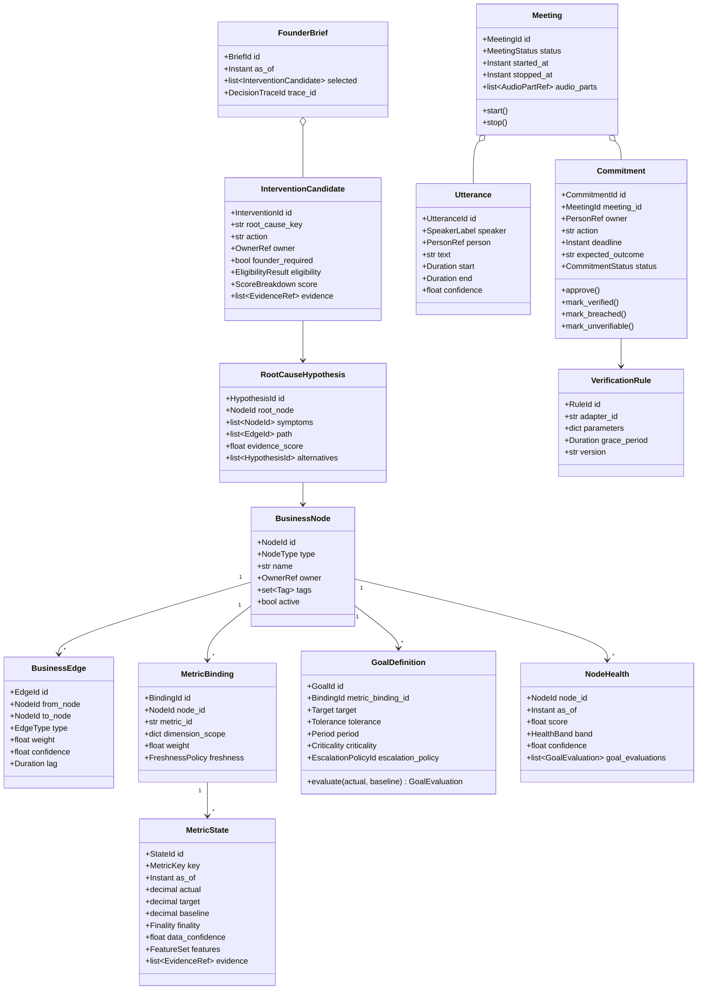

# Object-Oriented and Low-Level Design

## 1. Design Approach

The production platform uses ordinary object-oriented Python with clean/hexagonal architecture. The term "agent" refers to an application object that coordinates deterministic domain capabilities, not a model that writes code or chooses arbitrary tools.

Each microservice follows:

```text
api
  -> application use cases
  -> domain model and policies
  -> ports/interfaces
  -> adapters
  -> repositories/providers
```

Dependency direction always points inward. Domain objects have no Azure, OVOS, Deepgram, ClickHouse, MCP, Appsmith, or MLflow imports.

## 2. Repository Layout

```text
services/
  voice_orchestrator/
    src/voice_orchestrator/
      api/
      application/
      domain/
      ports/
      adapters/
      bootstrap/
    tests/

  control_plane/
    src/control_plane/
      api/
      application/
      domain/
      ports/
      adapters/
      workers/
      bootstrap/
    tests/

  business_state/
    src/business_state/
      api/
      application/
      domain/
      ports/
      adapters/
      workers/
      bootstrap/
    tests/

  insight_decision/
    src/insight_decision/
      api/
      application/
      domain/
      ports/
      adapters/
      workers/
      bootstrap/
    tests/

  meeting_intelligence/
    src/meeting_intelligence/
      api/
      application/
      domain/
      ports/
      adapters/
      workers/
      bootstrap/
    tests/

edge/
  seleric_ovos_skill/
  meeting_recorder/
  device_daemon/

shared_contracts/
  openapi/
  events/
  errors/
  security/
```

`shared_contracts` contains only cross-service DTO schemas, event envelopes, stable error codes and authentication claim types. It does not contain shared business logic. Each bounded context owns its domain model and database schema.

## 3. OOP Principles

### Encapsulation

Each entity protects its invariants. For example, a Commitment controls legal status transitions instead of exposing arbitrary status mutation.

### Abstraction

Provider-specific behavior is hidden behind ports such as `MetricProvider`, `TranscriptionProvider`, and `ObjectStore`.

### Inheritance

Use inheritance only for stable behavioral families, such as detector or verification interfaces. Prefer composition for business behavior.

### Polymorphism

Configuration selects an implementation from a registry:

```text
DetectorStrategyRegistry[policy.strategy_id]
VerificationAdapterRegistry[rule.adapter_id]
VoiceProviderRegistry[profile.adapter_id]
```

### SOLID

- Single responsibility: one class owns one business behavior.
- Open/closed: add adapters/strategies without editing orchestration logic.
- Liskov: adapters must honor typed contracts and error semantics.
- Interface segregation: small ports instead of one broad platform interface.
- Dependency inversion: application services depend on ports.

## 4. Domain Class Model



## 5. Value Objects

Use immutable typed value objects for:

```text
NodeId
MetricId
MetricKey
EntityScope
GoalId
ConfigVersion
CatalogueVersion
ModelVersion
EvidenceRef
OwnerRef
Money
Ratio
Confidence
Finality
Freshness
TimeWindow
Duration
TraceContext
```

Example:

```python
@dataclass(frozen=True)
class Confidence:
    value: float

    def __post_init__(self) -> None:
        if not 0.0 <= self.value <= 1.0:
            raise ValueError("confidence must be in [0,1]")
```

## 6. Voice Orchestrator Service LLD

The Voice Orchestrator owns the real-time interaction contract. It never queries ClickHouse, chooses business metrics, computes health, or ranks interventions.

### 6.1 Ports

```python
class IntentClassifier(Protocol):
    async def classify(self, text: str, context: IntentContext) -> IntentResult: ...

class InsightDecisionClient(Protocol):
    async def get_company_health(self, request: HealthRequest) -> CompanyHealth: ...
    async def get_priorities(self, request: PriorityRequest) -> FounderBrief: ...
    async def explain(self, request: ExplainRequest) -> Explanation: ...
    async def get_risks(self, request: RiskRequest) -> RiskBrief: ...
    async def get_opportunities(self, request: OpportunityRequest) -> OpportunityBrief: ...

class MeetingIntelligenceClient(Protocol):
    async def start_meeting(self, request: StartMeetingRequest) -> MeetingStarted: ...
    async def stop_meeting(self, request: StopMeetingRequest) -> MeetingStopped: ...

class ResponseRenderer(Protocol):
    def render(self, template_id: str, payload: BaseModel, locale: str) -> RenderedResponse: ...

class SpeechProvider(Protocol):
    async def transcribe(self, audio: AudioInput, context: SpeechContext) -> Transcript: ...
    async def synthesize(self, text: str, context: SpeechContext) -> AudioOutput: ...

class DialogueRepository(Protocol):
    async def get(self, conversation_id: str) -> DialogueSession | None: ...
    async def save(self, session: DialogueSession) -> None: ...
```

A local speech profile may execute on the edge. A managed streaming profile routes through the Voice Orchestrator so vendor credentials never reside on the Raspberry Pi.

### 6.2 Dialogue session aggregate

```python
class DialogueSession:
    def __init__(self, conversation_id: str, user_id: str, brand_id: int):
        self.conversation_id = conversation_id
        self.user_id = user_id
        self.brand_id = brand_id
        self.last_brief_id: str | None = None
        self.last_intervention_id: str | None = None
        self.active_meeting_id: str | None = None
        self.version = 0

    def remember_brief(self, brief: FounderBrief) -> None:
        self.last_brief_id = brief.id
        self.last_intervention_id = brief.selected[0].id if brief.selected else None
        self.version += 1

    def remember_referenced_intervention(self, intervention_id: str) -> None:
        self.last_intervention_id = intervention_id
        self.version += 1
```

Only reference memory is stored here. Numeric truth remains in Business State and decision evidence remains in Insight Decision.

### 6.3 Voice turn application

```python
class ProcessVoiceTurn:
    def __init__(
        self,
        classifier: IntentClassifier,
        handlers: HandlerRegistry,
        renderer: ResponseRenderer,
        repository: DialogueRepository,
    ) -> None:
        self._classifier = classifier
        self._handlers = handlers
        self._renderer = renderer
        self._repository = repository

    async def execute(self, command: VoiceTurnCommand) -> VoiceTurnResponse:
        session = await self._load_or_create(command)
        result = await self._classifier.classify(command.transcript, session.intent_context())
        if not result.is_accepted:
            return self._renderer.render('intent_fallback', result, command.locale)

        handler = self._handlers.require(result.intent_id)
        outcome = await handler.execute(command, session, result)
        await self._repository.save(session)
        return self._renderer.render(outcome.template_id, outcome.payload, command.locale)
```

### 6.4 Handler contract

```python
class VoiceIntentHandler(Protocol):
    intent_id: str

    async def execute(
        self,
        command: VoiceTurnCommand,
        session: DialogueSession,
        intent: IntentResult,
    ) -> HandlerOutcome: ...
```

New voice capabilities are added by publishing an `IntentDefinition`, registering a typed handler, and adding a response template. Configuration may bind registered IDs; it may not specify arbitrary import paths.

## 7. Control Plane Service LLD

The Control Plane is the only configuration-write boundary. Runtime services consume immutable published bundles by version.

### 7.1 Aggregates

```text
ConfigurationDraft aggregate
ConfigurationVersion aggregate
Ontology aggregate
GoalPackage aggregate
PolicyPackage aggregate
TemplatePackage aggregate
IntentPackage aggregate
ProviderProfile aggregate
DeviceProfile aggregate
```

### 7.2 Validation chain

```python
class DraftValidator(Protocol):
    order: int
    async def validate(self, draft: ConfigurationDraft, ctx: ValidationContext) -> list[Issue]: ...

class ConfigurationValidationPipeline:
    def __init__(self, validators: list[DraftValidator]):
        self._validators = sorted(validators, key=lambda item: item.order)

    async def validate(self, draft: ConfigurationDraft, ctx: ValidationContext) -> ValidationReport:
        issues: list[Issue] = []
        for validator in self._validators:
            issues.extend(await validator.validate(draft, ctx))
        return ValidationReport.from_issues(issues)
```

Validators:

```text
SchemaValidator
CatalogueMetricValidator
DimensionValidator
GraphValidator
GoalValidator
OwnerAndEscalationValidator
WeightValidator
AdapterAvailabilityValidator
TemplateValidator
IntentPackageValidator
VerificationRuleValidator
RetentionPolicyValidator
SecretReferenceValidator
```

### 7.3 Runtime bundle

```python
class RuntimeBundle(BaseModel):
    config_version: str
    effective_at: datetime
    ontology: OntologySnapshot
    metric_bindings: tuple[MetricBinding, ...]
    goals: tuple[GoalDefinition, ...]
    state_policies: tuple[MetricStatePolicy, ...]
    decision_policies: DecisionPolicyPackage
    intents: IntentPackage
    templates: TemplatePackage
    extraction_rules: ExtractionRulePackage
    verification_rules: VerificationRulePackage
    provider_profiles: ProviderProfilePackage
```

The bundle is compiled at publish time, content-addressed, signed/checksummed, and cached by runtime services. A runtime request pins one version for its entire execution.

### 7.4 Publish use case

```python
class PublishConfiguration:
    async def execute(self, command: PublishConfigCommand) -> PublishedVersion:
        draft = await self._drafts.require(command.draft_id)
        draft.require_approved()
        report = await self._validator.validate(draft, command.context)
        report.require_no_errors()
        simulation = await self._simulations.require_passed(command.draft_id)
        version = draft.publish(command.actor_id, command.effective_at, simulation.id)
        async with self._uow:
            await self._versions.add(version)
            await self._runtime_pointer.set(version.id)
            await self._outbox.add(ConfigPublished.from_version(version))
        return version
```

## 8. Business State Service LLD

The Business State Service transforms certified metrics into reproducible observations, features, forecasts, anomaly evidence and node health. It does not choose interventions.

### 8.1 Ports

```python
class MetricProvider(Protocol):
    async def get_definition(self, metric_id: str) -> MetricDefinition: ...
    async def query(self, request: CertifiedMetricRequest) -> CertifiedMetricResult: ...
    async def explain(self, query_id: str) -> DeterministicInsight: ...

class RuntimeConfigClient(Protocol):
    async def get_bundle(self, version: str | None = None) -> RuntimeBundle: ...

class FeatureCalculator(Protocol):
    id: str
    version: str
    def calculate(self, series: TimeSeries, config: FeatureConfig) -> FeatureResult: ...

class DetectorStrategy(Protocol):
    id: str
    version: str
    def evaluate(self, state: MetricStateContext) -> DetectorEvidence: ...

class ForecastModel(Protocol):
    model_id: str
    model_version: str
    def fit(self, request: FitRequest) -> ModelArtifactRef: ...
    def predict(self, request: ForecastRequest) -> PredictionOutput: ...

class HealthStrategy(Protocol):
    id: str
    version: str
    def evaluate(self, request: NodeHealthRequest) -> NodeHealth: ...

class StateRepository(Protocol):
    async def latest_metric_state(self, key: MetricKey, as_of: datetime) -> MetricState | None: ...
    async def save_metric_state(self, state: MetricState) -> None: ...
    async def save_node_health(self, health: NodeHealth) -> None: ...
```

### 8.2 Strategy registries

```python
class StrategyRegistry(Generic[T]):
    def __init__(self, items: Iterable[T], get_id: Callable[[T], str]):
        self._items = {get_id(item): item for item in items}

    def require(self, strategy_id: str) -> T:
        try:
            return self._items[strategy_id]
        except KeyError as error:
            raise StrategyNotAvailable(strategy_id) from error
```

Initial registered implementations:

```text
rolling_mean
rolling_median
finite_difference_velocity
smoothed_acceleration
mad_volatility
ewma_volatility
seasonal_naive_forecast
ewma_forecast
statsforecast_adapter
merlion_adapter_optional
robust_residual_detector
prediction_interval_detector
change_point_detector
weighted_dependency_health
```

### 8.3 Metric state builder

```python
class MetricStateBuilder:
    def __init__(
        self,
        features: StrategyRegistry[FeatureCalculator],
        detectors: StrategyRegistry[DetectorStrategy],
        forecasts: StrategyRegistry[ForecastModel],
        clock: Clock,
    ) -> None:
        self._features = features
        self._detectors = detectors
        self._forecasts = forecasts
        self._clock = clock

    def build(
        self,
        metric_series: TimeSeries,
        binding: MetricBinding,
        goal: GoalDefinition | None,
        policy: MetricStatePolicy,
        provenance: Provenance,
    ) -> MetricState:
        feature_set = FeatureSet()
        for cfg in policy.features:
            feature_set.add(self._features.require(cfg.calculator_id).calculate(metric_series, cfg))

        prediction = None
        if policy.forecast is not None:
            prediction = self._forecasts.require(policy.forecast.model_id).predict(
                ForecastRequest(metric_series, policy.forecast)
            )

        detector_evidence = tuple(
            self._detectors.require(cfg.strategy_id).evaluate(
                MetricStateContext(metric_series, feature_set, prediction, cfg)
            )
            for cfg in policy.detectors
        )

        return MetricState.create(
            binding=binding,
            goal=goal,
            feature_set=feature_set,
            prediction=prediction,
            detector_evidence=detector_evidence,
            provenance=provenance,
            generated_at=self._clock.now(),
        )
```

### 8.4 Node health strategy

```python
class WeightedDependencyHealthStrategy:
    def evaluate(self, request: NodeHealthRequest) -> NodeHealth:
        direct = weighted_mean(request.goal_scores)
        dependency_penalty = capped_weighted_mean(
            [1.0 - item.health.score for item in request.dependency_states],
            request.policy.max_dependency_penalty,
        )
        raw = request.policy.alpha * direct + (1.0 - request.policy.alpha) * (1.0 - dependency_penalty)
        score = clamp(raw, 0.0, 1.0)
        confidence = min(request.data_confidence, request.binding_coverage, request.goal_coverage)
        return NodeHealth.from_score(score, confidence, request.policy.bands, request)
```

Missing data creates `UNKNOWN_DATA`; it is never converted into a healthy score.

### 8.5 State refresh use case

```python
class RefreshBusinessState:
    async def execute(self, command: RefreshStateCommand) -> StateRefreshResult:
        bundle = await self._config.get_bundle(command.config_version)
        plan = self._planner.plan(bundle, command.brand_id, command.as_of)
        observations = await self._metric_loader.load(plan)
        states = self._state_factory.build_all(observations, bundle)
        health = self._health_evaluator.evaluate_all(states, bundle.ontology, bundle.goals)
        async with self._uow:
            await self._states.upsert_all(states)
            await self._health.upsert_all(health)
            await self._outbox.add(BusinessStateRefreshed.from_result(command, states, health))
        return StateRefreshResult.from_outputs(states, health)
```

Job idempotency key:

```text
brand_id + config_version + state_bucket + state_profile_id
```

### 8.6 Read API

```text
GET /v1/state/health
GET /v1/state/nodes/{node_id}
GET /v1/state/metrics/{metric_key}
GET /v1/state/risks/source-data
POST /v1/state/refresh       # internal/admin only
POST /v1/state/conditions/evaluate
```

Every result includes `as_of`, finality, confidence, config version, metric catalogue version, query IDs and evidence references.

## 9. Insight Decision Service LLD

The Insight Decision Service interprets already-materialized state using the declared business graph and policy package. V1 produces suspected root drivers, not unqualified causal proof.

### 9.1 Ports

```python
class BusinessStateClient(Protocol):
    async def get_company_state(self, request: CompanyStateRequest) -> CompanyState: ...
    async def evaluate_condition(self, request: StateConditionRequest) -> StateConditionResult: ...

class RuntimeConfigClient(Protocol):
    async def get_bundle(self, version: str | None = None) -> RuntimeBundle: ...

class CommitmentReadClient(Protocol):
    async def get_material_commitment_risks(self, request: CommitmentRiskRequest) -> list[CommitmentRisk]: ...

class RootDriverStrategy(Protocol):
    id: str
    version: str
    def resolve(self, request: RootDriverRequest) -> list[RootDriverHypothesis]: ...

class CandidateFactory(Protocol):
    def create(self, request: CandidateFactoryRequest) -> list[InterventionCandidate]: ...

class EligibilityRule(Protocol):
    order: int
    def evaluate(self, candidate: InterventionCandidate, context: EligibilityContext) -> EligibilityDecision: ...

class CandidateDedupeStrategy(Protocol):
    def consolidate(self, candidates: list[InterventionCandidate], policy: DedupePolicy) -> DedupeResult: ...

class RankingStrategy(Protocol):
    id: str
    def rank(self, candidates: list[InterventionCandidate], policy: RankingPolicy) -> list[InterventionCandidate]: ...

class DecisionTraceRepository(Protocol):
    async def save(self, trace: DecisionTrace) -> None: ...
    async def get(self, trace_id: str) -> DecisionTrace: ...
```

### 9.2 Declared graph root-driver strategy

```python
class DeclaredGraphEvidenceStrategy:
    def resolve(self, request: RootDriverRequest) -> list[RootDriverHypothesis]:
        hypotheses: list[RootDriverHypothesis] = []
        for symptom in request.material_nodes:
            for path in request.graph.upstream_paths(symptom.node_id, request.policy.max_depth):
                candidate = path.root
                score = self._score(
                    edge_confidence=path.edge_confidence,
                    temporal_precedence=request.temporal_precedence(candidate, symptom),
                    anomaly_concurrence=request.anomaly_concurrence(candidate, symptom),
                    contribution=request.contribution(candidate, symptom),
                    evidence_completeness=request.evidence_completeness(candidate),
                )
                hypotheses.append(RootDriverHypothesis.suspected(candidate, symptom, path, score))
        return consolidate_hypotheses(hypotheses)
```

A hypothesis may be labelled `VALIDATED_CAUSAL` only when the selected strategy is backed by an approved causal model/version and the edge is explicitly classified as causal in configuration.

### 9.3 Eligibility pipeline

```python
class EligibilityPipeline:
    def __init__(self, rules: list[EligibilityRule]):
        self._rules = sorted(rules, key=lambda rule: rule.order)

    def evaluate(self, candidate: InterventionCandidate, context: EligibilityContext) -> EligibilityResult:
        decisions: list[EligibilityDecision] = []
        for rule in self._rules:
            decision = rule.evaluate(candidate, context)
            decisions.append(decision)
            if decision.is_terminal_rejection:
                break
        return EligibilityResult(decisions)
```

Registered rules:

```text
FreshnessRule
DataQualityRule
DataConfidenceRule
EvidenceConfidenceRule
MaterialityRule
ActionabilityRule
OwnershipAndSlaRule
FounderLeverageRule
PrerequisiteRule
CooldownRule
ConflictRule
```

### 9.4 Ranking and top-three enforcement

```python
class WeightedProductRanking:
    def rank(self, candidates: list[InterventionCandidate], policy: RankingPolicy) -> list[InterventionCandidate]:
        eligible = [item for item in candidates if item.eligibility.is_eligible]
        for item in eligible:
            components = self._normalizer.normalize(item, policy)
            item.assign_score(product_with_weights(components, policy.weights), components)
        return sorted(eligible, key=lambda item: item.score.total, reverse=True)

class SelectFounderBrief:
    async def execute(self, query: FounderPriorityQuery) -> FounderBrief:
        bundle = await self._config.get_bundle(query.config_version)
        company_state = await self._state.get_company_state(query.to_state_request())
        commitment_risks = await self._commitments.get_material_commitment_risks(query.to_commitment_request())
        hypotheses = self._root_drivers.resolve(RootDriverRequest(company_state, bundle.ontology, bundle.decision_policies))
        candidates = self._factory.create(CandidateFactoryRequest(company_state, hypotheses, commitment_risks, bundle))
        evaluated = [item.with_eligibility(self._eligibility.evaluate(item, query.context)) for item in candidates]
        deduped = self._dedupe.consolidate(evaluated, bundle.decision_policies.dedupe)
        ranked = self._ranking.rank(deduped.survivors, bundle.decision_policies.ranking)
        selected = tuple(item for item in ranked if item.score.total >= bundle.decision_policies.min_score)[:query.limit]
        trace = DecisionTrace.capture(query, company_state, candidates, deduped, ranked, selected, bundle)
        await self._traces.save(trace)
        return FounderBrief.create(query.as_of, selected, trace.id, company_state.freshness)
```

The service returns zero to three items. It never pads the result to reach three.

### 9.5 Explanation and deterministic NLG

```python
class ExplainIntervention:
    async def execute(self, query: ExplainInterventionQuery) -> Explanation:
        trace = await self._traces.get(query.decision_trace_id)
        selected = trace.require_selected(query.intervention_id)
        return Explanation.from_trace(selected, trace)
```

Explanations read the original trace. They do not silently recompute using newer state.

`ResponseTemplateRenderer` uses strict Jinja2 templates and fails when a required field is absent. A future constrained language adapter may paraphrase a completed typed DTO but may not alter facts, scores, ranking or evidence.

### 9.6 Executive application facade

```python
class ExecutiveAgent:
    """Deterministic application facade; not a generative agent runtime."""

    async def get_company_health(self, query: CompanyHealthQuery) -> CompanyHealth: ...
    async def get_founder_priorities(self, query: FounderPriorityQuery) -> FounderBrief: ...
    async def explain_intervention(self, query: ExplainInterventionQuery) -> Explanation: ...
    async def get_risks(self, query: RiskQuery) -> RiskBrief: ...
    async def get_opportunities(self, query: OpportunityQuery) -> OpportunityBrief: ...
```

## 10. Meeting Intelligence Service LLD

### 10.1 Ports

```python
class ObjectStore(Protocol):
    async def put_part(self, request: PutObjectPart) -> ObjectRef: ...
    async def get_stream(self, object_ref: ObjectRef) -> AsyncIterator[bytes]: ...

class TranscriptionProvider(Protocol):
    async def transcribe(self, request: TranscriptionRequest) -> TranscriptResult: ...

class DiarizationProvider(Protocol):
    async def diarize(self, request: DiarizationRequest) -> DiarizationResult: ...

class ParticipantResolver(Protocol):
    def resolve(self, request: ParticipantResolutionRequest) -> ParticipantResolution: ...

class MeetingExtractor(Protocol):
    extractor_id: str
    version: str
    def extract(self, request: ExtractionRequest) -> ExtractionDraft: ...

class BusinessStateConditionClient(Protocol):
    async def evaluate(self, request: StateConditionRequest) -> StateConditionResult: ...

class VerificationAdapter(Protocol):
    adapter_id: str
    async def observe(self, request: VerificationRequest) -> VerificationObservation: ...

class WorkflowScheduler(Protocol):
    async def schedule(self, job: ScheduledJob) -> JobRef: ...
    async def cancel(self, job_ref: JobRef) -> None: ...
```

### 10.2 Meeting aggregate

```python
class Meeting:
    def start(self, at: datetime) -> None:
        if self.status is not MeetingStatus.CREATED:
            raise InvalidMeetingTransition()
        self.status = MeetingStatus.RECORDING
        self.started_at = at

    def register_audio_part(self, part: AudioPartRef) -> None:
        if part.idempotency_key in self._part_keys:
            return
        self.audio_parts.append(part)
        self._part_keys.add(part.idempotency_key)

    def stop(self, at: datetime) -> None:
        if self.status is not MeetingStatus.RECORDING:
            raise InvalidMeetingTransition()
        self.status = MeetingStatus.UPLOAD_PENDING
        self.stopped_at = at
```

### 10.3 Hybrid evidence-linked extractor

```python
class SpacyRuleMeetingExtractor:
    def __init__(
        self,
        terminology: TerminologyMatcher,
        commitment_matcher: CommitmentMatcher,
        decision_matcher: DecisionMatcher,
        deadline_parser: DeadlineParser,
        ontology_linker: OntologyLinker,
        validator: ExtractionValidator,
    ) -> None:
        ...

    def extract(self, request: ExtractionRequest) -> ExtractionDraft:
        linked_terms = self._terminology.match(request.utterances)
        commitment_spans = self._commitment_matcher.match(request.utterances)
        decision_spans = self._decision_matcher.match(request.utterances)
        deadlines = self._deadline_parser.parse(
            request.utterances,
            relative_base=request.meeting_started_at,
            timezone=request.timezone,
        )
        draft = compose_draft(linked_terms, commitment_spans, decision_spans, deadlines)
        return self._validator.validate_and_score(draft, request)
```

The validator checks negation, retraction, missing owner/deadline, conflicting spans and evidence completeness. Low-confidence drafts must enter human review.

### 10.4 Commitment aggregate

```python
_ALLOWED = {
    CommitmentStatus.DRAFT: {CommitmentStatus.REVIEW_REQUIRED, CommitmentStatus.REJECTED},
    CommitmentStatus.REVIEW_REQUIRED: {CommitmentStatus.APPROVED, CommitmentStatus.REJECTED},
    CommitmentStatus.APPROVED: {
        CommitmentStatus.IN_PROGRESS,
        CommitmentStatus.VERIFIED,
        CommitmentStatus.BREACHED,
        CommitmentStatus.UNVERIFIABLE,
        CommitmentStatus.CANCELLED,
    },
    CommitmentStatus.IN_PROGRESS: {
        CommitmentStatus.VERIFIED,
        CommitmentStatus.BREACHED,
        CommitmentStatus.UNVERIFIABLE,
        CommitmentStatus.CANCELLED,
    },
}

class Commitment:
    def transition(self, target: CommitmentStatus, evidence: EvidenceRef, actor: ActorRef) -> None:
        if target not in _ALLOWED.get(self.status, set()):
            raise InvalidCommitmentTransition(self.status, target)
        self.status = target
        self.history.append(StatusChange(target, evidence, actor))
```

### 10.5 Verification engine

```python
class VerificationEngine:
    def __init__(
        self,
        adapters: StrategyRegistry[VerificationAdapter],
        state_client: BusinessStateConditionClient,
        clock: Clock,
    ) -> None:
        self._adapters = adapters
        self._state_client = state_client
        self._clock = clock

    async def verify(self, commitment: Commitment, rule: VerificationRule) -> VerificationRun:
        if rule.adapter_id == 'certified_metric_condition':
            observation = await self._state_client.evaluate(rule.to_state_condition(commitment))
        else:
            adapter = self._adapters.require(rule.adapter_id)
            observation = await adapter.observe(VerificationRequest(commitment, rule, self._clock.now()))
        result = rule.evaluate(observation)
        return VerificationRun.from_result(commitment, rule, observation, result)
```

The Meeting service never submits free-form SQL. Metric verification references a published condition definition and certified metric IDs.

## 11. Durable Job Queue LLD

PostgreSQL table concept:

```text
job_id
owner_service
job_type
job_key unique
payload_json
scheduled_at
status
attempts
max_attempts
lease_owner
lease_until
last_error
created_at
updated_at
```

Worker claim pattern:

```sql
SELECT job_id
FROM job_queue
WHERE status = 'PENDING'
  AND scheduled_at <= now()
ORDER BY scheduled_at
FOR UPDATE SKIP LOCKED
LIMIT :batch_size;
```

The job transaction updates the lease before work. Completion and outbox event insertion are idempotent.

## 12. Transactional Outbox LLD

Event envelope:

```json
{
  "event_id": "uuid",
  "event_type": "CommitmentBreached.v1",
  "aggregate_type": "Commitment",
  "aggregate_id": "...",
  "occurred_at": "...",
  "brand_id": 20,
  "trace_id": "...",
  "schema_version": 1,
  "payload": {}
}
```

Publishing flow:

1. Domain change and outbox record commit in one transaction.
2. Publisher claims pending outbox rows.
3. Event is delivered to HTTP subscriber or optional broker.
4. Delivery is recorded.
5. Consumers use event ID for idempotency.

## 13. Error Model

Stable error envelope:

```json
{
  "error": {
    "code": "DATA_STALE",
    "message": "Current executive state is not sufficiently fresh.",
    "retryable": true,
    "trace_id": "...",
    "details": {}
  }
}
```

Error categories:

```text
AUTHENTICATION_FAILED
AUTHORIZATION_FAILED
INTENT_LOW_CONFIDENCE
UNSUPPORTED_INTENT
DATA_UNAVAILABLE
DATA_STALE
DATA_QUALITY_FAILED
CONFIG_NOT_PUBLISHED
CONFIG_ADAPTER_MISSING
MODEL_UNAVAILABLE
MEETING_STATE_INVALID
TRANSCRIPTION_FAILED
EXTRACTION_REVIEW_REQUIRED
VERIFICATION_DELAYED
DEPENDENCY_TIMEOUT
INTERNAL_ERROR
```

## 14. API Versioning

- URI major versions: `/v1/...`
- Additive fields are backward compatible.
- Breaking changes create `/v2` or a new event type version.
- Every DTO contains `api_version` where persisted or sent asynchronously.
- OpenAPI contract tests run in CI.

## 15. Idempotency

Required commands include an idempotency key:

```text
create meeting
upload audio part
stop meeting
approve extraction
approve commitment
run verification
recompute state bucket
publish configuration
```

The server stores key, actor/client, request hash, response reference, and expiry.

## 16. Caching

Use in-process bounded caches first:

- Runtime configuration bundle by version
- Metric definitions by catalogue version
- Intent classifier package by version
- Template compilation by version

Do not introduce Redis until multiple replicas require a shared low-latency cache or distributed locks.

## 17. Security LLD

### User flow

```text
Admin/Founder -> OIDC Authorization Code with PKCE -> access token -> service
```

### Device flow

```text
Device -> client credential or certificate -> short-lived access token -> Voice Orchestrator/Meeting Intelligence APIs
```

### Service flow

```text
Service account/managed identity -> scoped access token -> internal API
```

Authorization checks include:

```text
role and scope
brand access
device assignment
resource ownership
config state
operation risk level
```

## 18. Testing Strategy

### Unit tests

- Value-object invariants
- Health formula bounds
- Detector strategies
- Eligibility rules
- Dedupe
- Ranking reproducibility
- Commitment transitions
- Deadline parsing
- Template strictness

### Contract tests

- Seleric MCP adapter fixtures
- OpenAPI provider/consumer contracts
- STT/TTS adapter contracts
- Object storage adapter
- Identity claim normalization

### Golden tests

- Voice utterance to handler
- Certified metric response to state
- State to founder brief
- Decision trace to explanation
- Transcript to extraction draft
- Verification evidence to commitment status

### Backtests

For each detector/model:

- Walk-forward evaluation
- Same metric baseline comparison
- False alert rate
- Detection delay
- Stability across seasonality
- Calibration where applicable

### Failure injection

- MCP timeout
- Stale data
- Provider outage
- database restart
- duplicate audio upload
- worker crash after observation but before completion
- config publication with missing adapter
- object storage unavailable

## 19. DeepSeek Harness and NOOA Usage

### DeepSeek Harness

Use in a separate development lab for:

- Adapter/plugin experiments
- Replaying sample conversations
- Evaluating tool/handler selection
- Generating test cases
- Comparing optional language models
- Inspecting trajectories

Do not make it a production service dependency because it is a developer preview with breaking changes expected.

### NVIDIA OO Agents

Use its typed-object design as inspiration and optionally for isolated experiments in evidence-linked summarization or extraction.

Production classes use ordinary deterministic Python bodies. Any NOOA method that executes generated code must run in an OS-isolated sandbox without production credentials and is not part of the Voice Node path.
