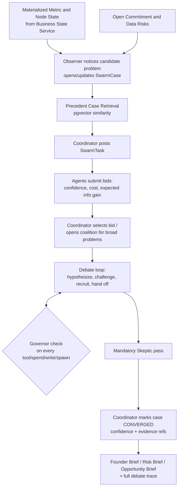
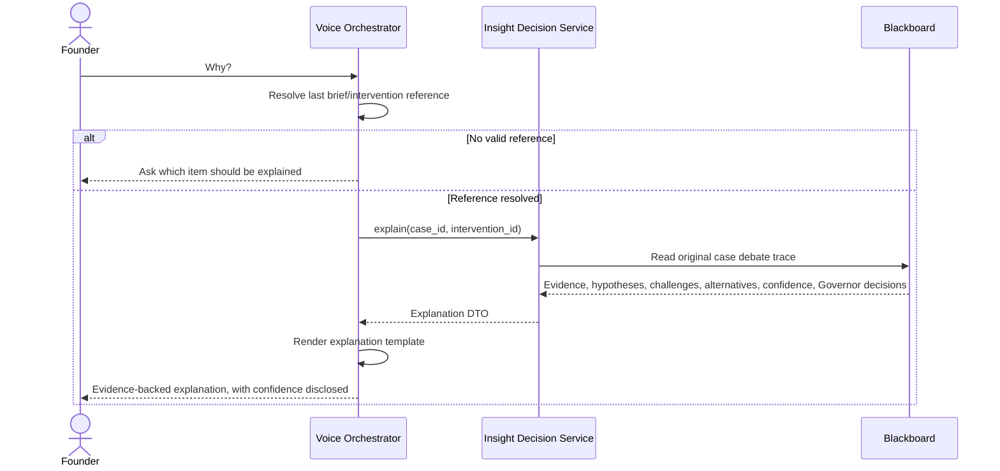
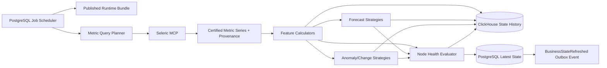
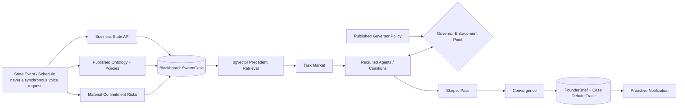
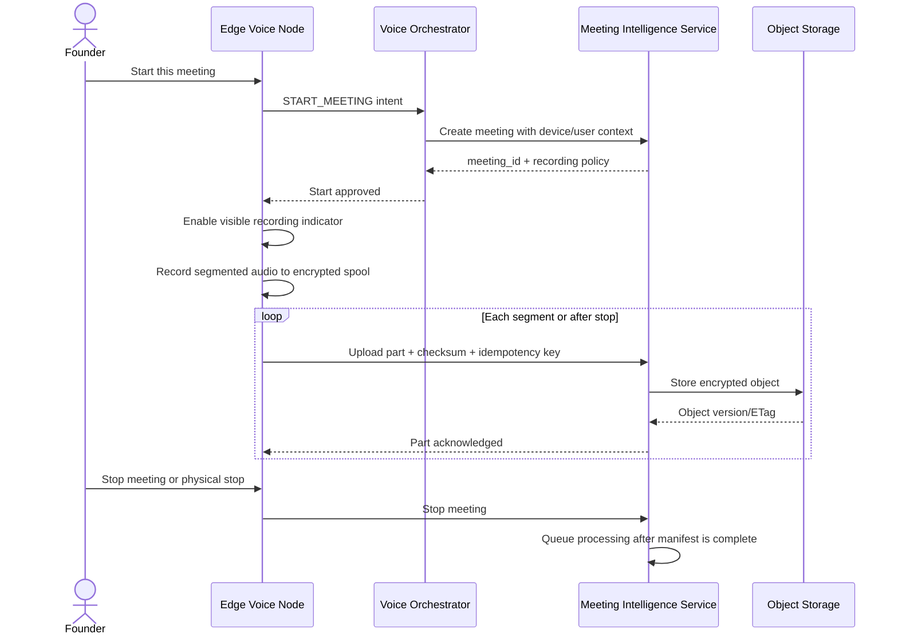
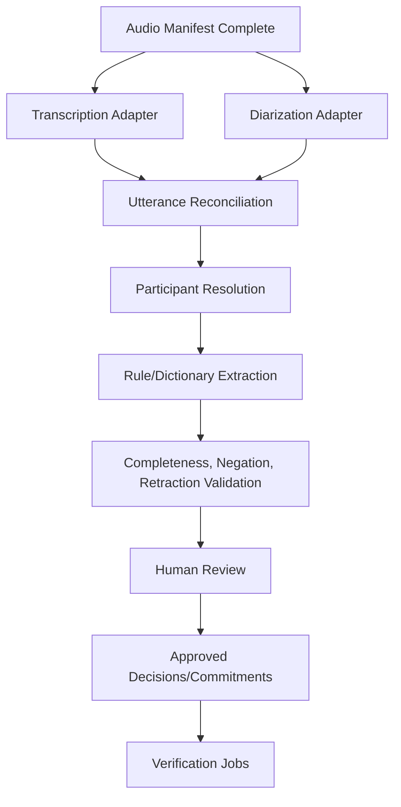
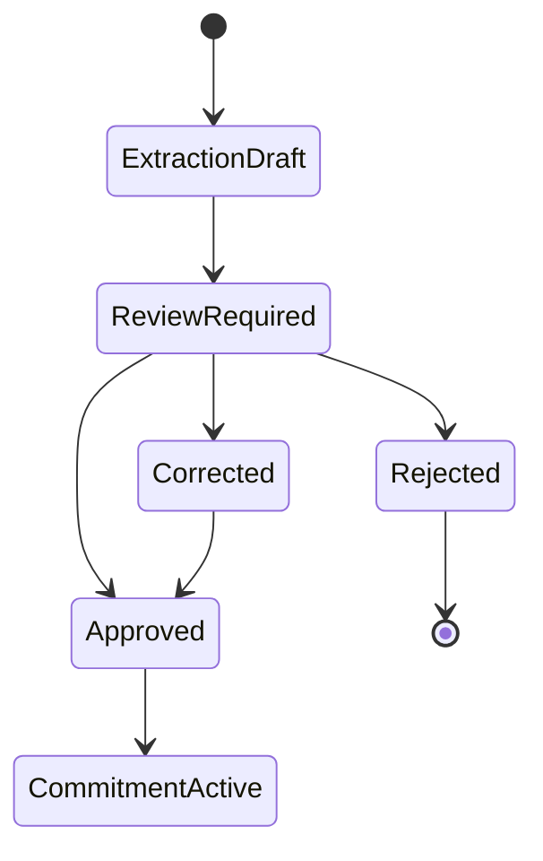
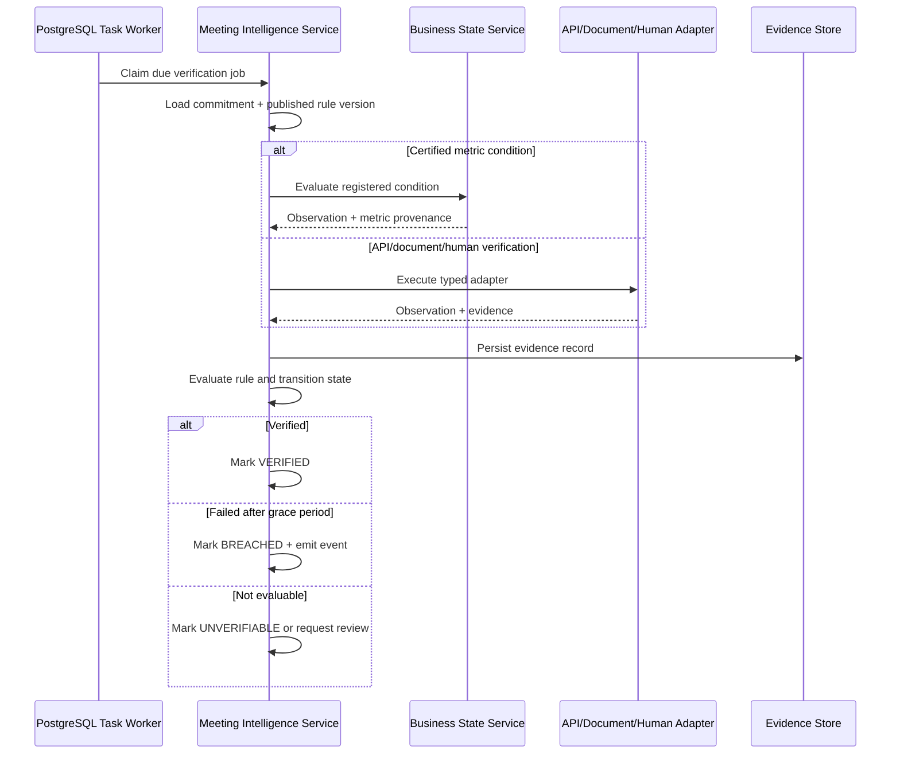

# Workflows and Data Flows

## 1. Executive Query Workflow

```mermaid
sequenceDiagram
    actor Founder
    participant Edge as Edge Voice Node
    participant Speech as Local/Managed Speech Adapter
    participant Voice as Voice Orchestrator
    participant Insight as Insight Decision Service
    participant State as Business State Service
    participant Control as Control Plane Service
    participant MCP as Seleric MCP

    Founder->>Edge: Wake word and utterance
    Edge->>Speech: Audio after local activation
    Speech-->>Edge: Transcript + confidence
    Edge->>Voice: VoiceTurnCommand + device/user/trace context
    Voice->>Voice: Normalize, classify bounded intent, resolve references

    alt Transcript or intent below threshold
        Voice-->>Edge: Safe repeat/clarify response
    else Supported executive intent
        Voice->>Insight: Typed executive query
        Insight->>Control: Resolve published runtime bundle if cache miss
        Insight->>State: Read state/health snapshot pinned to bundle

        alt Current materialized state is valid
            State-->>Insight: State + freshness + evidence
        else Bounded synchronous refresh allowed
            State->>MCP: Certified metric query
            MCP-->>State: Values + query IDs + catalogue version + freshness
            State->>State: Derive state, health, persist idempotently
            State-->>Insight: Refreshed state + evidence
        else Refresh not allowed within response SLO
            State-->>Insight: STALE/UNAVAILABLE status + last valid timestamp
        end

        Note over Insight: Company-health assembly reads state directly (unchanged).<br/>Founder-priority/risk/opportunity queries read the swarm's<br/>latest CONVERGED case; no live agent debate runs here (doc 03 §5).
        Insight->>Insight: Health assembly, or read latest converged swarm case
        Insight-->>Voice: Typed response + case/trace ID + confidence
        Voice->>Voice: Render strict versioned response template
        Voice->>Speech: Text/SSML
        Speech-->>Edge: Audio stream/file
        Edge-->>Founder: Spoken response
    end
```

### 1.1 Edge to Voice Orchestrator

```json
{
  "api_version": "1.0",
  "interaction_id": "uuid",
  "conversation_id": "uuid",
  "device_id": "device-office-01",
  "user_id": "founder-user-id",
  "brand_id": 20,
  "locale": "en-IN",
  "transcript": "What are the three things I need to do today?",
  "stt_confidence": 0.96,
  "captured_at": "2026-09-15T10:00:00+05:30",
  "traceparent": "00-..."
}
```

### 1.2 Voice Orchestrator to Insight Decision

```json
{
  "request_type": "FOUNDER_PRIORITIES",
  "brand_id": 20,
  "limit": 3,
  "as_of": "2026-09-15T10:00:00+05:30",
  "user_context": {
    "user_id": "founder-user-id",
    "roles": ["exec"]
  },
  "reference_context": {},
  "trace_id": "uuid"
}
```

### 1.3 Insight Decision to Voice Orchestrator

```json
{
  "brief_id": "brief_...",
  "as_of": "...",
  "freshness": {},
  "items": [],
  "decision_trace_id": "trace_...",
  "template_id": "founder_priorities_v1",
  "template_context": {},
  "versions": {
    "config": "cfg_...",
    "catalogue": "47f987dbb82d",
    "ranking": "founder_rank_v1"
  }
}
```

## 2. Company Health Workflow

```text
1. Insight Decision resolves the active runtime bundle.
2. Business State returns the latest valid health snapshot for executive-visible nodes.
3. If allowed, Business State refreshes missing/stale state using certified Seleric MCP metrics.
4. Direct goal health and bounded dependency effects are read from the state snapshot.
5. Unknown or low-confidence data remains explicitly unknown.
6. Insight Decision aggregates node health by configured domain roll-up.
7. It selects material positive and negative changes and attaches evidence references.
8. It stores an optional decision trace and returns CompanyHealth.
9. Voice Orchestrator renders the configured spoken response.
```

Health states:

```text
HEALTHY
WATCH
ATTENTION_REQUIRED
UNKNOWN_DATA
```

`UNKNOWN_DATA` is never treated as healthy.

## 3. Founder Priority Workflow — the Seleric Swarm Loop [replaces the deterministic pipeline]

**Changed 2026-08-31.** The founder priority workflow no longer runs a deterministic eligibility/ranking pipeline. It runs the swarm loop the founder specified: business state → agents notice problems → agents create hypotheses → agents recruit other agents → agents debate → agents propose actions → controlled execution → outcome returns → swarm learns. This is a fully asynchronous, precompute-first workflow (doc 03 §5) — a live voice query never triggers a new case synchronously; it reads the most recent case the swarm has already converged.



### 3.1 Governor gate replaces “hard eligibility gates”

The deterministic pipeline's hard vetoes (stale data, low confidence, immateriality, no action, already owned, not founder-required, missing prerequisite, cooldown, duplicate root cause) are not deleted — they become things agents are required to *reason about and cite* rather than a formula that silently rejects a candidate. Two things now enforce what the formula used to:

1. **The Skeptic agent** is specifically responsible for catching materiality, precondition, and duplicate-root-cause problems during debate (doc 05 §37) — this is judgment, not a fixed threshold, and it is auditable because the challenge is a recorded Blackboard message.
2. **The Governor** enforces the subset of vetoes that are genuinely non-negotiable regardless of agent confidence: no production write, spend, PII access, or external communication without policy permission (doc 05 §40). A Governor `DENY` is unconditional — no amount of agent confidence overrides it.

### 3.2 Consolidation — now a Coordinator responsibility, not a formula step

The Coordinator consolidates candidate hypotheses under one root-driver key using the same criteria the deterministic dedupe step used (explicit configured root-driver key; same suspected root node plus category; same action object and owner; configured mutually exclusive group) — but the consolidation itself is a Coordinator decision informed by the Skeptic's challenges, not a pure key-matching function. Rejected duplicates remain on the Blackboard as linked symptoms, exactly as they remained in the old `DecisionTrace`.

## 4. “Why?” Workflow



The explanation reads the original case's recorded debate. It does not silently recalculate with newer data or re-run the agents unless the founder explicitly requests an update — and re-running produces a new case, not a silent edit to the old one, because Blackboard records are append-only (doc 05 §34).

## 5. Risk Workflow

Risk classes:

```text
OBSERVED_DEGRADATION
FORECAST_RISK
CHANGE_POINT
COMMITMENT_RISK
DATA_QUALITY_RISK
OPERATING_PRECONDITION_RISK
```

```text
Business State snapshots
  + forecast/anomaly evidence
  + material commitment state
  + data-quality/freshness state
  -> swarm case opened (Observer)
  -> agent debate and Skeptic pass (§3)
  -> Coordinator convergence
  -> risk brief with confidence + debate trace
```

Risk generation uses the same swarm loop as founder priorities (§3), scoped to `problem_class = RISK`. It is not a separate deterministic pipeline.

A forecast risk requires horizon, estimate/probability, uncertainty or calibration state, model version, backtest status and freshness.

## 6. Opportunity Workflow

Opportunity classes:

```text
POSITIVE_VARIANCE
UNDERFUNDED_WINNER
FUNNEL_IMPROVEMENT
PRODUCT_TRACTION
GEOGRAPHIC_TRACTION
CREATIVE_TRACTION
COST_EFFICIENCY
RESOLVED_CONSTRAINT
```

Required checks:

```text
signal stability
financial upside
margin availability
inventory availability
fulfilment capacity
creative/campaign capacity
owner readiness
goal conflict
confidence and freshness
```

When an operational prerequisite source is not connected, the output status is `VALIDATION_REQUIRED`, not an executable recommendation.

## 7. Business State Computation Data Flow



Job key:

```text
brand_id + config_version + state_bucket + state_profile_id
```

Finality:

```text
INTRADAY
PROVISIONAL
FINAL
STALE
FAILED_QUALITY
```

A value can be available and still provisional because costs, returns or settlements lag.

## 8. Insight Decision Data Flow — Seleric Swarm Layer



## 9. Configuration Publish Data Flow

```text
Admin command
  -> draft revision
  -> schema validation
  -> certified metric/dimension validation
  -> graph validation
  -> policy/adapter validation
  -> Governor policy validation (tool/spend/PII/write/spawn/iteration bounds well-formed and non-contradictory)
  -> template compilation
  -> historical simulation/diff
  -> approval
  -> immutable published version
  -> ConfigPublished outbox event
  -> runtime bundle refresh
  -> targeted state and case recompute
```

A published Governor policy change takes effect for the *next* agent turn in every open case, not retroactively for in-flight turns already granted — an in-flight grant is honored to completion, and the new policy applies starting the next check (doc 09 §5a).

## 10. Meeting Start and Capture Workflow



## 11. Meeting Processing Workflow



Participant resolution order:

1. Preselected participant.
2. Calendar/meeting metadata.
3. Spoken self-identification.
4. Human reviewer mapping.
5. Future consented voiceprint only after a separate privacy design.
6. Leave unresolved.

## 12. Semantic Extraction Data Flow

```text
Utterances
  -> normalize punctuation and speaker turns
  -> phrase-match known people, roles, products, metrics and projects
  -> match commitment/decision/follow-up verb and dependency patterns
  -> parse deadlines relative to meeting start/timezone
  -> compose action and expected-outcome spans
  -> link ontology IDs
  -> validate negation, corrections and retractions
  -> create evidence-linked drafts
```

Example correction:

```text
“Aman will send the plan tomorrow. Actually, make that Friday.”
```

The later utterance updates the same draft deadline and both evidence spans remain attached.

Ambiguous example:

```text
“Someone from growth should look at it soon.”
```

Expected draft:

```text
owner = null
deadline = null
action = review referenced issue
confidence = low
review_required = true
```

## 13. Review and Approval Workflow



Approval stores machine proposal, human-final values, reviewer, time, reason, source utterances and extractor/rule version.

## 14. Commitment Verification Workflow



## 15. Proactive Notification Workflow

```text
BusinessStateRefreshed or CommitmentBreached
  -> Observer agent evaluates impacted evidence, opens/updates a swarm case
  -> case converges (§3) or remains open
  -> on convergence: notification eligibility/cooldown policy
  -> create Notification object with evidence + confidence
  -> Voice Orchestrator delivery queue
  -> enrolled device receives non-sensitive alert metadata
  -> device indicates alert; founder invokes playback
  -> delivery/acknowledgement recorded
```

A notification is only created from a `CONVERGED` case with a completed Skeptic pass — an in-progress debate never reaches the founder as a proactive alert.

V1 does not play sensitive business details without explicit user interaction.

## 16. Data Retention and Deletion Flow

Configurable retention objects:

```text
voice interaction transcript retention
audio retention
meeting transcript retention
utterance/evidence retention
model artifact retention
audit retention
```

```text
approved deletion request
  -> authorization and legal-hold check
  -> mark object pending deletion
  -> delete/tombstone derived extraction
  -> delete transcript if policy permits
  -> delete audio object versions
  -> retain minimum immutable audit record
  -> record completion
```

## 17. Error and Fallback Flows

### MCP unavailable

- Never fabricate data.
- Use a latest valid cached brief only when the policy permits.
- State the exact timestamp and finality.
- Otherwise report live data unavailable.

### State stale

- Return stale/provisional label.
- Suppress high-confidence action wording.
- Queue refresh without blocking indefinitely.

### STT or intent confidence low

- Ask the user to repeat or choose from supported commands.
- Do not call an executive handler.

### Meeting processing failure

- Preserve source audio and manifest.
- Retry with the configured fallback provider/profile.
- Move to review-required after retry exhaustion.

### LLM provider unavailable or Governor policy unfetchable [new]

- Pause affected case investigations at the current LangGraph checkpoint; do not force a conclusion.
- Voice Orchestrator continues serving the latest already-`CONVERGED` case with disclosed age.
- Governor fails closed: no tool call, spend, write, or spawn proceeds without a successfully fetched, current policy (doc 03 §15, GOV-006).

### Verification adapter failure

- Retry within policy.
- Preserve current commitment state.
- Mark verification delayed, not breached, until grace policy is exhausted.

## 18. Observability Flow

One executive interaction trace links:

```text
wake_event
voice_session
stt_span
intent_classification
insight_api
config_bundle
state_read_or_refresh
mcp_query_if_needed
case_debate_trace   # was: decision_trace
template_render
tts_span
device_playback
```

One swarm case trace links:

```text
case_opened
precedent_retrieval
task_posted
bids_submitted
bid_selected_or_coalition_opened
agent_turn (repeated, one per handoff)
governor_check (repeated, one per gated action)
skeptic_challenge
case_converged_or_inconclusive
brief_published
```

One meeting trace links:

```text
meeting_start
audio_part_upload
transcription_job
diarization_job
utterance_reconciliation
extraction_job
review
commitment_approval
verification_job
status_transition
```
