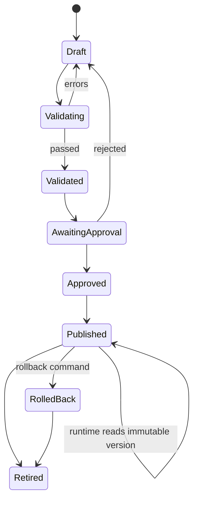

# Admin and Configuration System Specification

## 1. Purpose

The admin system is a first-class part of V1. It allows authorized operators to add and change business objects, goals, metric bindings, policies, providers, intents, templates, meeting rules, verification behavior, and — new since 2026-08-31 — Seleric Governor policy and agent-swarm definitions, without editing source code.

Appsmith Community Edition is used as the initial UI. All writes go through domain APIs.

**Reconciliation note:** the Seleric Governor (doc 03 §7a, doc 05 §40) is *policy authored here*, not a new admin subsystem. Every rule in §2 (the configuration lifecycle) applies to `GovernorPolicy` and `AgentDefinition` objects exactly as written — draft, validate, approve, publish, immutable versioning, rollback. §3.17-3.18 below extend the existing module list; they do not introduce a second approval workflow.

## 2. Configuration Lifecycle



Rules:

- Draft rows may change.
- Validated and approved states retain the validation result.
- Publishing creates an immutable version.
- Rollback publishes a new runtime pointer to a prior immutable version.
- Services record the exact published version used.

## 3. Admin Modules

### 3.1 Business Ontology

Manage:

- Node types
- Nodes
- Edge types
- Edges
- Domains/functions/processes
- Owners
- Tags and external references
- Effective dates

Validation:

- Node and edge type compatibility
- Unique stable IDs
- Disallowed cycles in dependency/causal subgraph
- Orphan nodes
- Missing owners where required
- Edge-weight range

### 3.2 Metric Bindings

Manage:

- Seleric catalogue metric ID
- Node binding
- Entity/dimension scope
- Time grain
- Aggregation/binding role
- Weight
- Criticality
- Freshness requirement
- Finality requirement

Validation:

- Metric resolves in current catalogue
- Requested dimensions are supported
- Ratio semantics are preserved
- Time axis is explicit
- Placement/event-date differences are acknowledged

### 3.3 Goals

Manage:

- Goal ID and name
- Metric binding
- Target value or target expression
- Direction: maximize, minimize, range, maintain
- Tolerance
- Evaluation period
- Baseline policy
- Effective dates
- Criticality
- Owner
- Founder escalation rule

Example:

```json
{
  "goal_id": "goal_checkout_cvr",
  "metric_binding_id": "checkout_cvr_all_mobile",
  "target": {"type": "minimum", "value": 0.035},
  "tolerance": 0.003,
  "period": "P1D",
  "owner_id": "role_product_head",
  "founder_escalation_policy_id": "critical_cross_functional"
}
```

### 3.4 Feature Definitions

Manage:

- Feature ID
- Calculator implementation ID
- Window
- Lag
- Minimum observations
- Null policy
- Outlier policy
- Grain restrictions
- Version

No arbitrary Python is accepted through admin. Only registered calculators and validated parameters are selectable.

### 3.5 Detector and Forecast Policies

Manage:

- Metric pattern or binding
- Detector strategy
- Training/lookback window
- Threshold type
- Minimum history
- Seasonality
- Calibration requirement
- Fallback strategy
- Suppression and cooldown

Example strategy choices:

```text
target_deviation
period_comparison
robust_mad
ewma_residual
statsforecast_interval_residual
change_point
```

### 3.6 Node Health Policies

Manage:

- Direct metric aggregation
- Alpha value
- Dependency edge types
- Maximum parent penalty
- Data-confidence policy
- Status bands
- Unknown-state policy

### 3.7 Intervention Templates

Manage:

- Applicable node types/tags
- Trigger predicate
- Root-cause category
- Suggested action template
- Default owner type
- Founder-required rule
- Exposure estimator
- Preconditions
- Cooldown
- Dedupe key expression
- Response template reference

Predicates use a safe declarative expression language, not executable code.

Example:

```json
{
  "template_id": "checkout_degradation",
  "applies_to": {"node_type": "funnel_stage"},
  "predicate": {
    "all": [
      {"field": "health", "op": "lt", "value": 0.6},
      {"field": "severity", "op": "gte", "value": 2.0}
    ]
  },
  "dedupe_key": "checkout_payment_degradation",
  "founder_rule": "cross_functional_or_loss_gt_threshold"
}
```

### 3.8 Eligibility and Ranking — retired as a deterministic formula, replaced by 3.17/3.18

**Changed 2026-08-31.** This module no longer configures a weighted-ranking formula (there is no formula to configure). The dimensions it used to parameterize — freshness, confidence, materiality, actionability, ownership, founder leverage, prerequisites, cooldown, deduplication — are still real considerations, but they are now things the swarm's agents (particularly the Skeptic) reason about, not thresholds an admin tunes here. What remains admin-configurable in this space:

- `max_founder_brief_items` (still 3 — hard-coded invariant, doc 06 §9.5a, not a tunable weight)
- convergence confidence threshold (minimum confidence for a case to be considered `CONVERGED`, doc 06 §9.3a)
- per-problem-class bid-selection cost/information-gain weighting (advanced; defaults are the documented formula in doc 06 §9.3a and should rarely need admin override)

See §3.17-3.18 for where the substantive new controls live.

### 3.9 Intent Administration

Manage:

- Intent ID
- Example utterances
- Keywords and negative examples
- Synonyms
- Entity/slot definitions
- Handler ID
- Confidence threshold
- Fallback message
- Allowed roles
- Locale

Training workflow:

1. Edit examples
2. Validate minimum examples and class separation
3. Train candidate classifier
4. Run fixed evaluation set
5. Compare with active classifier
6. Approve
7. Publish model/package version
8. Retain rollback version

### 3.10 Response Templates

Manage:

- Intent
- Response subtype
- Locale
- Jinja2 template
- Optional SSML template
- Maximum item and word count
- Required variables
- Freshness/provisional clauses

Preview must use synthetic typed payloads and production-like formatting.

### 3.11 Device Administration

Manage:

- Device ID
- Assigned user/room/brand
- Hardware profile
- Wake-word profile
- Voice provider profile
- Allowed intents
- Certificate/client status
- Software version
- Last heartbeat
- Local storage threshold
- Revoked state

### 3.12 Provider Profiles

Manage non-secret provider configuration:

- Adapter ID
- Endpoint
- Model
- Language
- Timeout
- Retry
- cost/usage limit
- secret reference
- fallback provider

### 3.13 Meeting Dictionaries and Rules

Manage:

- Person names and aliases
- Role names
- Product names and aliases
- Metric names and catalogue IDs
- Process/project/system names
- Commitment verbs
- Decision phrases
- Follow-up phrases
- Deadline patterns
- Stop phrases and negation patterns

Rules are versioned and tested against approved utterance examples.

### 3.14 Verification Rules

Manage:

- Rule ID
- Adapter ID
- Input schema
- Target object type
- Metric/API/document references
- Evaluation expression
- Observation window
- Grace period
- Retry policy
- Manual fallback
- Success/failure wording

No raw SQL field exists in the admin UI.

### 3.15 Meeting Review

Review screen shows:

- Audio playback at utterance timestamp
- Speaker label and proposed participant
- Transcript
- Extracted field
- Confidence
- Source utterance IDs
- Ontology/entity match
- Approve, correct, reject, or mark missing

Corrections are stored separately from machine output for evaluation and future training.

### 3.16 Audit and Decision Inspector

Admin can inspect:

- Voice interaction
- Intent and confidence
- Handler invoked
- Config version
- Metric queries and freshness
- Feature and detector versions
- Candidate interventions
- Eligibility decisions
- Ranking components
- Selected brief
- Rendered template
- Commitment verification evidence

### 3.17 Seleric Governor Policy [new]

Manage, as versioned `GovernorPolicy` objects using the same lifecycle as every other config object:

- **Tool permissions**: which registered tool ports each agent role may invoke, per problem class.
- **Financial spend limits**: maximum spend an agent-proposed action may commit without a human-approval gate; hard ceiling above which no policy version may grant automatic approval.
- **PII access rules**: which agent roles/tools may read fields classified as PII, and under what case conditions.
- **External communication rules**: whether/which agents may send any message outside the platform (e.g., email, external API) — off by default.
- **Production write restrictions**: which write operations are Governor-grantable at all in V1 (deliberately narrow — see doc 01 §5, "autonomous production writes without a Governor-approved action" remains rejected as a default).
- **API spend limits**: LLM provider token/cost budget per case, per day, per agent role.
- **Agent-spawning limits**: maximum concurrent agents and coalitions per case, and system-wide.
- **Max iteration counts**: maximum debate turns before a case is forced to `INCONCLUSIVE` rather than looping indefinitely.
- **Human-approval gates**: which action types require an explicit human approval before execution regardless of Governor policy otherwise permitting them.

Validation (in addition to the standard schema/reference checks in §2):

- No policy version may set spend/write/PII grants above the platform's hard ceilings (enforced independent of admin input — an admin cannot configure the Governor into an unsafe default).
- Every `ToolPermission` must reference a real registered tool port; unregistered tool names are rejected the same way an unresolvable metric ID is rejected in §3.2.
- A policy that removes all `ApprovalGate`s for a previously gated production-write action requires two-person approval (Business Goal Owner + Security Administrator or Platform Admin), reusing the existing separation-of-duties mechanism in §4.

Publication of a new Governor policy version takes effect for the *next* agent turn in every open case; an already-granted, in-flight action is honored to completion (doc 07 §9).

### 3.18 Swarm and Agent Administration [new]

Manage:

- `AgentDefinition` objects: agent role ID, capability tags, tool port bindings, default reasoning-provider profile, cost profile. Adding or retiring an agent role is a config change here, not a code change, once the base agent-execution machinery exists (SWARM-004).
- Read-only **swarm case / debate inspector**: browse any case's full message history (observations, hypotheses, challenges, handoffs, bids, Governor decisions), the same way the old Decision Inspector (§3.16) browsed a formula's inputs/outputs — this is the audit-trail UI that replaces determinism as the accountability mechanism.
- Read-only **agent reputation dashboard**: per-agent, per-problem-class accuracy, calibration, false-positive rate, cost, and speed (doc 05 §39).
- Read-only **task market view**: open tasks, submitted bids, and the Coordinator's selection reasoning for a given case.

No admin action here can directly instruct an agent to reach a specific conclusion — the admin surface configures the swarm's *boundaries and definitions*, not its live reasoning. Overriding a specific in-progress or published conclusion (e.g., dismissing a bad brief item) goes through the existing brief/notification suppression mechanism, not through agent instruction.

## 4. Admin Roles

| Role | Primary permissions |
|---|---|
| Platform Admin | Devices, providers, identity mappings, deployment flags |
| Ontology Steward | Nodes, edges, terminology, metric bindings |
| Business Goal Owner | Goals, thresholds, owner and escalation settings |
| Data/ML Steward | Features, detectors, models, state validation |
| Executive Policy Admin | Intervention, eligibility, ranking, notification policy |
| Meeting Reviewer | Participant mapping, transcript correction, extraction review |
| Commitment Approver | Approve commitments and verification rules |
| **Governor Policy Approver** [new] | Approve/publish `GovernorPolicy`, `AgentDefinition`; required second signer for spend/write/PII grant increases |
| Auditor | Read-only config, decision, swarm-debate, access, and verification history |

Separation of duties can require two roles for publish operations.

## 5. Configuration API

### Draft command

```json
{
  "base_version": "cfg_42",
  "change_set": [
    {
      "operation": "upsert",
      "object_type": "goal",
      "object_id": "goal_checkout_cvr",
      "payload": {}
    }
  ],
  "reason": "September target revision"
}
```

### Validation result

```json
{
  "draft_id": "draft_91",
  "status": "FAILED",
  "errors": [],
  "warnings": [],
  "affected_services": ["state-decision"],
  "recompute_scope": {
    "node_ids": [],
    "from": "2026-09-01"
  }
}
```

### Runtime bundle

```json
{
  "version": "cfg_43",
  "hash": "sha256:...",
  "effective_at": "...",
  "brand_id": 20,
  "ontology": {},
  "goals": [],
  "policies": {},
  "templates": {},
  "provider_profiles": [],
  "created_at": "..."
}
```

## 6. Dynamic Reload

Services cache the runtime bundle by version and ETag.

On ConfigPublished:

1. Service receives outbox event or polls version endpoint
2. Fetches new bundle
3. Validates local adapter availability
4. Atomically swaps active bundle
5. Emits config activation telemetry
6. Recomputes only affected state when specified
7. Retains previous bundle for immediate rollback

## 7. Admin Safety

- Appsmith uses API tokens scoped to the logged-in user.
- It has no direct write credentials for domain databases.
- Secret values are never returned after creation.
- Raw SQL and code fields are not exposed.
- Publish actions are audited with before/after hashes.
- Every configuration object supports effective dates.
- Validation must run against the current Seleric metric catalogue version.
