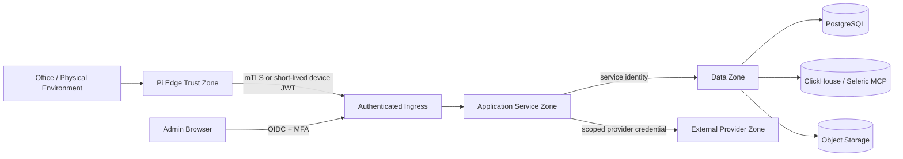

# Security, Observability, Reliability, and Operations

## 1. Purpose

This document defines the production controls required for the Seleric Voice Node V1. The architecture is intentionally small, but it handles confidential company metrics, meeting audio, employee commitments, device credentials, and executive recommendations. **Since 2026-08-31, it also handles non-deterministic agent reasoning with tool/spend/PII/write/spawn access that must be actively constrained rather than absent by construction** — this is the most security-consequential change in the baseline, and this document has been rewritten with that as the primary lens rather than a section added at the margin. The MVP therefore needs explicit trust boundaries, least-privilege authorization, auditable decisions, recovery procedures, privacy controls, and — new — a Governor safety boundary that is itself treated as security-critical infrastructure, from the first release.

## 2. Security objectives

1. A compromised Raspberry Pi must not provide direct database access.
2. A voice utterance must not authorize financially consequential actions.
3. Every business answer must be attributable to certified data, published configuration, and — where the swarm produced it — a complete, retrievable agent-debate trace with confidence score (replaces "versioned logic" as the attribution mechanism for the reasoning path; certified data and published configuration are still the attribution mechanism for the facts themselves).
4. Meeting recording must be visible, consent-aware, encrypted, retained according to policy, and deletable.
5. Configuration changes — including Governor policy — must be reviewed, simulated, published, and reversible.
6. Service credentials must be scoped to the minimum API and brand boundary required. **No agent, and no LLM provider, ever receives a standing credential to PostgreSQL, MCP, or object storage — every capability an agent uses is a typed tool port the Governor explicitly grants per turn.**
7. Failed or stale data must produce a safe degraded response rather than an apparently confident answer. **A denied or unfetchable Governor policy must produce a safe degraded response (fail closed) rather than a permissive default.**
8. The platform must recover from network loss, duplicate requests, worker crashes, and provider failure — including LLM provider failure — without corrupting state.
9. **[new]** No agent conclusion, regardless of stated confidence, may bypass the Governor to reach a production write, a spend commitment, a PII field, or an external communication channel.
10. **[new]** The Governor's own policy must not be modifiable by anything inside the swarm — only through the existing human-gated Control Plane approval workflow.

## 3. Trust boundaries



### 3.1 Edge zone

Contains microphone capture, local wake word, local VAD, playback, LED/button state, short-lived conversation state, and encrypted meeting spool. It contains no warehouse credentials and no reusable administrator token.

### 3.2 Application zone

Contains the six backend services. Internal endpoints are not internet-accessible. Each service has a distinct identity, database role, and allowed operation set.

### 3.3 Data zone

Contains certified metric access, configuration/operational state, analytical history, and audio/transcript objects. Network access is private wherever the deployment environment permits it.

### 3.4 Provider zone

Contains optional managed STT/TTS, identity providers, and — new — the LLM reasoning provider used by the Seleric Swarm Layer. Only the minimum audio/text/prompt content required for the configured provider is transmitted; the LLM provider specifically receives only what a Governor-scoped agent turn assembles for it (evidence excerpts, prior Blackboard messages relevant to the turn) and never a standing credential to PostgreSQL, MCP, or object storage. Provider use is configurable and logged.

### 3.5 Governor boundary [new — cross-cutting, not a zone of its own]

The Governor is not drawn as a separate zone above because it is not a network location; it is an enforcement point inside the Application Zone, specifically inside Insight Decision Service, that every agent action must pass before crossing *into* the Data Zone, the Provider Zone (for anything beyond a scoped reasoning call), or any write path. See §5a for the full design. Concretely: every arrow in the diagram above that originates from an agent turn inside Insight Decision Service — into PostgreSQL, into the LLM provider beyond a granted scope, or into any write — is Governor-checked, not merely service-identity-checked.

## 4. Identity and authentication

### 4.1 Human users

Use an external OIDC provider.

Azure profile:

- Microsoft Entra ID
- Authorization Code Flow with PKCE
- MFA required for configuration approvers and security administrators
- Group-to-role mapping

On-prem profile:

- Keycloak or an existing enterprise OIDC provider
- The same role and scope claims used in Azure

### 4.2 Device enrollment

Each device has:

```text
device_id
device_public_key or client certificate
assigned_brand_ids
assigned_user_id
hardware_profile
permission_profile
credential_issued_at
credential_expires_at
revoked_at
last_seen_at
```

Enrollment flow:

1. Administrator creates a pending device record.
2. Device generates a private key locally.
3. Administrator verifies a one-time pairing code.
4. Control Plane registers the public key/certificate.
5. Device receives a short-lived access token.
6. Long-lived private key remains on the device with file-system permissions restricted to the device service account.

### 4.3 Service identities

Each service uses a separate database role and workload identity.

Example access matrix:

| Service | PostgreSQL rights | Object storage rights | Seleric MCP rights |
|---|---|---|---|
| Voice Orchestrator | dialogue/session read-write | none | none |
| Business State | state/config read-write | model artifact read | metrics read |
| Insight Decision | brief/blackboard/case read-write; config/state read | none | explain read (no direct MCP access from agents — always via Business State) |
| Meeting Intelligence | meeting/commitment read-write | meeting prefix read-write | certified verification read |
| Control Plane | configuration/audit read-write, incl. Governor policy | config export read-write | catalogue metadata read |
| Admin UI | no direct database rights | none | none |

The Admin UI calls domain APIs only. **No swarm agent, and no LLM provider, has a service identity with any row in this matrix beyond what Insight Decision Service's own Blackboard/case rights grant it — agents act through the service's ports, they do not hold independent credentials.**

## 5. Authorization model

### 5.1 Roles

```text
Founder
ExecutiveViewer
BusinessAdministrator
MetricSteward
OntologyEditor
PolicyApprover
MeetingReviewer
SecurityAdministrator
Auditor
ServiceIdentity
DeviceIdentity
```

### 5.2 Scopes

```text
executive:read
brief:read
meeting:start
meeting:review
commitment:approve
commitment:verify
config:read
config:draft
config:validate
config:approve
config:publish
config:rollback
device:enroll
device:revoke
audit:read
```

### 5.3 Brand isolation

Every persisted command, query, event, and object includes `brand_id`. Authorization evaluates both scope and brand membership. A service or user authorized for one brand cannot infer object existence in another brand.

### 5.4 Voice authorization limit — unchanged

The V1 voice path is read-only except for starting/stopping meeting capture. Recommendations do not directly change campaigns, prices, budgets, financial records, or operational systems. This is unaffected by the swarm change: a founder-facing voice answer is always a *read* of a Governor-cleared, already-published brief — the swarm's own write proposals are a separate, Governor-gated path that does not go through voice at all.

### 5.5 Swarm agent scopes [new]

Agents do not hold user/service roles from §5.1 — an agent acts under a **`GovernorScope`**, a narrower, per-turn grant issued by the Governor enforcement point, not a standing role:

```text
agent:reason (always granted — read Blackboard, propose hypotheses)
agent:tool:<tool_id> (granted per Governor policy, per agent role, per problem class)
agent:spend:<limit> (granted up to policy ceiling, requires case-level budget remaining)
agent:pii:<field_class> (granted only where policy explicitly allows and case requires)
agent:write:<resource_type> (granted only for the specific proposed action, single-use)
agent:external_comm (off by default; requires explicit policy grant)
agent:spawn (bounded by AgentSpawnLimit, checked against current concurrent count)
```

A `GovernorScope` is minted for exactly one agent turn and expires with it — it is not cached or reused across turns, which is why every tool call is re-checked (doc 06 §9.4a) rather than checked once per case.

## 5a. Seleric Governor — full design [new, the primary addition of this rewrite]

This section is the canonical Governor design; doc 03 §7a and doc 05 §40 summarize it from the HLD and component-contract perspectives respectively and point here for detail.

### 5a.1 What it controls

| Control | Enforcement point | Failure mode if unset/unfetchable |
|---|---|---|
| Tool permissions | Per tool-port call inside `agent.act()` (doc 06 §9.4a) | Deny (no default-allow tool) |
| Financial spend limits | Per proposed action and per case running total | Deny above ceiling; ceiling itself is a hard platform maximum no policy can exceed |
| PII access | Per field-classification tag on any read/write the agent attempts | Deny |
| External communication | Per attempted outbound channel | Deny (off by default) |
| Production writes | Per write operation type | Deny (see doc 01 §5 — narrow allowlist only) |
| API spend (LLM token/cost) | Per case, per day, per agent role | Deny further reasoning calls; case pauses, does not force-conclude |
| Agent-spawning limits | Per case and system-wide concurrent agent/coalition count | Deny spawn; existing agents continue |
| Max iteration counts | Per case debate-turn counter | Case forced to `INCONCLUSIVE`, not silently truncated |
| Human-approval gates | Per action type flagged in policy | Action held in `PENDING_APPROVAL`, visible in Admin, until a human actor with `PolicyApprover`/`CommitmentApprover` scope grants it |

### 5a.2 Why it cannot be recruited or overridden

The Governor has no `agent_id`, is not in the Agent Registry (doc 05 §36), and receives no Blackboard message asking it to "join" a case — it only receives `GovernorCheckRequest` calls from the enforcement library, which is code the agents cannot address as a peer. A denial is terminal for that turn: there is no swarm-internal retry, rephrase, or escalate-to-a-different-agent path that reaches the same denied capability. The only path around a denial is a human-approved policy change through the existing Control Plane workflow (§5a.3) — which is by design slower and reviewed, not something a fast-moving debate can trigger on itself.

### 5a.3 Relationship to the existing config-approval workflow and doc 09's own trust-zone model

Two explicit reconciliations, since the founder's brief asked that Governor design absorb/supersede rather than duplicate:

1. **Doc 08's config lifecycle** (draft → validate → simulate → approve → publish → rollback) is reused unmodified as the mechanism for changing Governor policy. There is no second approval system.
2. **This document's own trust-zone model** (§3) is extended, not replaced: the Governor is a new enforcement point *inside* the Application Zone (§3.5), and agent `GovernorScope` grants (§5.5) are a new, narrower authorization primitive alongside the existing role/scope model (§5.1-5.2) — they layer on top of service identity, they do not replace it. An agent still runs under Insight Decision Service's own service identity for anything it does; the `GovernorScope` further restricts what that identity may be used for on a given turn.

### 5a.4 What "fail closed" means precisely

If the Governor policy bundle cannot be fetched, is expired, or fails signature/hash verification: every `check()` call returns `DENY` for `TOOL_CALL`, `SPEND`, `PII_ACCESS`, `EXTERNAL_COMM`, `PRODUCTION_WRITE`, and `AGENT_SPAWN`. Agents may continue read-only reasoning against evidence already fetched into the case (they are not frozen mid-thought), but cannot take any new action until policy is restored. This is a deliberate asymmetry: read-only reasoning failing open would be low-risk and annoying to block; anything that spends, writes, touches PII, or leaves the platform failing open would be a real incident.

## 6. Secret management

### Azure

- Azure Key Vault for provider credentials, signing keys, and database secrets where managed identity is not available
- Managed identity preferred over stored credentials
- Key Vault references injected at runtime
- No secrets in container images, Git, Appsmith configuration exports, or Pi images

### On-prem

- SOPS plus age keys, or Vault if already operated
- Docker secrets or mounted root-owned files
- Secrets rotated independently of application deployment

### Device

- Device private key and refresh material stored under a dedicated Linux service account
- Read permission limited to the device daemon
- Token cache encrypted where practical
- Remote revocation supported

## 7. Data protection and privacy

### 7.1 Encryption

- TLS 1.2 or later for all network traffic
- mTLS preferred for device-to-gateway and service-to-service links
- PostgreSQL and object storage encrypted at rest
- Meeting audio encrypted before or during upload
- Backup encryption enabled

### 7.2 Meeting consent

The device must present an unmistakable recording state through LED and audible acknowledgement. The organization must define a consent policy appropriate to jurisdiction and internal HR policy.

Required behavior:

- `Start this meeting` produces an audible confirmation
- LED remains in a distinct recording state
- Physical stop/mute control always works locally
- Recording start/stop times are written to audit history
- Participant consent status can be captured in the meeting record
- A meeting cannot silently resume after a restart

### 7.3 Data minimization

- Wake-word audio is processed locally and not retained
- Non-triggered ambient audio is discarded
- Voice-query audio retention is disabled by default; transcripts may be retained according to policy
- Raw meeting audio retention is configurable independently from transcript and commitment retention
- The business response contains only required metrics and evidence, not unrestricted table extracts

### 7.4 Suggested retention classes

| Data class | Default V1 retention | Configurable range |
|---|---:|---:|
| Wake-word frames | 0 | fixed 0 |
| Voice-query audio | 0 | 0-7 days |
| Voice transcript/session | 30 days | 7-180 days |
| Raw meeting audio | 90 days | 30-365 days |
| Meeting transcript | 365 days | 90 days-indefinite under policy |
| Commitments/decisions | operational lifetime + 1 year | policy-controlled |
| Executive briefs/traces | 365 days | 90 days-7 years |
| Audit records | 2 years | organization policy |
| Model/config artifacts | active lifetime + superseded versions | organization policy |

Deletion must remove or cryptographically render inaccessible the relevant audio and transcript objects while preserving a minimal compliance audit entry where required.

## 8. Threat model and controls

| Threat | Control |
|---|---|
| Stolen Pi | Device certificate revocation; no DB credentials; encrypted spool; least-privilege token |
| Spoofed wake word | Tuned threshold; optional speaker/presence confirmation; read-only voice actions |
| Replay of a voice command | Short conversation nonce; timestamps; no consequential voice writes |
| Prompt/tool injection through speech | Deterministic intent grammar and allowlisted handlers; no generic SQL/code tool reaches the swarm from voice — voice never triggers a live case |
| Compromised admin browser | OIDC MFA, short sessions, CSRF protection, role separation, approval workflow |
| Malicious config | Schema validation, adapter allowlist, simulation, two-person approval, rollback — now including Governor policy (§5a) |
| Metric-definition ambiguity | Certified catalogue IDs, version pinning, provenance and validation checks |
| Model drift | Backtest gates, monitoring, rollback to deterministic baseline (Business State Service, unaffected by swarm change) |
| False causal statement | Ontology grounding requires citation of real node/edge IDs (SWARM-009); Skeptic agent specifically checks for causal-language overreach (RCA-004); `VALIDATED_CAUSAL` still requires approved DoWhy analysis, agent conviction is never sufficient |
| **Prompt injection via Blackboard evidence** [new] | An agent reading MCP-derived state, meeting transcript excerpts, or a prior case's messages as "evidence" could encounter adversarial text designed to manipulate its next action. Mitigation: evidence is passed to the reasoning provider as structured, clearly-delimited data, not as instructions; every tool call an agent attempts is independently Governor-checked regardless of what the evidence "said" to do; the Skeptic is prompted to flag evidence that reads as an instruction rather than a fact. |
| **Agent recruits itself into a spend/write loop** [new] | `AgentSpawnLimit` and max-iteration-count Governor controls (§5a.1) bound this structurally; a case that exceeds its iteration budget is forced to `INCONCLUSIVE`, never left to loop. |
| **Governor policy misconfigured to over-grant** [new] | Hard platform ceilings that no policy version can exceed (§5a.1); two-person approval required to reduce approval gates on a previously gated action (doc 08 §3.17). |
| **LLM provider data exfiltration / logging by the provider** [new] | Provider selection is adapter-based (doc 04 §4a) so a self-hosted or contractually-bound provider can be substituted; only Governor-scoped evidence excerpts are sent, never raw database access or full transcripts by default; provider data-retention terms are part of the doc 01 §4 adoption-control checklist applied to this dependency. |
| Transcript leakage | Private object storage, scoped URLs, no public buckets, retention/deletion controls |
| Dependency/supply-chain compromise | Version pinning, SBOM, license scan, signature/provenance checks, CVE monitoring — now including LangGraph and the LLM provider SDK |
| Worker duplicate execution | Idempotency keys, unique job keys, transactional outbox, state-machine guards; LangGraph checkpoint IDs double as the resume idempotency key (doc 06 §6.15 pattern) |
| Provider outage | Configurable provider fallback, local/offline fallback where available, explicit degraded response; LLM provider outage pauses affected cases rather than forcing a conclusion (doc 03 §15) |

## 9. Audit and decision trace

Every externally visible response receives a `trace_id`. For responses backed by Business State Service (health, freshness) the trace links:

```text
voice session
-> normalized intent and classifier version
-> active configuration version
-> certified metric IDs and Seleric query IDs
-> catalogue version and freshness
-> feature/detector/model versions
-> node health results
-> response template version
-> spoken response
```

For responses backed by the Seleric Swarm Layer (founder priorities, risks, opportunities, explanations) the trace links the full Blackboard case instead of a formula trace:

```text
voice session
-> normalized intent and classifier version
-> active configuration version + active Governor policy version
-> case_id opened_at, trigger
-> precedent cases retrieved (if any)
-> every agent message: from_agent, to_agent/broadcast, type, content, evidence_refs, confidence
-> every Governor check: agent, action_type, requested_scope, decision, policy_version, reason_code
-> Skeptic challenge(s) and resulting confidence adjustment
-> convergence decision + final confidence
-> selected/rejected candidate actions with reasons
-> response template version
-> spoken response, with confidence disclosed
```

This is the accountability mechanism the founder's brief requires in place of determinism: every conclusion is traceable to the specific debate that produced it, not to a formula's inputs.

Configuration and meeting actions additionally record actor, time, before/after values, approval, and reason. Governor policy changes additionally record the specific grant/limit delta and both approvers where two-person approval applies.

Audit records are append-only at application level. Corrections are new events, not destructive edits. This applies to Blackboard case records identically to every other audit surface (doc 05 §34).

## 10. Observability architecture

Use OpenTelemetry instrumentation across edge and backend.

### 10.1 Signals

- Traces: one end-to-end trace per voice query, state job, meeting pipeline, verification run, config publication, and — new — one per swarm case (every agent turn as a span)
- Metrics: technical, data freshness, model quality, decision quality, meeting quality, and — new — swarm/Governor quality
- Logs: structured JSON with trace/span IDs and no raw secrets; agent reasoning content is logged at a level that supports audit but respects PII policy (redacted per the same rules as any other PII-adjacent log)
- Business events: versioned domain events written through the outbox

### 10.2 Core technical metrics

```text
edge_online
device_reconnect_count
wake_detection_latency_ms
wake_false_positive_count
stt_first_partial_latency_ms
intent_resolution_latency_ms
state_api_latency_ms
priority_api_latency_ms
tts_first_audio_latency_ms
barge_in_stop_latency_ms
http_request_duration_ms
http_error_count
job_queue_depth
job_retry_count
worker_lease_expiry_count
object_upload_failure_count
database_pool_saturation
```

### 10.3 Data and decision metrics

```text
metric_freshness_age_seconds
metric_query_warning_count
state_snapshot_success_rate
state_snapshot_lag_seconds
config_bundle_version
config_publish_failure_count
forecast_backtest_error
prediction_interval_coverage
anomaly_alert_rate
anomaly_false_positive_rate_after_review
candidate_generated_count
candidate_rejected_count_by_rule
founder_brief_item_count
duplicate_root_cause_suppression_count
```

### 10.3a Swarm and Governor metrics [new]

```text
swarm_case_opened_count
swarm_case_converged_count
swarm_case_inconclusive_count
swarm_case_abandoned_count
swarm_case_time_to_converge_seconds
swarm_agent_turn_count_by_role
swarm_agent_turn_latency_ms
swarm_bid_count_by_task
swarm_skeptic_challenge_count
swarm_skeptic_reversal_rate            # hypotheses the Skeptic caused to be rejected/downgraded
governor_check_count_by_action_type
governor_deny_count_by_reason_code
governor_policy_fetch_failure_count
governor_fail_closed_duration_seconds
llm_provider_latency_ms
llm_provider_error_count
llm_provider_token_spend_by_case
agent_reputation_calibration_by_role   # tracked over time, not just latest value
case_retrieval_precedent_hit_rate
brief_acknowledgement_rate
recommendation_outcome_observed_rate
```

### 10.4 Meeting metrics

```text
meeting_audio_gap_seconds
transcription_realtime_factor
speaker_diarization_unresolved_ratio
extraction_review_change_rate
commitment_missing_owner_rate
commitment_missing_deadline_rate
commitment_evidence_coverage
verification_on_time_rate
verified_count
breached_count
unverifiable_count
```

## 11. SLOs and error budgets

### 11.1 Interactive SLOs

| SLO | Target |
|---|---:|
| Local wake acknowledgement | p95 < 250 ms after accepted wake |
| Barge-in playback stop | p95 < 300 ms |
| Cached/precomputed executive answer first audio | p95 < 2.5 s (always reads a `CONVERGED` swarm case; no live debate is on this path — doc 03 §5) |
| Non-cached bounded analytical answer first audio | p95 < 6 s (company-health path only, which stays fully deterministic) |
| Supported intent resolution | >= 95% golden-set accuracy |
| Low-confidence false execution | 0 in acceptance set |

A single end-to-end target below 650 ms is not a dependable MVP requirement because cloud STT, network round trips, bounded data access, NLG, and TTS each contribute variable latency. The platform reports per-stage latency instead. Live swarm-case debate latency is explicitly out of the voice-interactive SLO's critical path — see §11.1a.

### 11.1a Swarm SLOs [new]

| SLO | Target |
|---|---:|
| Case time-to-converge (typical single-agent case) | p95 < 10 minutes |
| Case time-to-converge (coalition / broad problem) | p95 < 30 minutes |
| Skeptic pass completion before any published action | 100% |
| Governor check completion before any tool/spend/write/spawn | 100% (fail-closed if not) |
| Case reaching `INCONCLUSIVE` rather than a silent drop | 100% of cases with no selected bid or exceeded iteration budget |
| Founder brief items without a disclosed confidence score | 0 |

These SLOs govern the async swarm path only; they do not gate voice-interactive latency because the voice path never waits on a live case (§11.1).

### 11.2 Data SLOs

| SLO | Target |
|---|---:|
| Hourly operational-state freshness | <= 90 minutes under normal pipeline operation |
| Daily finalized financial state | according to certified MCP finality policy |
| State job success | >= 99% monthly |
| Every executive numeric statement with provenance | 100% |
| Every selected intervention with a complete Blackboard debate trace | 100% |

### 11.3 Meeting SLOs

| SLO | Target |
|---|---:|
| Audio part acknowledgement | >= 99.9% |
| Post-meeting transcript available | within 15 minutes for a 60-minute meeting under normal capacity |
| Extracted commitment with source evidence | 100% |
| Unapproved commitment becoming active | 0 |
| Verification result with evidence | 100% |

## 12. Health endpoints

Every service exposes:

```text
GET /health/live
GET /health/ready
GET /health/dependencies
GET /metrics
```

Readiness evaluates only dependencies required to serve requests. A failed optional provider does not necessarily make the service unready if a configured fallback exists.

The Control Plane exposes the active runtime bundle version and adapter compatibility report. The Business State Service exposes last successful state-bucket timestamps by brand and profile.

## 13. Backup and recovery

### 13.1 PostgreSQL

Back up:

- Configuration revisions and runtime pointers
- Meetings, transcripts metadata, commitments and verifications
- Dialogue references and decision traces
- Job and outbox state

Recommended V1 objectives:

```text
RPO: 15 minutes for operational/configuration data
RTO: 4 hours
```

Perform a restore drill before the September demo and at least quarterly afterwards.

### 13.2 Object storage

- Versioning enabled where supported
- Lifecycle rules for audio/model/config exports
- Cross-location replication optional after MVP
- Object checksums validated on upload and read
- Database references are not marked complete until object checksum confirmation succeeds

### 13.3 ClickHouse/state history

The executive-state mart can be recomputed from certified source metrics and versioned configuration. Retain config/model versions needed for reproducibility.

## 14. Deployment operations

### Azure profile

- Azure Container Apps for APIs and workers
- Minimum one warm replica for interactive Voice Orchestrator and Insight Decision APIs during office hours
- Jobs or scale-to-zero workers for transcription, state refresh, and verification where cold-start latency is acceptable
- Azure Database for PostgreSQL Flexible Server with private networking
- Azure Blob Storage for meeting/model objects
- Azure Key Vault
- Application Insights/Log Analytics through OpenTelemetry
- Azure Container Registry

### On-prem profile

- Docker Compose or Podman Compose on one or two Linux hosts
- Caddy or Traefik for TLS and ingress
- PostgreSQL
- MinIO
- OpenVoiceOS STT/TTS services
- OpenTelemetry Collector, Prometheus, Loki, and Grafana
- Keycloak or existing OIDC

### Hybrid recommendation

Run certified data systems and sensitive meeting storage where already operated; run stateless APIs in Azure Container Apps if operational simplicity is more valuable. All provider choices remain adapter configuration, not domain-code changes.

## 15. Release and supply-chain controls

- Lock dependencies with hashes
- Build immutable OCI images
- Generate SBOM for every release
- Run SAST, dependency, secret, and container scans
- Sign release images where the platform supports it
- Record source commit and image digest in deployment metadata
- Use database migrations with forward and tested rollback/repair procedures
- Run contract, golden, and failure-injection tests before publication
- Publish configuration separately from application deployment

## 16. Operational runbooks

### Runbook A: Seleric MCP unavailable

1. Circuit-break new metric requests.
2. Serve only still-valid precomputed briefs when their TTL permits it.
3. Announce the `as_of` time and degraded status.
4. Do not generate a fresh top-three brief.
5. Alert the data/platform owner.

### Runbook B: State is stale

1. Mark affected metric and nodes `STALE`.
2. Reject candidates relying on stale evidence.
3. Surface data-health risk if material.
4. Retry the state job using bounded backoff.

### Runbook C: STT provider unavailable

1. Switch to configured secondary adapter where allowed.
2. If no provider is available, provide an audible offline/error cue.
3. Preserve a local meeting spool and upload later; do not lose already recorded parts.

### Runbook D: Bad configuration publication

1. Freeze automated alerts and new state jobs if safety validation fails.
2. Roll runtime pointer back to previous known-good version.
3. Recompute affected state buckets.
4. Record incident and publication reason.

### Runbook E: Meeting worker fails

1. Leave meeting in retryable pipeline state.
2. Preserve raw audio and idempotency keys.
3. Retry transcription/extraction separately.
4. Never activate partial commitments without review.

### Runbook F: Device stolen or lost

1. Revoke device certificate/token.
2. Invalidate active sessions.
3. Review last connection and audit activity.
4. Rotate any device-specific provider token if one existed.
5. Wipe or replace device.

### Runbook G: LLM provider unavailable or rate-limited [new]

1. Pause all in-flight swarm cases at their current LangGraph checkpoint; do not force a conclusion.
2. Voice Orchestrator continues serving the latest `CONVERGED` case per node/topic with disclosed age.
3. Switch to a configured fallback reasoning-provider adapter if one is defined; otherwise wait and resume.
4. Alert the data/platform owner if pause duration exceeds the case time-to-converge SLO (§11.1a).
5. On resume, agents pick up from the last checkpoint — no case restarts from zero.

### Runbook H: Governor policy fetch fails or a policy version is found unsafe [new]

1. Enforcement point fails closed immediately: no tool/spend/write/spawn proceeds (§5a.4).
2. Read-only agent reasoning against already-fetched evidence may continue.
3. If a *published* policy version is found unsafe after the fact (e.g., a validation gap slipped through), roll the runtime Governor policy pointer back to the previous known-good version using the same rollback mechanism as any other config revision (doc 08 §2).
4. Record the incident, the unsafe policy version, and the rollback target.
5. Re-run the Governor grant/deny fixture test suite (doc 06 §"Swarm-specific tests") against the corrected policy before republishing.

### Runbook I: Swarm case appears to have converged on a wrong or overconfident conclusion [new]

1. Do not edit the published brief item in place — Blackboard records are append-only.
2. Suppress the notification/brief item through the existing suppression mechanism (doc 07 §15) rather than instructing an agent to "fix" it.
3. Pull the full case debate trace from the Admin swarm inspector (doc 08 §3.18) to determine whether the failure was a missing/weak Skeptic challenge, a Governor gap, or a genuine evidence problem.
4. If it is a systemic pattern (not a one-off), consider an `AgentDefinition` or Governor policy adjustment through the normal config-approval workflow — never a live instruction to the running agent.
5. Feed the confirmed-wrong outcome into the agent-reputation update (doc 05 §39) so future bid selection reflects it.

## 17. Definition of operational readiness

The MVP is operationally ready only when:

- Device revoke and reconnect tests pass
- Database backup and restore drill passes
- Stale-data behavior is demonstrated
- MCP/provider outage behavior is demonstrated
- Every target query produces a trace (formula trace or Blackboard debate trace as applicable)
- Meeting deletion and retention behavior is tested
- Configuration rollback is tested, including Governor policy rollback
- Duplicate meeting upload and duplicate verification execution are harmless
- Alerting reaches the assigned service owner
- The fallback demo path is prepared
- **[new]** At least one full swarm case (Observer → debate including a Skeptic pass → Coordinator convergence → Governor-cleared or Governor-denied action) is demonstrated end-to-end with a complete, inspectable audit trail
- **[new]** A Governor denial is demonstrated: an out-of-policy action attempt is blocked and visible in the audit trail
- **[new]** LLM provider outage/pause-and-resume behavior (Runbook G) is demonstrated without a case restarting from zero
- **[new]** Case-retrieval precedent is demonstrated: a second, similar case surfaces the first case's resolution before independent investigation restarts
