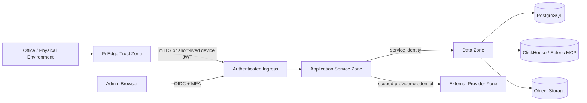

# Security, Observability, Reliability, and Operations

## 1. Purpose

This document defines the production controls required for the Seleric Voice Node V1. The architecture is intentionally small, but it handles confidential company metrics, meeting audio, employee commitments, device credentials, and executive recommendations. The MVP therefore needs explicit trust boundaries, least-privilege authorization, auditable decisions, recovery procedures, and privacy controls from the first release.

## 2. Security objectives

1. A compromised Raspberry Pi must not provide direct database access.
2. A voice utterance must not authorize financially consequential actions.
3. Every business answer must be attributable to certified data, published configuration, and versioned logic.
4. Meeting recording must be visible, consent-aware, encrypted, retained according to policy, and deletable.
5. Configuration changes must be reviewed, simulated, published, and reversible.
6. Service credentials must be scoped to the minimum API and brand boundary required.
7. Failed or stale data must produce a safe degraded response rather than an apparently confident answer.
8. The platform must recover from network loss, duplicate requests, worker crashes, and provider failure without corrupting state.

## 3. Trust boundaries



### 3.1 Edge zone

Contains microphone capture, local wake word, local VAD, playback, LED/button state, short-lived conversation state, and encrypted meeting spool. It contains no warehouse credentials and no reusable administrator token.

### 3.2 Application zone

Contains the six backend services. Internal endpoints are not internet-accessible. Each service has a distinct identity, database role, and allowed operation set.

### 3.3 Data zone

Contains certified metric access, configuration/operational state, analytical history, and audio/transcript objects. Network access is private wherever the deployment environment permits it.

### 3.4 Provider zone

Contains optional managed STT/TTS or identity providers. Only the minimum audio/text required for the configured provider is transmitted. Provider use is configurable and logged.

## 4. Identity and authentication

### 4.1 Human users

Use an external OIDC provider.

Azure profile:

- Microsoft Entra ID
- Authorization Code Flow with PKCE
- MFA required for configuration approvers and security administrators
- Group-to-role mapping

On-prem profile:

- Keycloak or an existing enterprise OIDC provider
- The same role and scope claims used in Azure

### 4.2 Device enrollment

Each device has:

```text
device_id
device_public_key or client certificate
assigned_brand_ids
assigned_user_id
hardware_profile
permission_profile
credential_issued_at
credential_expires_at
revoked_at
last_seen_at
```

Enrollment flow:

1. Administrator creates a pending device record.
2. Device generates a private key locally.
3. Administrator verifies a one-time pairing code.
4. Control Plane registers the public key/certificate.
5. Device receives a short-lived access token.
6. Long-lived private key remains on the device with file-system permissions restricted to the device service account.

### 4.3 Service identities

Each service uses a separate database role and workload identity.

Example access matrix:

| Service | PostgreSQL rights | Object storage rights | Seleric MCP rights |
|---|---|---|---|
| Voice Orchestrator | dialogue/session read-write | none | none |
| Business State | state/config read-write | model artifact read | metrics read |
| Insight Decision | brief/trace read-write; config/state read | none | deterministic explain read |
| Meeting Intelligence | meeting/commitment read-write | meeting prefix read-write | certified verification read |
| Control Plane | configuration/audit read-write | config export read-write | catalogue metadata read |
| Admin UI | no direct database rights | none | none |

The Admin UI calls domain APIs only.

## 5. Authorization model

### 5.1 Roles

```text
Founder
ExecutiveViewer
BusinessAdministrator
MetricSteward
OntologyEditor
PolicyApprover
MeetingReviewer
SecurityAdministrator
Auditor
ServiceIdentity
DeviceIdentity
```

### 5.2 Scopes

```text
executive:read
brief:read
meeting:start
meeting:review
commitment:approve
commitment:verify
config:read
config:draft
config:validate
config:approve
config:publish
config:rollback
device:enroll
device:revoke
audit:read
```

### 5.3 Brand isolation

Every persisted command, query, event, and object includes `brand_id`. Authorization evaluates both scope and brand membership. A service or user authorized for one brand cannot infer object existence in another brand.

### 5.4 Voice authorization limit

The V1 voice path is read-only except for starting/stopping meeting capture. Recommendations do not directly change campaigns, prices, budgets, financial records, or operational systems. Future write actions require a separate approval channel and typed action contract.

## 6. Secret management

### Azure

- Azure Key Vault for provider credentials, signing keys, and database secrets where managed identity is not available
- Managed identity preferred over stored credentials
- Key Vault references injected at runtime
- No secrets in container images, Git, Appsmith configuration exports, or Pi images

### On-prem

- SOPS plus age keys, or Vault if already operated
- Docker secrets or mounted root-owned files
- Secrets rotated independently of application deployment

### Device

- Device private key and refresh material stored under a dedicated Linux service account
- Read permission limited to the device daemon
- Token cache encrypted where practical
- Remote revocation supported

## 7. Data protection and privacy

### 7.1 Encryption

- TLS 1.2 or later for all network traffic
- mTLS preferred for device-to-gateway and service-to-service links
- PostgreSQL and object storage encrypted at rest
- Meeting audio encrypted before or during upload
- Backup encryption enabled

### 7.2 Meeting consent

The device must present an unmistakable recording state through LED and audible acknowledgement. The organization must define a consent policy appropriate to jurisdiction and internal HR policy.

Required behavior:

- `Start this meeting` produces an audible confirmation
- LED remains in a distinct recording state
- Physical stop/mute control always works locally
- Recording start/stop times are written to audit history
- Participant consent status can be captured in the meeting record
- A meeting cannot silently resume after a restart

### 7.3 Data minimization

- Wake-word audio is processed locally and not retained
- Non-triggered ambient audio is discarded
- Voice-query audio retention is disabled by default; transcripts may be retained according to policy
- Raw meeting audio retention is configurable independently from transcript and commitment retention
- The business response contains only required metrics and evidence, not unrestricted table extracts

### 7.4 Suggested retention classes

| Data class | Default V1 retention | Configurable range |
|---|---:|---:|
| Wake-word frames | 0 | fixed 0 |
| Voice-query audio | 0 | 0-7 days |
| Voice transcript/session | 30 days | 7-180 days |
| Raw meeting audio | 90 days | 30-365 days |
| Meeting transcript | 365 days | 90 days-indefinite under policy |
| Commitments/decisions | operational lifetime + 1 year | policy-controlled |
| Executive briefs/traces | 365 days | 90 days-7 years |
| Audit records | 2 years | organization policy |
| Model/config artifacts | active lifetime + superseded versions | organization policy |

Deletion must remove or cryptographically render inaccessible the relevant audio and transcript objects while preserving a minimal compliance audit entry where required.

## 8. Threat model and controls

| Threat | Control |
|---|---|
| Stolen Pi | Device certificate revocation; no DB credentials; encrypted spool; least-privilege token |
| Spoofed wake word | Tuned threshold; optional speaker/presence confirmation; read-only voice actions |
| Replay of a voice command | Short conversation nonce; timestamps; no consequential voice writes |
| Prompt/tool injection through speech | Deterministic intent grammar and allowlisted handlers; no generic SQL/code tool |
| Compromised admin browser | OIDC MFA, short sessions, CSRF protection, role separation, approval workflow |
| Malicious config | Schema validation, adapter allowlist, simulation, two-person approval, rollback |
| Metric-definition ambiguity | Certified catalogue IDs, version pinning, provenance and validation checks |
| Model drift | Backtest gates, monitoring, rollback to deterministic baseline |
| False causal statement | V1 language says “suspected driver”; declared dependency and temporal evidence shown |
| Transcript leakage | Private object storage, scoped URLs, no public buckets, retention/deletion controls |
| Dependency/supply-chain compromise | Version pinning, SBOM, license scan, signature/provenance checks, CVE monitoring |
| Worker duplicate execution | Idempotency keys, unique job keys, transactional outbox, state-machine guards |
| Provider outage | Configurable provider fallback, local/offline fallback where available, explicit degraded response |

## 9. Audit and decision trace

Every externally visible response receives a `trace_id`. The trace links:

```text
voice session
-> normalized intent and classifier version
-> active configuration version
-> certified metric IDs and Seleric query IDs
-> catalogue version and freshness
-> feature/detector/model versions
-> node health results
-> root-driver hypotheses
-> candidate eligibility decisions
-> ranking components
-> selected intervention IDs
-> response template version
-> spoken response
```

Configuration and meeting actions additionally record actor, time, before/after values, approval, and reason.

Audit records are append-only at application level. Corrections are new events, not destructive edits.

## 10. Observability architecture

Use OpenTelemetry instrumentation across edge and backend.

### 10.1 Signals

- Traces: one end-to-end trace per voice query, state job, meeting pipeline, verification run, and config publication
- Metrics: technical, data freshness, model quality, decision quality, meeting quality
- Logs: structured JSON with trace/span IDs and no raw secrets
- Business events: versioned domain events written through the outbox

### 10.2 Core technical metrics

```text
edge_online
device_reconnect_count
wake_detection_latency_ms
wake_false_positive_count
stt_first_partial_latency_ms
intent_resolution_latency_ms
state_api_latency_ms
priority_api_latency_ms
tts_first_audio_latency_ms
barge_in_stop_latency_ms
http_request_duration_ms
http_error_count
job_queue_depth
job_retry_count
worker_lease_expiry_count
object_upload_failure_count
database_pool_saturation
```

### 10.3 Data and decision metrics

```text
metric_freshness_age_seconds
metric_query_warning_count
state_snapshot_success_rate
state_snapshot_lag_seconds
config_bundle_version
config_publish_failure_count
forecast_backtest_error
prediction_interval_coverage
anomaly_alert_rate
anomaly_false_positive_rate_after_review
candidate_generated_count
candidate_rejected_count_by_rule
founder_brief_item_count
duplicate_root_cause_suppression_count
brief_acknowledgement_rate
recommendation_outcome_observed_rate
```

### 10.4 Meeting metrics

```text
meeting_audio_gap_seconds
transcription_realtime_factor
speaker_diarization_unresolved_ratio
extraction_review_change_rate
commitment_missing_owner_rate
commitment_missing_deadline_rate
commitment_evidence_coverage
verification_on_time_rate
verified_count
breached_count
unverifiable_count
```

## 11. SLOs and error budgets

### 11.1 Interactive SLOs

| SLO | Target |
|---|---:|
| Local wake acknowledgement | p95 < 250 ms after accepted wake |
| Barge-in playback stop | p95 < 300 ms |
| Cached/precomputed executive answer first audio | p95 < 2.5 s |
| Non-cached bounded analytical answer first audio | p95 < 6 s |
| Supported intent resolution | >= 95% golden-set accuracy |
| Low-confidence false execution | 0 in acceptance set |

A single end-to-end target below 650 ms is not a dependable MVP requirement because cloud STT, network round trips, bounded data access, NLG, and TTS each contribute variable latency. The platform reports per-stage latency instead.

### 11.2 Data SLOs

| SLO | Target |
|---|---:|
| Hourly operational-state freshness | <= 90 minutes under normal pipeline operation |
| Daily finalized financial state | according to certified MCP finality policy |
| State job success | >= 99% monthly |
| Every executive numeric statement with provenance | 100% |
| Every selected intervention with decision trace | 100% |

### 11.3 Meeting SLOs

| SLO | Target |
|---|---:|
| Audio part acknowledgement | >= 99.9% |
| Post-meeting transcript available | within 15 minutes for a 60-minute meeting under normal capacity |
| Extracted commitment with source evidence | 100% |
| Unapproved commitment becoming active | 0 |
| Verification result with evidence | 100% |

## 12. Health endpoints

Every service exposes:

```text
GET /health/live
GET /health/ready
GET /health/dependencies
GET /metrics
```

Readiness evaluates only dependencies required to serve requests. A failed optional provider does not necessarily make the service unready if a configured fallback exists.

The Control Plane exposes the active runtime bundle version and adapter compatibility report. The Business State Service exposes last successful state-bucket timestamps by brand and profile.

## 13. Backup and recovery

### 13.1 PostgreSQL

Back up:

- Configuration revisions and runtime pointers
- Meetings, transcripts metadata, commitments and verifications
- Dialogue references and decision traces
- Job and outbox state

Recommended V1 objectives:

```text
RPO: 15 minutes for operational/configuration data
RTO: 4 hours
```

Perform a restore drill before the September demo and at least quarterly afterwards.

### 13.2 Object storage

- Versioning enabled where supported
- Lifecycle rules for audio/model/config exports
- Cross-location replication optional after MVP
- Object checksums validated on upload and read
- Database references are not marked complete until object checksum confirmation succeeds

### 13.3 ClickHouse/state history

The executive-state mart can be recomputed from certified source metrics and versioned configuration. Retain config/model versions needed for reproducibility.

## 14. Deployment operations

### Azure profile

- Azure Container Apps for APIs and workers
- Minimum one warm replica for interactive Voice Orchestrator and Insight Decision APIs during office hours
- Jobs or scale-to-zero workers for transcription, state refresh, and verification where cold-start latency is acceptable
- Azure Database for PostgreSQL Flexible Server with private networking
- Azure Blob Storage for meeting/model objects
- Azure Key Vault
- Application Insights/Log Analytics through OpenTelemetry
- Azure Container Registry

### On-prem profile

- Docker Compose or Podman Compose on one or two Linux hosts
- Caddy or Traefik for TLS and ingress
- PostgreSQL
- MinIO
- OpenVoiceOS STT/TTS services
- OpenTelemetry Collector, Prometheus, Loki, and Grafana
- Keycloak or existing OIDC

### Hybrid recommendation

Run certified data systems and sensitive meeting storage where already operated; run stateless APIs in Azure Container Apps if operational simplicity is more valuable. All provider choices remain adapter configuration, not domain-code changes.

## 15. Release and supply-chain controls

- Lock dependencies with hashes
- Build immutable OCI images
- Generate SBOM for every release
- Run SAST, dependency, secret, and container scans
- Sign release images where the platform supports it
- Record source commit and image digest in deployment metadata
- Use database migrations with forward and tested rollback/repair procedures
- Run contract, golden, and failure-injection tests before publication
- Publish configuration separately from application deployment

## 16. Operational runbooks

### Runbook A: Seleric MCP unavailable

1. Circuit-break new metric requests.
2. Serve only still-valid precomputed briefs when their TTL permits it.
3. Announce the `as_of` time and degraded status.
4. Do not generate a fresh top-three brief.
5. Alert the data/platform owner.

### Runbook B: State is stale

1. Mark affected metric and nodes `STALE`.
2. Reject candidates relying on stale evidence.
3. Surface data-health risk if material.
4. Retry the state job using bounded backoff.

### Runbook C: STT provider unavailable

1. Switch to configured secondary adapter where allowed.
2. If no provider is available, provide an audible offline/error cue.
3. Preserve a local meeting spool and upload later; do not lose already recorded parts.

### Runbook D: Bad configuration publication

1. Freeze automated alerts and new state jobs if safety validation fails.
2. Roll runtime pointer back to previous known-good version.
3. Recompute affected state buckets.
4. Record incident and publication reason.

### Runbook E: Meeting worker fails

1. Leave meeting in retryable pipeline state.
2. Preserve raw audio and idempotency keys.
3. Retry transcription/extraction separately.
4. Never activate partial commitments without review.

### Runbook F: Device stolen or lost

1. Revoke device certificate/token.
2. Invalidate active sessions.
3. Review last connection and audit activity.
4. Rotate any device-specific provider token if one existed.
5. Wipe or replace device.

## 17. Definition of operational readiness

The MVP is operationally ready only when:

- Device revoke and reconnect tests pass
- Database backup and restore drill passes
- Stale-data behavior is demonstrated
- MCP/provider outage behavior is demonstrated
- Every target query produces a trace
- Meeting deletion and retention behavior is tested
- Configuration rollback is tested
- Duplicate meeting upload and duplicate verification execution are harmless
- Alerting reaches the assigned service owner
- The fallback demo path is prepared
