# Data Model and Persistence Design

**Scope:** Physical and logical persistence blueprint for Seleric Voice Node V1  
**Primary principle:** Reuse the existing Seleric metric plane; persist only the new ontology, goal, state, decision, voice, meeting, and control-plane objects required by this platform.

**Changed 2026-08-31:** the agent-swarm reasoning model requires new persistent structures — the Seleric Blackboard (case records, hypotheses, agent messages, task/bid records, proposed actions), the Agent Registry and reputation tracking, and Governor policy. All of it lives in the existing PostgreSQL instance; no new datastore is introduced (doc 01 §3a). §6.9 and §10a below are the new schema; meetings/commitments/config-versioning (§7, §9, §11) are unaffected and preserved as-is.

## 1. Persistence Decisions

V1 uses three persistence classes:

| Persistence class | Selected system | Purpose |
|---|---|---|
| Transactional and configuration state | PostgreSQL (with the `pgvector` extension enabled) | Service-owned aggregates, configuration revisions, current snapshots, jobs, outbox, audit, meetings, commitments, and — new — the Seleric Blackboard (cases/hypotheses/messages/tasks/bids), Agent Registry, agent reputation, and Governor policy |
| High-volume analytical history | Existing ClickHouse | Metric-state history, detector/forecast history, node-health history, decision-performance history |
| Binary and large immutable artifacts | S3-compatible object storage or Azure Blob | Meeting audio, transcript artifacts, model artifacts, evaluation sets, exports |

The existing Seleric MCP, Cube semantic layer, and warehouse remain the source of truth for certified business metrics. The Voice Node platform does not copy raw ad, commerce, attribution, session, or product facts into PostgreSQL.

## 2. Why These Stores Are Explicitly Needed

### PostgreSQL

Needed because V1 requires:

- transactions across business objects and their outbox events;
- immutable configuration revisions and effective dating;
- referential integrity for ontology, goals, interventions, meetings, and commitments;
- reliable delayed jobs without adding Redis, Kafka, or Temporal;
- row-level authorization by brand;
- JSONB only where adapter-specific parameters are genuinely dynamic.

### ClickHouse

Needed because derived state and detector history can grow quickly across metric, entity, time, and model versions. ClickHouse is already part of Seleric and is better suited to time-window comparisons, backtests, and state-history analytics than the transactional database.

### Object storage

Needed because audio and model artifacts should not be stored as PostgreSQL byte arrays. Object storage provides checksums, lifecycle policies, legal deletion, versioning, and low-cost archive tiers.

## 3. Database Ownership and Boundary Rules

V1 may use one PostgreSQL cluster, but each backend service owns a separate schema.

```text
voice.*       owned by voice-orchestrator
control.*     owned by control-plane-service
state.*       owned by business-state-service
decision.*    owned by insight-decision-service
meeting.*     owned by meeting-intelligence-service
platform.*    technical queue, outbox relay, audit and identity projections
```

Rules:

1. A service is the only writer to its schema.
2. Cross-service reads occur through versioned APIs or replicated read projections, not direct joins in request handlers.
3. Foreign identifiers across service boundaries are stored as opaque IDs rather than database foreign keys.
4. Transactions never span service schemas.
5. State changes publish outbox events in the same transaction as the aggregate update.
6. Consumers are idempotent and record processed event IDs.
7. One cluster does not mean one shared domain model. Schemas remain independently migratable and extractable.
8. Admin UI never connects directly to PostgreSQL. It calls the Control Plane API.

## 4. Common Column and Identifier Standard

All business tables use:

```text
id                  UUIDv7 or sortable ULID
brand_id            BIGINT NOT NULL
created_at          TIMESTAMPTZ NOT NULL
created_by          TEXT/UUID where applicable
updated_at          TIMESTAMPTZ NOT NULL
version             BIGINT NOT NULL for optimistic locking
```

Where applicable:

```text
status              TEXT with CHECK constraint or lookup validation
effective_from      TIMESTAMPTZ
effective_to        TIMESTAMPTZ NULL
config_version      TEXT NOT NULL
schema_version      INTEGER NOT NULL
trace_id            TEXT
correlation_id      TEXT
idempotency_key     TEXT
```

### Design conventions

- Use `NUMERIC`, not floating point, for money and business ratios stored as authoritative values.
- Use floating point only for model scores where exact decimal arithmetic is not required.
- Store timestamps in UTC; retain source timezone and use `Asia/Kolkata` for business-window evaluation.
- Store money with an explicit `currency_code`.
- Do not use PostgreSQL ENUM for frequently extended business vocabularies; use validated text and configuration registries.
- Use JSONB for adapter parameters, dimension filters, explanation payloads, and immutable input snapshots—not for core identifiers or lifecycle fields.
- Hash immutable payloads with SHA-256 for audit and replay.

## 5. Multi-Brand and Authorization Model

Every domain row that can contain business data carries `brand_id`.

### Row-level security

PostgreSQL RLS policies enforce:

```text
row.brand_id IN current_request_allowed_brand_ids
```

The service sets a transaction-local security context after validating the JWT/service token. Background workers receive an explicit `brand_id` in every job payload and set the same context.

### Global objects

Objects intended for every brand use a separate `scope_type`:

```text
scope_type = GLOBAL | BRAND
scope_brand_id = NULL for GLOBAL
```

A runtime bundle resolves global defaults first, then brand overrides. Overrides cannot modify immutable platform-security policies.

## 6. Control Plane Schema

The Control Plane is the only source of configuration truth.

### 6.1 `control.config_object`

Stores the stable identity of a configurable object.

| Column | Type | Notes |
|---|---|---|
| `config_object_id` | UUID/ULID PK | Stable identity across revisions |
| `brand_id` | BIGINT | Brand scope |
| `object_type` | TEXT | `business_node`, `edge`, `goal`, `metric_binding`, `policy`, `template`, `provider_profile`, etc. |
| `object_key` | TEXT | Human-stable unique key within type and brand |
| `display_name` | TEXT | Admin display name |
| `active_revision_id` | UUID NULL | Published revision currently active |
| `status` | TEXT | ACTIVE, ARCHIVED |
| `version` | BIGINT | Optimistic lock |

Unique index:

```text
(brand_id, object_type, object_key)
```

### 6.2 `control.config_revision`

Immutable revision payload.

| Column | Type | Notes |
|---|---|---|
| `revision_id` | UUID PK | Revision identity |
| `config_object_id` | UUID FK | Stable object |
| `revision_number` | INTEGER | Monotonic per object |
| `payload` | JSONB | Schema-validated object payload |
| `payload_hash` | TEXT | SHA-256 canonical payload hash |
| `schema_version` | INTEGER | Payload schema version |
| `lifecycle_status` | TEXT | DRAFT, VALIDATED, APPROVED, PUBLISHED, RETIRED |
| `effective_from` | TIMESTAMPTZ NULL | Scheduled activation |
| `effective_to` | TIMESTAMPTZ NULL | Optional retirement |
| `change_reason` | TEXT | Required |
| `created_by` | TEXT | Actor |
| `created_at` | TIMESTAMPTZ | Timestamp |

Unique index:

```text
(config_object_id, revision_number)
```

No update is permitted after `PUBLISHED`; corrections create a new revision.

### 6.3 `control.change_set`

Groups changes into one review and publication unit.

```text
change_set_id
brand_id
base_bundle_version
status
reason
created_by
reviewed_by
approved_by
created_at
validated_at
approved_at
published_at
```

### 6.4 `control.change_set_item`

```text
change_set_id
revision_id
operation          UPSERT | RETIRE
validation_status
validation_messages JSONB
recompute_scope     JSONB
```

### 6.5 `control.runtime_bundle`

Immutable, fully resolved configuration consumed by runtime services.

```text
bundle_id
brand_id
bundle_version
payload_uri_or_json
payload_hash
catalogue_version
status              STAGED | ACTIVE | ROLLED_BACK | RETIRED
effective_at
published_by
published_at
previous_bundle_id
```

A unique partial index allows only one active bundle per brand.

### 6.6 `control.validation_run`

```text
validation_run_id
change_set_id
validator_id
validator_version
started_at
completed_at
status
errors JSONB
warnings JSONB
simulation_result_uri
```

### 6.7 `control.device_registration`

```text
device_id
brand_id
device_name
hardware_profile
certificate_thumbprint
assigned_user_id
status
last_seen_at
config_channel
current_edge_config_version
revoked_at
```

### 6.8 `control.provider_profile`

Stores non-secret provider configuration.

```text
provider_profile_id
brand_id
capability          STT | TTS | DIARIZATION | OBJECT_STORAGE | TASK_TRACKER
adapter_id
parameter_json
secret_reference_ids JSONB
priority
healthcheck_policy
fallback_profile_id
active
```

Actual secret values live in Key Vault/Vault/environment secret stores and are referenced by opaque secret IDs.

### 6.9 `control.governor_policy` [new]

Versioned Governor policy — uses the identical `config_object`/`config_revision` lifecycle as every other configuration object (§6.1-6.2); this table stores the resolved, publishable payload shape for clarity.

```text
governor_policy_id
brand_id
config_revision_id          -- FK to control.config_revision; publish/rollback reuses §6.2 machinery
tool_permissions JSONB       -- {agent_role: {problem_class: [tool_id, ...]}}
spend_limits JSONB           -- {per_case, per_day, per_agent_role, currency_code}
pii_access_rules JSONB       -- {agent_role: [field_class, ...]}
external_comm_allowed BOOLEAN DEFAULT FALSE
production_write_allowlist JSONB   -- explicit allowed write operation types, empty by default
api_spend_limits JSONB       -- LLM token/cost ceilings, per case/day/role
agent_spawn_limits JSONB     -- {max_concurrent_per_case, max_concurrent_system_wide}
max_iteration_count INTEGER NOT NULL
approval_gates JSONB         -- {action_type: required_approval_role}
hard_ceiling_version TEXT NOT NULL   -- references the platform-code-enforced maximum this policy cannot exceed
active BOOLEAN
```

Validation (doc 08 §3.17): every `tool_permissions` entry must reference a real registered tool port; no policy revision may set any limit above its `hard_ceiling_version` ceiling regardless of admin input; removing an existing `approval_gates` entry for a previously gated action requires two-person approval.

## 7. Voice Orchestrator Schema

Voice data is deliberately small and short-lived.

### 7.1 `voice.dialogue_session`

```text
session_id
brand_id
device_id
user_id
started_at
ended_at
status
active_intent_catalogue_version
active_runtime_bundle_version
last_brief_id
last_intervention_id
last_meeting_id
locale
trace_id
expires_at
```

Indexes:

```text
(device_id, status)
(user_id, started_at DESC)
(expires_at)
```

### 7.2 `voice.dialogue_turn`

```text
turn_id
session_id
brand_id
sequence_number
started_at
completed_at
transcript_text_encrypted_or_redacted
intent_id
intent_confidence
handler_id
request_payload_hash
response_payload JSONB
response_template_id
status
latency_ms
trace_id
```

Retention is short and configurable. Raw command audio is disabled by default.

### 7.3 `voice.session_reference`

Stores only references needed for “Why?” and pronoun resolution.

```text
reference_id
session_id
reference_type      BRIEF | INTERVENTION | NODE | MEETING | COMMITMENT
reference_value
turn_id
created_at
expires_at
```

### 7.4 `voice.device_delivery`

Tracks proactive messages sent to devices.

```text
delivery_id
brand_id
device_id
notification_id
priority
payload JSONB
status              QUEUED | SENT | ACKNOWLEDGED | EXPIRED | FAILED
attempt_count
next_attempt_at
sent_at
acknowledged_at
```

## 8. Business State Schema

### 8.1 Configuration projections

The Business State Service consumes published configuration and owns query-optimized projections.

#### `state.business_node_projection`

```text
node_id
brand_id
node_key
node_type
name
owner_ref
criticality
tags TEXT[]
active
config_version
```

#### `state.business_edge_projection`

```text
edge_id
brand_id
from_node_id
to_node_id
edge_type            DEPENDS_ON | INFLUENCES | MEASURED_BY | OWNS
weight
confidence
lag_seconds
validated_causal     BOOLEAN DEFAULT FALSE
active
config_version
```

Acyclicity is validated for dependency edges at publication time. Non-dependency association edges need not form a DAG.

#### `state.metric_binding_projection`

```text
binding_id
brand_id
node_id
metric_id
dimension_scope JSONB
weight
aggregation_basis
freshness_policy_id
active
config_version
```

#### `state.goal_projection`

```text
goal_id
brand_id
node_id
binding_id
goal_key
target_type          ABSOLUTE | MINIMUM | MAXIMUM | RANGE | CHANGE | RUN_RATE
target_value
lower_value
upper_value
tolerance_value
period_definition JSONB
criticality
owner_ref
escalation_policy_id
effective_from
effective_to
config_version
```

### 8.2 `state.metric_state_current`

Latest published state per metric key.

```text
state_id
brand_id
metric_key_hash
metric_id
node_id
binding_id
entity_scope JSONB
as_of_ts
window_start
window_end
actual_value
baseline_value
target_value
lower_expected
upper_expected
currency_code
finality             INTRADAY | PROVISIONAL | FINAL
freshness_status     CURRENT | LATE | STALE | UNKNOWN
data_confidence
health_status        HEALTHY | WATCH | DEGRADED | CRITICAL | UNKNOWN
feature_json
forecast_ref
anomaly_ref
evidence_refs JSONB
catalogue_version
config_version
feature_profile_version
detector_profile_version
forecast_profile_version
state_run_id
updated_at
```

Unique index:

```text
(brand_id, metric_key_hash)
```

Indexes:

```text
(brand_id, node_id, health_status)
(brand_id, as_of_ts DESC)
(brand_id, freshness_status)
```

### 8.3 `state.node_health_current`

```text
node_health_id
brand_id
node_id
as_of_ts
score
band                 GREEN | YELLOW | RED | UNKNOWN
confidence
direct_goal_score
upstream_modifier
status_reason_codes TEXT[]
goal_evaluations JSONB
evidence_refs JSONB
config_version
health_strategy_version
state_run_id
updated_at
```

Unique index:

```text
(brand_id, node_id)
```

An unknown or stale node is never coerced to green.

### 8.4 `state.forecast_output_current`

```text
forecast_id
brand_id
metric_key_hash
model_profile_id
model_version
scored_at
horizon_start
horizon_end
point_forecast
lower_bound
upper_bound
coverage_level
validation_metrics JSONB
calibration_status
input_snapshot_hash
artifact_uri
expires_at
```

### 8.5 `state.anomaly_output_current`

```text
anomaly_id
brand_id
metric_key_hash
detector_profile_id
detector_version
scored_at
observed_value
expected_value
residual
normalized_severity
threshold
is_anomaly
change_point_flag
confidence
reason_codes TEXT[]
input_snapshot_hash
expires_at
```

### 8.6 `state.state_refresh_run`

```text
state_run_id
brand_id
trigger_type          SCHEDULED | CONFIG_CHANGE | MANUAL | EVENT
requested_scope JSONB
runtime_bundle_version
catalogue_version
started_at
completed_at
status
metric_count
success_count
unknown_count
failed_count
warning_count
error_summary JSONB
trace_id
```

### 8.7 Evidence registry

`state.evidence_reference` keeps each conclusion traceable without duplicating all query rows.

```text
evidence_id
brand_id
evidence_type        MCP_QUERY | STATE_SNAPSHOT | MODEL_OUTPUT | MEETING_UTTERANCE | VERIFICATION
source_system
source_reference
query_id
metric_ids TEXT[]
time_range JSONB
filters JSONB
value_snapshot JSONB
freshness_snapshot JSONB
catalogue_version
payload_hash
created_at
retention_class
```

## 9. ClickHouse State-History Tables

Current snapshots remain in PostgreSQL for low-latency reads. Every completed run appends immutable history to ClickHouse.

### 9.1 `seleric_state.metric_state_history`

Suggested engine:

```text
MergeTree
PARTITION BY toYYYYMM(as_of_ts)
ORDER BY (brand_id, metric_id, metric_key_hash, as_of_ts, state_run_id)
```

Columns mirror the stable analytical subset of `metric_state_current`, including actual, baseline, target, features, finality, confidence, profile/model versions, and evidence IDs.

### 9.2 `seleric_state.node_health_history`

```text
PARTITION BY toYYYYMM(as_of_ts)
ORDER BY (brand_id, node_id, as_of_ts, state_run_id)
```

### 9.3 `seleric_state.forecast_history`

```text
PARTITION BY toYYYYMM(scored_at)
ORDER BY (brand_id, metric_key_hash, model_profile_id, scored_at, horizon_end)
```

### 9.4 `seleric_state.anomaly_history`

```text
PARTITION BY toYYYYMM(scored_at)
ORDER BY (brand_id, metric_key_hash, detector_profile_id, scored_at)
```

### 9.5 History finalization

Because some Seleric cost facts become final after a lag, a later refresh appends a new record with a newer `state_run_id` and finality. History is not updated in place. Consumer views use the latest successful version per metric key and as-of bucket.

## 10. Insight Decision Schema

**Changed 2026-08-31:** §10.2-10.6 below (`analysis_run`, `root_driver_hypothesis`, `intervention_candidate`, `eligibility_evaluation`, `consolidation_group`) described the retired deterministic pipeline's working tables. They are superseded by the Blackboard schema in §10a (`swarm_case` replaces `analysis_run`, `swarm_hypothesis` replaces `root_driver_hypothesis`, `proposed_action` replaces the eligible/selected slice of `intervention_candidate`). They are kept below, unmodified, only as a historical reference for anyone reading old data or old traces created before this cutover — no new rows are written to them. `decision.founder_brief` and `decision.founder_brief_item` (§10.7-10.8) are **not** retired: their shape is unchanged, only `decision_trace_id` now points at a `swarm_case`/message-trace bundle instead of a formula `decision_trace` row (§10.9 is likewise kept for historical rows; new traces are the message log in `decision.swarm_message`, §10a.4).

### 10.1 Configuration projections

#### `decision.intervention_template_projection`

```text
intervention_template_id
brand_id
template_key
applicable_node_types TEXT[]
applicable_metric_ids TEXT[]
action_template
expected_outcome_template
default_owner_ref
founder_leverage_default
precondition_definition JSONB
verification_rule_template_id
active
config_version
```

#### `decision.policy_projection`

Stores resolved eligibility, consolidation, ranking, notification, and NLG policies.

```text
policy_id
brand_id
policy_type
policy_key
parameters JSONB
policy_version
active
config_version
```

### 10.2 `decision.analysis_run`

```text
analysis_run_id
brand_id
trigger_type
state_run_id
runtime_bundle_version
started_at
completed_at
status
candidate_count
eligible_count
consolidated_count
selected_count
trace_id
```

### 10.3 `decision.root_driver_hypothesis`

```text
hypothesis_id
brand_id
analysis_run_id
root_node_id
hypothesis_type       DECLARED_DEPENDENCY | VALIDATED_CAUSAL | CORRELATIONAL
symptom_node_ids JSONB
path_edge_ids JSONB
evidence_score
confidence
alternative_hypotheses JSONB
reason_codes TEXT[]
```

The default V1 label is `DECLARED_DEPENDENCY`, not causal proof.

### 10.4 `decision.intervention_candidate`

```text
candidate_id
brand_id
analysis_run_id
root_cause_key
root_node_id
hypothesis_id
intervention_template_id
action_text_structured JSONB
expected_outcome JSONB
owner_ref
founder_required
financial_exposure_low
financial_exposure_expected
financial_exposure_high
currency_code
severity
urgency
actionability
evidence_confidence
data_confidence
founder_leverage
raw_score
normalized_score
status                GENERATED | INELIGIBLE | ELIGIBLE | CONSOLIDATED | SELECTED | DISMISSED
reason_codes TEXT[]
evidence_refs JSONB
preconditions JSONB
created_at
```

Indexes:

```text
(brand_id, analysis_run_id, status, normalized_score DESC)
(brand_id, root_cause_key, created_at DESC)
```

### 10.5 `decision.eligibility_evaluation`

```text
eligibility_evaluation_id
candidate_id
policy_id
policy_version
result                PASS | FAIL | UNKNOWN
reason_code
detail JSONB
evaluated_at
```

### 10.6 `decision.consolidation_group`

```text
consolidation_group_id
analysis_run_id
brand_id
root_cause_key
representative_candidate_id
member_candidate_ids JSONB
consolidation_strategy_version
```

### 10.7 `decision.founder_brief`

```text
brief_id
brand_id
as_of_ts
case_id              -- was analysis_run_id; FK to decision.swarm_case (§10a.1)
state_run_id
status                GENERATED | PUBLISHED | SUPERSEDED | EXPIRED
summary_status
confidence            -- new: case.final_confidence carried onto the published brief
runtime_bundle_version
governor_policy_version   -- new
catalogue_version
data_freshness JSONB
decision_trace_id      -- kept for historical rows predating 2026-08-31; new rows use case_id as the trace anchor
published_at
expires_at
```

### 10.8 `decision.founder_brief_item`

```text
brief_item_id
brief_id
rank
candidate_id
title
spoken_action
why_now
expected_impact_text
evidence_refs JSONB
founder_required
precondition_status
```

Unique index:

```text
(brief_id, rank)
```

Database constraint or application invariant enforces `rank BETWEEN 1 AND 3` and at most three items.

### 10.9 `decision.decision_trace`

```text
decision_trace_id
brand_id
analysis_run_id
input_state_hash
candidate_ids JSONB
excluded_candidate_ids JSONB
consolidation_groups JSONB
selected_candidate_ids JSONB
policy_versions JSONB
score_breakdowns JSONB
alternative_rankings JSONB
rendered_response_hash
created_at
```

### 10.10 `decision.notification`

```text
notification_id
brand_id
brief_id
candidate_id
notification_type
priority
channel_policy_id
status
scheduled_at
expires_at
acknowledged_by
acknowledged_at
```

## 10a. Seleric Blackboard, Agent Registry, and Reputation Schema [new, 2026-08-31]

All tables below are in the existing `decision.*` schema, owned exclusively by `insight-decision-service`, following the same ownership rules as §3. LangGraph's own PostgreSQL checkpointer manages its own internal tables (graph-state snapshots keyed by `thread_id`/checkpoint) the same way Procrastinate manages its own queue tables (§12.1) — `decision.swarm_case.case_id` is used as the LangGraph `thread_id` so a case's checkpoint history and its Blackboard record are joinable by the same key without a foreign key across library boundaries.

### 10a.1 `decision.swarm_case`

The case aggregate root (doc 06 §9.2a).

```text
case_id
brand_id
status                CaseStatus: OPEN | INVESTIGATING | CONVERGED | INCONCLUSIVE | ABANDONED
trigger_type          STATE_CHANGE | SCHEDULE | MANUAL | COMMITMENT_RISK | PRECEDENT_FOLLOWUP
observation            TEXT
urgency                URGENCY_LOW | URGENCY_MEDIUM | URGENCY_HIGH | URGENCY_CRITICAL
problem_class          TEXT  -- used for reputation/bid tie-break bucketing
opened_at
closed_at NULL
final_confidence NULL
outcome JSONB NULL      -- populated on close; later updated by outcome-confirmation job
outcome_confirmed_at NULL
resolution_summary TEXT NULL   -- feeds the embedding below
resolution_embedding VECTOR(1536) NULL   -- pgvector column; populated on close
runtime_bundle_version
governor_policy_version
langgraph_thread_id     -- equals case_id; documented alias for clarity at the LangGraph boundary
trace_id
```

Indexes:

```text
(brand_id, status, opened_at DESC)
(brand_id, problem_class, status)
ivfflat or hnsw index on resolution_embedding for pgvector similarity search
```

`resolution_embedding` is only populated on a closed case (`CONVERGED`/`INCONCLUSIVE`/`ABANDONED`) — an open case is never a valid precedent, since its own resolution is not yet known.

### 10a.2 `decision.swarm_evidence`

```text
evidence_id
case_id
brand_id
evidence_type          STATE_SNAPSHOT | MCP_QUERY | MEETING_UTTERANCE | COMMITMENT_RISK | PRECEDENT_CASE
source_reference        -- e.g. state.metric_state_current.state_id, or another swarm_case.case_id for precedent
value_snapshot JSONB
attached_by_agent_id NULL   -- null if attached by the system when the case opened
attached_at
```

Every `decision.swarm_hypothesis.evidence_refs` entry must resolve to a row here — this is the storage-level backing for the `HypothesisWithoutEvidence` invariant (doc 06 §9.2a).

### 10a.3 `decision.swarm_hypothesis`

```text
hypothesis_id
case_id
brand_id
proposing_agent_id
statement TEXT
hypothesis_type         DECLARED_DEPENDENCY | VALIDATED_CAUSAL | CORRELATIONAL   -- unchanged vocabulary from the retired deterministic RootDriverHypothesis
target_node_id
supporting_node_ids TEXT[]     -- ontology-grounded citations, SWARM-009
evidence_refs JSONB NOT NULL   -- must be non-empty; see 10a.2
confidence NUMERIC NOT NULL
status                   PROPOSED | CHALLENGED | SUPPORTED | REJECTED | ADOPTED
created_at
```

Check constraint: `evidence_refs` must not be an empty array — enforced at the database level in addition to the application-layer aggregate invariant, since this is the guarantee the entire "evidence-grounded, not free-form" principle (doc 02 §6) depends on.

### 10a.4 `decision.swarm_message`

The append-only agent-to-agent communication log — the core of the audit trail (doc 05 §34, doc 09 §9).

```text
message_id
case_id
brand_id
from_agent_id            -- 'governor' and 'coordinator' are valid pseudo-agent values for system messages
to_agent_id NULL          -- null = broadcast to all active agents on the case
message_type             OBSERVATION | HYPOTHESIS | CHALLENGE | RECRUIT | BID | VOTE | HANDOFF | GOVERNOR_DECISION | CONVERGENCE
payload JSONB
related_hypothesis_id NULL
related_evidence_ids JSONB NULL
created_at
```

Index: `(case_id, created_at)` — the full case debate trace is reconstructed by ordering this table by `created_at` for a `case_id`, which is exactly what the Admin swarm inspector (doc 08 §3.18) and the "Why?" explanation flow (doc 07 §4) read.

### 10a.5 `decision.swarm_task` and `decision.swarm_bid`

The task market (doc 06 §9.3a).

```text
-- decision.swarm_task
task_id
case_id
brand_id
description TEXT
problem_class
status              OPEN | BIDDING | ASSIGNED | DONE | ABANDONED
posted_by            -- 'coordinator' or an agent_id if an agent recruits sub-help
posted_at
assigned_bid_id NULL
```

```text
-- decision.swarm_bid
bid_id
task_id
agent_id
confidence NUMERIC
estimated_cost NUMERIC
expected_information_gain NUMERIC
expected_value NUMERIC        -- computed and stored at submission time for audit (doc 06 §9.3a formula)
submitted_at
selected BOOLEAN DEFAULT FALSE
```

Unselected bids are retained, not deleted — they are part of the audit trail showing what the Coordinator considered and why it did not pick them.

### 10a.6 `decision.proposed_action`

```text
action_id
case_id
brand_id
proposing_agent_id
hypothesis_id
action_text_structured JSONB
expected_outcome JSONB
owner_ref
governor_check_request JSONB
governor_decision              GRANT | DENY | PENDING_APPROVAL
governor_decision_reason_code
governor_policy_version
approved_by NULL                -- populated only if governor_decision was PENDING_APPROVAL and a human later approved
created_at
executed_at NULL
outcome_ref NULL
```

### 10a.7 `decision.coalition`

Temporary coalitions for broad problems (doc 06 §9.3a coalition path, SWARM-012).

```text
coalition_id
case_id
brand_id
member_agent_ids TEXT[]
formed_at
converged_at NULL
conclusion_summary NULL
reconciled_with_case BOOLEAN DEFAULT FALSE   -- true once the Coordinator has reconciled this coalition's output with the parent case
```

### 10a.8 `decision.agent_registry`

```text
agent_id                 -- e.g. 'observer', 'anomaly', 'diagnostic', 'prediction', 'strategy', 'experiment', 'skeptic'
brand_id
role                      -- one of the 7 initial roles; extensible via AgentDefinition config (SWARM-004)
capabilities TEXT[]
tool_ports TEXT[]
cost_profile JSONB
exposure_scope            INTERNAL  -- fixed to INTERNAL in V1; see doc 01 §3a.10 for the A2A-future field
config_version
active BOOLEAN
```

### 10a.9 `decision.agent_reputation`

```text
agent_id
problem_class
brand_id
accuracy NUMERIC
calibration NUMERIC
false_positive_rate NUMERIC
avg_cost NUMERIC
avg_speed_seconds NUMERIC
sample_count INTEGER
updated_at
```

Unique index: `(agent_id, problem_class, brand_id)`. Updated by a scheduled task-queue job that reads newly outcome-confirmed cases since the last run and applies the formula in doc 05 §39 — this is a read-model recomputation, not a hand-maintained field.

## 11. Meeting Intelligence Schema

### 11.1 `meeting.meeting`

```text
meeting_id
brand_id
device_id
meeting_type
status                STARTING | RECORDING | PROCESSING | REVIEW_REQUIRED | APPROVED | CLOSED | FAILED
started_at
stopped_at
created_by
expected_participants JSONB
recording_consent_state
locale
runtime_bundle_version
trace_id
```

### 11.2 `meeting.audio_part`

```text
audio_part_id
meeting_id
brand_id
part_number
object_uri
duration_ms
sample_rate
channel_count
codec
checksum
captured_at
uploaded_at
status
retention_class
```

Unique index:

```text
(meeting_id, part_number)
```

### 11.3 `meeting.transcription_run`

```text
transcription_run_id
meeting_id
provider_profile_id
model_name
model_version
vocabulary_version
started_at
completed_at
status
transcript_artifact_uri
word_alignment_artifact_uri
diarization_artifact_uri
quality_metrics JSONB
error_detail JSONB
```

### 11.4 `meeting.utterance`

```text
utterance_id
meeting_id
transcription_run_id
sequence_number
speaker_label
resolved_person_id NULL
start_ms
end_ms
text
transcript_confidence
speaker_confidence
resolution_method NULL
resolution_confidence NULL
source_word_refs JSONB
```

Indexes:

```text
(meeting_id, sequence_number)
(meeting_id, resolved_person_id)
```

### 11.5 `meeting.participant_assignment`

```text
participant_assignment_id
meeting_id
speaker_label
person_id
resolution_method      PRESELECTED | INTRODUCTION | CALENDAR | MANUAL | VOICE_PROFILE
confidence
review_status
supporting_utterance_ids JSONB
assigned_by
assigned_at
```

### 11.6 `meeting.extraction_run`

```text
extraction_run_id
meeting_id
extractor_profile_id
extractor_version
ontology_bundle_version
pattern_set_version
started_at
completed_at
status
quality_metrics JSONB
```

### 11.7 `meeting.extracted_decision`

```text
decision_id
meeting_id
extraction_run_id
decision_text
business_node_id NULL
owner_person_id NULL
status            DRAFT | APPROVED | REJECTED
confidence
source_utterance_ids JSONB
reviewed_by
reviewed_at
```

### 11.8 `meeting.commitment`

```text
commitment_id
meeting_id
brand_id
extraction_run_id
owner_person_id NULL
action_text
business_node_id NULL
target_metric_ids TEXT[]
deadline_at NULL
deadline_precision    EXACT | DAY | WEEK | RELATIVE_RESOLVED | MISSING
expected_outcome NULL
status                DRAFT | REVIEW_REQUIRED | APPROVED | IN_PROGRESS | VERIFIED | BREACHED | UNVERIFIABLE | CANCELLED
confidence
source_utterance_ids JSONB
verification_rule_id NULL
approved_by NULL
approved_at NULL
version
created_at
updated_at
```

Indexes:

```text
(brand_id, status, deadline_at)
(owner_person_id, status, deadline_at)
(meeting_id)
```

Missing owners and deadlines remain null and force review. They are never generated silently.

### 11.9 `meeting.review_action`

```text
review_action_id
meeting_id
object_type           PARTICIPANT | DECISION | COMMITMENT | TRANSCRIPT
object_id
action                APPROVE | REJECT | CORRECT | MERGE | SPLIT
before_payload JSONB
after_payload JSONB
reason
reviewer_id
created_at
```

### 11.10 `meeting.verification_rule`

```text
verification_rule_id
brand_id
rule_key
adapter_id
input_schema JSONB
parameters JSONB
success_condition JSONB
failure_condition JSONB
grace_period_seconds
manual_fallback_policy
rule_version
active
config_version
```

Rules reference allowlisted adapters and certified metric IDs. They never store arbitrary executable SQL or Python.

### 11.11 `meeting.verification_run`

```text
verification_run_id
commitment_id
brand_id
verification_rule_id
scheduled_for
started_at
completed_at
status                PENDING | RUNNING | SUCCEEDED | FAILED | INCONCLUSIVE
result                 VERIFIED | BREACHED | UNVERIFIABLE | NULL
input_snapshot JSONB
result_payload JSONB
evidence_refs JSONB
error_detail JSONB
attempt_number
trace_id
```

Unique idempotency index:

```text
(commitment_id, verification_rule_id, scheduled_for, attempt_number)
```

### 11.12 `meeting.external_task_link`

```text
external_task_link_id
commitment_id
adapter_id
external_system
external_task_id
external_url
sync_status
last_synced_at
```

External task creation remains approval-gated.

## 12. Platform Technical Tables

### 12.1 PostgreSQL-backed task queue

Procrastinate or an equivalent library owns its technical queue tables. Seleric job payloads must include:

```text
job_type
job_version
brand_id
aggregate_type
aggregate_id
idempotency_key
trace_id
runtime_bundle_version
payload
```

Important job types:

```text
refresh_business_state
publish_state_history
run_insight_analysis
publish_founder_brief
deliver_notification
process_meeting_audio
transcribe_meeting
extract_meeting_semantics
schedule_commitment_verification
verify_commitment
retention_cleanup
rebuild_projection
```

### 12.2 `platform.outbox_event`

```text
outbox_event_id
producer_service
brand_id
aggregate_type
aggregate_id
aggregate_version
event_type
event_version
payload JSONB
occurred_at
published_at NULL
attempt_count
next_attempt_at
trace_id
```

Unique index:

```text
(producer_service, aggregate_type, aggregate_id, aggregate_version, event_type)
```

### 12.3 `platform.inbox_event`

```text
consumer_service
event_id
received_at
processed_at
status
result_hash
error_detail
```

Primary key:

```text
(consumer_service, event_id)
```

### 12.4 `platform.audit_event`

Append-only security and business-control audit.

```text
audit_event_id
brand_id
actor_type
actor_id
action
resource_type
resource_id
before_hash
after_hash
reason
ip_or_device_context JSONB
trace_id
occurred_at
retention_class
```

Audit payloads should avoid copying sensitive transcript content; store references and hashes.

## 13. Event Contracts

Core events:

```text
ConfigPublished
ConfigRolledBack
GovernorPolicyPublished          -- new
DeviceEnrolled
DeviceRevoked
StateRefreshCompleted
MetricStateChanged
NodeHealthChanged
SwarmCaseOpened                  -- new
SwarmCaseConverged               -- new
SwarmCaseInconclusive            -- new
GovernorDenied                   -- new
FounderBriefPublished
ProactiveNotificationCreated
MeetingStarted
MeetingStopped
MeetingTranscribed
MeetingExtractionReviewRequired
CommitmentApproved
CommitmentDeadlineReached
CommitmentVerified
CommitmentBreached
CommitmentUnverifiable
```

Event envelope:

```json
{
  "event_id": "evt_...",
  "event_type": "FounderBriefPublished",
  "event_version": 1,
  "producer": "insight-decision-service",
  "brand_id": 20,
  "aggregate_type": "FounderBrief",
  "aggregate_id": "brief_...",
  "aggregate_version": 1,
  "occurred_at": "2026-09-15T04:30:00Z",
  "trace_id": "tr_...",
  "runtime_bundle_version": "cfg_43",
  "payload": {}
}
```

Consumers must reject unsupported major event versions and record the event in the inbox before side effects.

## 14. Object Storage Layout

Recommended logical paths:

```text
s3://seleric-private/{brand_id}/meetings/{meeting_id}/audio/{part_no}.flac
s3://seleric-private/{brand_id}/meetings/{meeting_id}/transcripts/{run_id}.json
s3://seleric-private/{brand_id}/meetings/{meeting_id}/alignment/{run_id}.json
s3://seleric-private/{brand_id}/models/{profile_id}/{model_version}/artifact.bin
s3://seleric-private/{brand_id}/evaluations/{evaluation_run_id}/results.parquet
s3://seleric-private/{brand_id}/exports/{export_id}/report.json
```

Object metadata:

```text
classification
owner_service
checksum
content_type
created_at
retention_class
legal_hold
schema_version
```

Rules:

- Private buckets/containers only.
- Server-side encryption mandatory.
- Download through short-lived signed URLs generated by the owning service.
- Lifecycle policies move eligible content to cool/archive tiers.
- Deletion workers remove both the object and its searchable metadata where policy permits.

## 15. Read Models and Query APIs

To avoid cross-service runtime joins, each service exposes purpose-built read APIs.

### Control Plane

```text
GET /v1/runtime-bundles/{brand_id}/active
GET /v1/config/objects
GET /v1/change-sets/{id}
```

### Business State

```text
GET /v1/state/company-health
GET /v1/state/nodes/{node_id}
GET /v1/state/metrics/{metric_key}
GET /v1/state/evidence/{evidence_id}
```

### Insight Decision

```text
GET /v1/briefs/current
GET /v1/briefs/{brief_id}
GET /v1/briefs/{brief_id}/items/{rank}/explanation
GET /v1/decision-traces/{trace_id}
```

### Meeting Intelligence

```text
GET /v1/meetings/{meeting_id}
GET /v1/meetings/{meeting_id}/utterances
GET /v1/meetings/{meeting_id}/review-queue
GET /v1/commitments/{commitment_id}
GET /v1/commitments/{commitment_id}/verification-runs
```

## 16. Current Versus Historical State

Use the following rule:

```text
PostgreSQL = latest operational truth and mutable lifecycle
ClickHouse = immutable analytical history
Object storage = immutable large artifacts
```

Examples:

- Current node health: PostgreSQL.
- Six months of node-health evolution: ClickHouse.
- Current commitment status: PostgreSQL.
- Commitment outcome and recommendation-performance analysis: ClickHouse projection later.
- Raw audio: object storage.
- Transcript lines needed for review: PostgreSQL plus full artifact in object storage.

## 17. Data Freshness and Finality

Every state snapshot carries:

```text
source_freshness
computed_at
as_of_ts
finality
catalogue_version
state_run_id
```

Policy examples:

- Same-day ad delivery may be `INTRADAY` and current.
- Same-day cost-adjusted P&L may be `PROVISIONAL`.
- A value older than its metric-specific SLA becomes `LATE` or `STALE`.
- A missing source becomes `UNKNOWN`, not zero.
- Founder brief eligibility may reject candidates whose required evidence is stale or unknown.

## 18. Idempotency and Concurrency

### API commands

Every externally retryable command accepts `Idempotency-Key`.

Store:

```text
service_name
idempotency_key
request_hash
response_status
response_body_hash
resource_id
expires_at
```

A repeated key with a different request hash returns a conflict.

### Aggregate concurrency

Use optimistic locking:

```sql
UPDATE ...
SET ..., version = version + 1
WHERE id = :id AND version = :expected_version;
```

Zero updated rows means a concurrency conflict.

### Jobs

A job handler writes completion state and emitted outbox event in one transaction where possible. Verification jobs derive a deterministic idempotency key from commitment, rule version, and scheduled deadline.

## 19. Indexing and Partitioning

### PostgreSQL

- Index all active lifecycle queries by `(brand_id, status, timestamp)`.
- Use partial indexes for active objects and pending jobs.
- Use GIN indexes only on JSONB fields with demonstrated query paths.
- Partition high-volume dialogue turns, utterances, audit events, and outbox events monthly only after volume warrants it; do not pre-partition small V1 tables.
- Keep FK indexes on all intra-service relationships.

### ClickHouse

- Partition history by month.
- Order by brand, business key, time, and run/version.
- Use TTL only after retention requirements are approved.
- Avoid `FINAL` in interactive paths by using correct deduplication engines/views and append-only version selection.

## 20. Retention Defaults

| Data class | Suggested default | Notes |
|---|---:|---|
| Raw voice-command audio | Disabled | Enable only for an explicit QA cohort |
| Voice transcripts/turn payloads | 30 days | Redact or encrypt sensitive text |
| Dialogue references | 24 hours | Only conversational context |
| Raw meeting audio | 90 days | Configurable per meeting type |
| Meeting transcript and utterances | 365 days | Subject to internal policy |
| Approved commitments and verification | 7 years or policy-defined | Business record |
| Current state | Until superseded | One row per business key |
| State history | 24 months initially | Extend based on model/backtest need |
| Config revisions and decision traces | 7 years | Auditability |
| Operational logs | 30-90 days | Sensitive fields excluded |
| Security audit | 1-7 years | Based on corporate policy |

Retention policies are config objects but deletion enforcement remains code-controlled and audited.

## 21. Backup, Restore, and Disaster Recovery

### PostgreSQL

- Point-in-time recovery enabled.
- Daily backups and restore drills.
- RPO target: 15 minutes managed Azure; 30 minutes on-prem V1.
- RTO target: 4 hours for transactional platform.

### ClickHouse

- Replicated or scheduled backups according to existing Seleric policy.
- Derived state can be recomputed from certified metric history and versioned configuration; this reduces its recovery criticality.

### Object storage

- Versioning or soft delete where legally appropriate.
- Cross-zone redundancy for production.
- Restore test includes one complete meeting from audio through commitments.

## 22. Migration and Schema Evolution

1. Each service owns Alembic migrations for its PostgreSQL schema.
2. Migrations are backward compatible for at least one deployment window.
3. Expand/contract pattern is mandatory for renamed or split fields.
4. Event schemas have explicit versions.
5. Configuration payloads have schema migrations independent of database migrations.
6. Runtime services must be able to read the active and immediately previous runtime-bundle schema versions during rollout.
7. ClickHouse history schema changes use additive columns or new versioned tables/views.
8. Object artifacts include a schema version and content hash.

## 23. Purge and Subject Deletion

A deletion request creates a tracked purge job that:

1. identifies owned records and referenced objects;
2. checks legal hold and business-record exemptions;
3. deletes or anonymizes eligible PostgreSQL rows;
4. deletes eligible object-storage artifacts;
5. appends tombstone events where downstream history must stop resolving identity;
6. updates read projections;
7. produces a signed purge report.

Derived aggregate metrics that cannot identify a person may remain according to policy.

## 24. Persistence ER Diagram

```mermaid
erDiagram
    CONFIG_OBJECT ||--o{ CONFIG_REVISION : has
    CHANGE_SET ||--o{ CHANGE_SET_ITEM : contains
    CONFIG_REVISION ||--o{ CHANGE_SET_ITEM : included_in
    RUNTIME_BUNDLE ||--o{ BUSINESS_NODE_PROJECTION : activates
    RUNTIME_BUNDLE ||--o{ GOAL_PROJECTION : activates

    BUSINESS_NODE_PROJECTION ||--o{ BUSINESS_EDGE_PROJECTION : connects
    BUSINESS_NODE_PROJECTION ||--o{ METRIC_BINDING_PROJECTION : measured_by
    BUSINESS_NODE_PROJECTION ||--o{ GOAL_PROJECTION : governed_by
    METRIC_BINDING_PROJECTION ||--o{ METRIC_STATE_CURRENT : produces
    BUSINESS_NODE_PROJECTION ||--|| NODE_HEALTH_CURRENT : has
    STATE_REFRESH_RUN ||--o{ METRIC_STATE_CURRENT : publishes

    SWARM_CASE ||--o{ SWARM_EVIDENCE : accumulates
    SWARM_CASE ||--o{ SWARM_HYPOTHESIS : generates
    SWARM_CASE ||--o{ SWARM_MESSAGE : records
    SWARM_CASE ||--o{ SWARM_TASK : posts
    SWARM_TASK ||--o{ SWARM_BID : receives
    SWARM_CASE ||--o{ PROPOSED_ACTION : produces
    SWARM_CASE ||--o{ COALITION : may_open
    SWARM_HYPOTHESIS ||--o{ PROPOSED_ACTION : supports
    SWARM_CASE ||--o| FOUNDER_BRIEF : publishes
    FOUNDER_BRIEF ||--o{ FOUNDER_BRIEF_ITEM : contains
    PROPOSED_ACTION ||--o| FOUNDER_BRIEF_ITEM : selected_as
    AGENT_REGISTRY ||--o{ SWARM_BID : submitted_by
    AGENT_REGISTRY ||--o{ AGENT_REPUTATION : tracked_as
    GOVERNOR_POLICY ||--o{ PROPOSED_ACTION : governs

    DIALOGUE_SESSION ||--o{ DIALOGUE_TURN : contains
    DIALOGUE_SESSION ||--o{ SESSION_REFERENCE : remembers

    MEETING ||--o{ AUDIO_PART : records
    MEETING ||--o{ TRANSCRIPTION_RUN : transcribed_by
    TRANSCRIPTION_RUN ||--o{ UTTERANCE : produces
    MEETING ||--o{ PARTICIPANT_ASSIGNMENT : resolves
    MEETING ||--o{ EXTRACTION_RUN : extracted_by
    EXTRACTION_RUN ||--o{ EXTRACTED_DECISION : produces
    EXTRACTION_RUN ||--o{ COMMITMENT : produces
    COMMITMENT ||--o{ REVIEW_ACTION : reviewed_by
    COMMITMENT }o--o| VERIFICATION_RULE : verified_by
    COMMITMENT ||--o{ VERIFICATION_RUN : checked_by
    COMMITMENT ||--o{ EXTERNAL_TASK_LINK : linked_to
```



## 25. What Is Deliberately Not Stored in V1

- Duplicate copies of all Seleric raw warehouse facts.
- Arbitrary SQL or Python inside configuration rows.
- LLM chain-of-thought.
- Voice biometric templates.
- Unreviewed inferred participant identities as truth.
- A single generic `entity` table for every domain concept.
- Unbounded conversation memory.
- Large audio blobs in PostgreSQL.
- Features in an online feature store solely for architectural symmetry.
- **[new]** A dedicated vector database for case retrieval — `pgvector` on the existing PostgreSQL is sufficient at V1 scale.
- **[new]** A separate "swarm database" or event-sourcing platform for agent messages — `decision.swarm_message` is an ordinary append-only table, not a specialized event store.
- **[new]** An external-facing agent directory (A2A Agent Cards) — the registry is internal-only until the deferred trigger is met (doc 01 §3a.10).
- **[new]** LLM chain-of-thought or raw provider request/response logs beyond what `decision.swarm_message` needs for audit — the message log stores the agent's structured conclusion and cited evidence, not a verbatim model transcript.

## 26. Extension Path

The design supports later extraction without changing core identities:

- Move feature serving to Feast by implementing the feature repository port.
- Move graph traversal to Apache AGE/Neo4j by implementing the ontology repository port.
- Move durable jobs to Temporal by implementing the workflow scheduler port.
- Move outbox events to Kafka/Event Hubs by replacing the relay, while preserving event envelopes.
- Add MLflow as the model registry while retaining `model_profile_id` and `model_version` contracts.
- Add online actions by creating a separately authorized action-execution bounded context; do not overload the decision service.
- **[new]** Add an A2A-facing agent directory by extending `decision.agent_registry.exposure_scope` and adding an external API surface — the schema does not need to change shape, only a new read path and authentication boundary.
- **[new]** Add a dedicated vector database by implementing the same `find_similar_cases` port (doc 06 §9.1a) against a new backend, if `pgvector` ever stops meeting case-retrieval latency/scale needs.

The V1 persistence design is therefore minimal in deployed products but explicit in domain ownership, auditability, and replacement boundaries.
