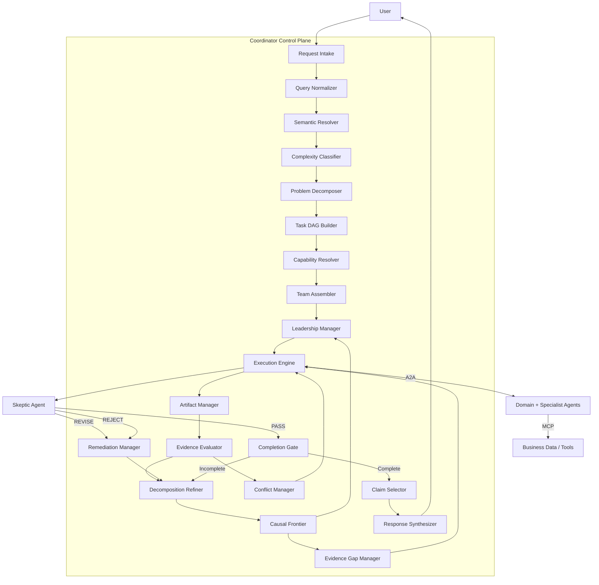

# 01 — Architecture

## Boundaries

- **LangGraph** — workflow, state, routing, checkpointing
- **A2A** — agent tasks/messages/artifacts
- **MCP** — agent-to-data (via domain agents, not unrestricted Coordinator MCP)
- **ML / DoWhy** — anomaly, forecast, causal estimation
- **LLM** — interpretation, planning enrichment, synthesis (never numeric fabrication)
