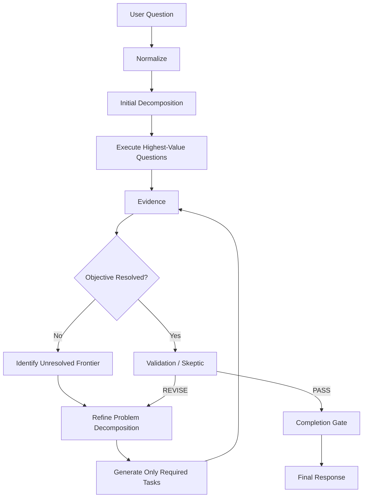

# 03 — Progressive Decomposition

Never: one LLM call → 20 tasks → execute everything.

Versioned `ProblemDecomposition` records (`DEC-…-vN`) with parent links, reasons, evidence refs, questions added/retired.

Templates constrain common intents (lookup, comparison, anomaly, diagnostic, predictive, prescriptive, executive_health, cac_diagnostic).

Ruled-out branches (e.g. stable CPM/CTR/CPC) become `irrelevant`.
