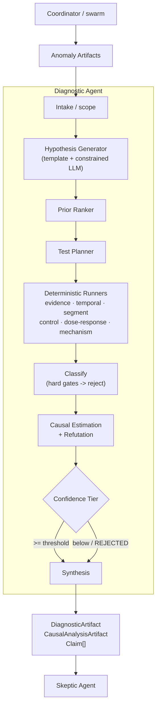

# 01 - Diagnostic Architecture

## Package layout

```
src/seleric_swarm/agents/diagnostic/
├── agent.py          DiagnosticAgent.diagnose() - the Coordinator boundary
├── graph.py          LangGraph StateGraph (the workflow)
├── state.py          DiagnosticState (TypedDict)
├── context.py        DiagnosticContext + DiagnosticDeps + ScopedAnomaly
├── contracts.py      DiagnosticRequest/Result, DiagnosticHypothesis, HypothesisTest,
│                     TestResult, DiagnosticFinding (+ re-exported DiagnosticArtifact,
│                     CausalAnalysisArtifact, Claim)
├── policies.py       config/diagnostic_policies.yaml accessor
├── prompts.py        system prompt + hypothesis-generation prompt
├── reasoning.py      ReasoningModel Protocol + LLMPort adapter + test doubles
├── registries.py     ports: AnomalyRepository, CausalEstimationService (+ reused
│                     Skeptic infra: evidence/artifact repos, causal graphs, incidents)
├── ontology.py       outcome metric -> candidate mechanism templates
├── intake.py         resolve outcome metric, scope anomalies, extract event times
├── synthesis.py      classify_hypothesis + finalize (artifacts + claims)
├── a2a.py            thin A2A adapter
├── swarm_bridge.py   SwarmDiagnosticSpecialist (in-loop delegate)
├── hypotheses/       generator (template + constrained LLM), ranker (prior score)
├── testing/          planner, runners (6 deterministic tests)
├── causal/           estimator (query build + confidence tiering)
└── services/         DoWhyCausalEstimationService
```

## LangGraph flow

```
START
  -> load_inputs        (evidence + anomalies + outcome metric + degradation start)
  -> generate_hypotheses (template mechanisms + constrained LLM, capped)
  -> rank_hypotheses     (deterministic prior: evidence / incident / temporal / mechanism)
  -> test_hypotheses     (per-hypothesis plan -> 6 runners)
  -> classify            (hard gate fail -> reject; score < 0.5 -> reject; else testing)
  -> causal_estimate     (top surviving hypotheses -> CausalEstimationService -> confidence tier)
  -> finalize            (retain iff tier >= threshold; DiagnosticArtifact + CausalArtifact + Claim[])
  -> END
```

## Required Mermaid diagram



## Design principles

1. **Deterministic tests, constrained LLM.** Every retain/reject is a function
   of test pass/fail + causal confidence. The LLM only widens the hypothesis set,
   and only to metrics already observed or in the graph.
2. **Never fake a causal pass.** `TemplateCausalEstimationService` returns
   `passed=False` when the scenario truth does not match; `DoWhyCausalEstimationService`
   degrades to a metadata artifact (with a limitation) when DoWhy is unavailable.
3. **Metadata ceiling.** Without an observation frame, confidence is capped at
   `PLAUSIBLE_CAUSAL` unless the caller sets `context["trust_metadata_causal"]`
   (fixture / replay mode). A real Coordinator call with no data stays capped ->
   the finding is `inconclusive`, which is honest.
4. **Frontier pivot.** When leadership has moved to a downstream domain, the
   outcome metric pivots to that domain's frontier (e.g. a CAC mission led by
   `technical_agent` diagnoses `metric.purchase_cvr`).
