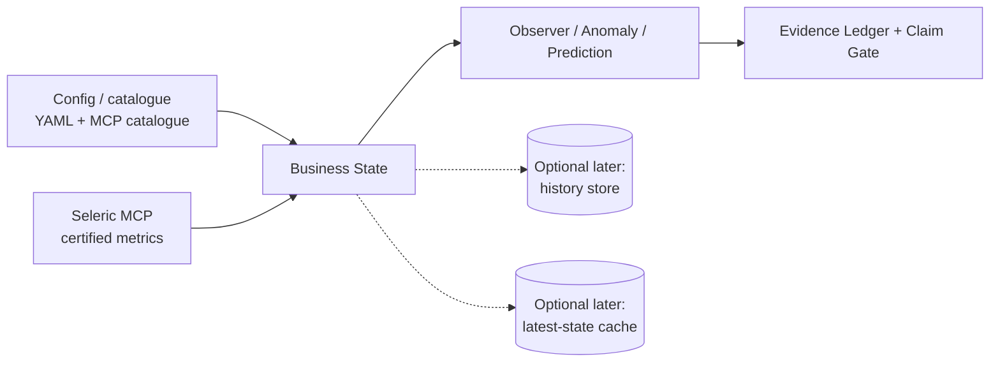
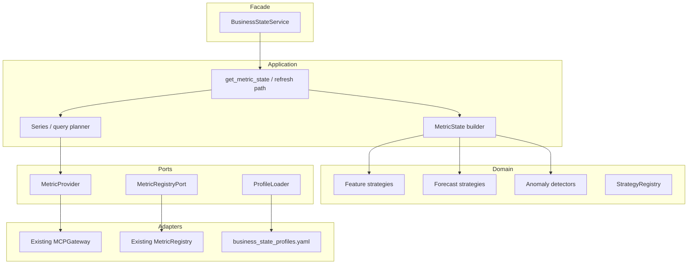
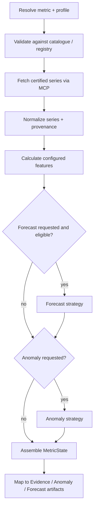

# 01 — Business State architecture

Grounded in the Seleric Voice Node V1 blueprint, adapted for reuse as concepts. In `Seleric_Agent`, this is an **in-process module**, not a standalone microservice (see [README.md](README.md#v3-integration)).

## 1. Role in the system



**Why it exists as a distinct concern:** scheduled or on-demand CPU/data work that transforms certified metrics into derived state. Different from LLM planning and from intervention / strategy ranking.

**Does not:** choose interventions, publish ontology config, own meetings/commitments, or run raw SQL against the warehouse.

## 2. Bounded context

| Owns | Does not own |
|---|---|
| Metric retrieval via MCP (through existing gateway) | Intervention ranking / briefs |
| Features, forecasts, anomalies (strategy registries) | Ontology write / admin publish |
| Freshness / finality / quality flags on state | Meeting commitments |
| Mapping state → evidence artifacts | Raw warehouse access |

Hard rules:

- No fallback raw SQL if a metric binding fails — binding/config error.
- Missing or stale data → `UNKNOWN` / quality flags — never coerced to healthy.
- Partial success is allowed; bad metrics stay non-actionable for numeric claims.

## 3. Internal architecture (hexagonal)

Suggested package layout (swarm-adapted):

```text
src/seleric_swarm/services/business_state/
  __init__.py
  facade.py          # BusinessStateService
  models.py          # MetricState, StateRequest, FeatureValue, ...
  features.py
  detectors.py
  forecasts.py
  series.py          # MCP → normalized series
  evidence_map.py    # MetricState → EvidenceArtifact(s)
  profiles.py        # load business_state_profiles.yaml
```



## 4. Refresh / compute pipeline (write-ish path)

For the swarm V0 this runs **on demand** inside a mission (not a separate job fleet). Same logical steps as Voice Node:



Idempotency key (if caching later):

```text
metric_id + time_range + dims_hash + profile_id
```

Finality (optional V0, useful soon):

```text
INTRADAY | PROVISIONAL | FINAL | STALE | FAILED_QUALITY
```

A value can be available and still provisional (costs/returns lag).

## 5. Strategy engines (pluggable)

| Engine | V0 strategies | Extension |
|---|---|---|
| **Features** | `current_value`, `period_delta_pct`, `rolling_mean`, `rolling_std`, `freshness_age` | Implement calculator, register in code; params from profile YAML |
| **Forecast** | EWMA and/or `drift_projection` (align with `prediction_policies.yaml`) | Champion models later; no model-serving platform in V0 |
| **Anomaly** | robust z-score / MAD; optional prediction-interval breach | Explicit method + threshold; PyOD later if needed |

Voice / mission read path should **not** require a large model fleet — compute on demand or from a small cache.

## 6. API surface (swarm facade)

Primary:

```text
get_metric_state(StateRequest) -> MetricState
evaluate_anomaly(StateRequest) -> AnomalyEvidence | None
forecast(StateRequest) -> ForecastOutput | None
```

Voice Node REST (reference only — not required in swarm V0):

```text
POST /v1/state-refresh-jobs
GET  /v1/state-snapshots/latest
GET  /v1/nodes/{node_id}/state
POST /v1/model-backtests
```

Every result should carry: `as_of`, finality/freshness, confidence, profile ids, catalogue/metric version, MCP query ids, evidence refs.

## 7. Data ownership (Voice Node reference vs swarm V0)

| Store | Voice Node BSS | Seleric_Agent V0 |
|---|---|---|
| PostgreSQL latest state | `state.metric_state_current`, health, registry | Optional later TTL cache via existing `persistence/` |
| ClickHouse history | feature/forecast/anomaly history | Skip |
| Object storage artifacts | model binaries | Skip — baselines in-process |
| Evidence ledger | via Insight | Existing EvidenceArtifact + Claim Gate |
| Domain Health Snapshots (resolved state, [04](04_DOMAIN_HEALTH_SNAPSHOTS.md)) | `state.metric_state_current`-style JSONB row | **[2026-09-14 decision]** One JSON file per `(domain, as_of)` on local/mounted disk for now — no new table, no migration. Move to a Postgres JSONB table (originally-planned shape, `persistence/postgres.py` pattern) once there's a real reason to query across snapshots (multi-brand rollout, cross-domain overview reads at scale) rather than reading the latest file per domain. |

## 8. Security & ops (service-scoped)

| Access | Scope |
|---|---|
| Metrics | read via MCP only (agent allowlist + module pin) |
| Profiles / registry | read config from repo YAML |
| Cache (if added) | read-write on a narrow table only |

Expose for ops later: last successful compute timestamps by metric/profile; profile version in every provenance blob.

## 9. What this architecture deliberately excludes (V0)

- Separate FastAPI + Procrastinate worker deployable
- Control Plane publication / Appsmith
- Ontology node-health + Insight Decision briefs
- Outbox `BusinessStateRefreshed` event bus
- Full Feast / Hopsworks feature store
