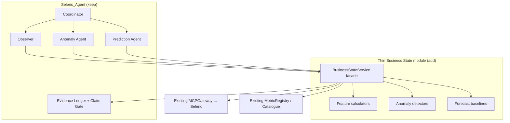

# 02 — Integrating Business State into Seleric_Agent (without complexity)

## Decision

**Do not** stand up the Voice Node `business-state-service` as a separate microservice.  
Fold a thin **Business State layer** into the swarm’s **Deterministic Intelligence Plane**, and let agents call it like they already call metrics / MCP.

## Why this fits the swarm

`Seleric_Agent` is a mission swarm:

- Coordinator decomposes and routes
- Domain agents own business semantics + MCP module pins
- Intelligence specialists (Observer, Anomaly, Prediction, …) analyze
- Deterministic services produce evidence
- Evidence Ledger + Claim Gate block unsupported conclusions

Golden rule already in the repo:

> LLMs decide what to investigate and how to interpret evidence. Data systems, statistical engines, ML models and causal tools produce or validate the evidence.

Business State is exactly that deterministic middle layer for “what is the reproducible state of this metric?”

## What already exists (reuse)

| Piece | Location |
|---|---|
| MCP gateway + allowlists | `src/seleric_swarm/protocols/mcp/gateway.py` |
| Seleric remote tools (`metrics_query`, catalogue, …) | `protocols/mcp/servers/seleric_remote.py` |
| Metric registry + live catalogue | `services/metrics.py`, `config/metric_registry.yaml` |
| Observer → evidence | `agents/intelligence/observer.py`, `swarm/specialists/observer.py` |
| Evidence helper | `services/evidence.py` → `EvidenceArtifact` |
| Time range resolution | `services/time_range.py` |
| Anomaly / forecast schemas | `schemas/anomaly_artifact.schema.json`, `forecast_artifact.schema.json` |
| Prediction policies (baselines) | `config/prediction_policies.yaml` |
| Claim Gate | `services/claim_gate.py` |
| Runtime boot (`mcp`, `metrics`) | `bootstrap.py`, `runtime.py` |
| Anomaly / forecast specialists (live path) | `swarm/specialists/anomaly.py`, `swarm/specialists/prediction.py` — wired via `coordinator/graph.py`, already `Protocol`-based (`ProviderBundle.anomaly: AnomalyDetector`, `ProviderBundle.forecaster: Forecaster` in `swarm/providers/base.py`) |

**Correction (was stale):** this doc previously said "Anomaly agent is still `not_implemented`." That referred to the **dead legacy stub** `agents/intelligence/anomaly.py` / `agents/intelligence/prediction.py` — both literally `return {"status": "not_implemented"}` — which is **not on the live mission path**. The real, wired agents are `swarm/specialists/anomaly.py` / `swarm/specialists/prediction.py`, invoked by `coordinator/graph.py`.

**Actual gap:** those live specialists work, but `build_hybrid_bundle()` (`swarm/providers/mcp_data.py:564-566`) **hardcodes** `TemplateAnomalyDetector` (`RelativeEffectAnomalyDetector`) and `TemplateForecaster` with no config seam to swap them — so every mission gets the same naive, `synthetic=True` / `data_origin="TEMPLATE"` detector regardless of domain or metric. The Protocol ports already make this pluggable *in code*; what's missing is a config-driven choice at that one instantiation point (see [03 §10](03_DEFINITIONS_TO_MAKE_FUNCTIONAL.md#10-provider-configurability-anomaly--forecast) and [05 Sprint 2.5](05_SPRINT_PLAN.md#sprint-25--pluggable-anomaly--forecast-providers)). Observer only does light comparison deltas — not a full feature / anomaly / forecast engine. `ml/` is essentially empty.

## What to skip (for now)

- Separate FastAPI service + worker fleet
- Full Control Plane / Appsmith
- ClickHouse state history marts
- Ontology-driven node health + Insight Decision
- Champion/challenger model registry + object-storage artifacts
- Outbox `BusinessStateRefreshed` bus

## Target shape



## Repo placement

```text
src/seleric_swarm/services/business_state/
  __init__.py
  facade.py
  features.py
  detectors.py
  forecasts.py
  models.py
  series.py
  evidence_map.py
  profiles.py

config/business_state_profiles.yaml
schemas/metric_state.schema.json
```

Wire on `SwarmRuntime`:

```text
runtime.business_state: BusinessStateService
```

Deps: existing `mcp`, `metrics`, profiles YAML, clock.  
No new compose service for V0.

## Minimal facade API

```python
class BusinessStateService:
    async def get_metric_state(self, request: StateRequest) -> MetricState:
        """MCP series → features → optional anomaly/forecast → evidence-ready state."""

    async def evaluate_anomaly(self, request: StateRequest) -> AnomalyEvidence | None:
        ...

    async def forecast(self, request: StateRequest) -> ForecastOutput | None:
        ...
```

`MetricState` stays small (full field list in [03_DEFINITIONS_TO_MAKE_FUNCTIONAL.md](03_DEFINITIONS_TO_MAKE_FUNCTIONAL.md)).

## How each agent uses it

| Agent | Today | With thin Business State |
|---|---|---|
| **Observer** | MCP metrics → evidence; ad-hoc `.delta` | `get_metric_state(need=[actual, features])` → evidence |
| **Anomaly** | live, but detector is hardcoded `TemplateAnomalyDetector` | `need=[..., anomaly]` → AnomalyArtifact, detector selectable via §10 config |
| **Prediction** | live, but forecaster is hardcoded `TemplateForecaster` | `forecast()` / `need=[forecast]`; LLM never invents numbers, forecaster selectable via §10 config |
| **Coordinator** | routes missions | unchanged |
| **Skeptic / Claim Gate** | validates claims | same refs + stronger provenance |

Matches roadmap: Phase 1 grounded reads → Phase 2 anomaly → Phase 4 prediction — without a parallel architecture.

## Integration steps

1. **Facade over what exists** — MCP + MetricRegistry only; return actual + freshness + provenance for 1–2 catalogue metrics.
2. **Add 4–5 features only** — `current_value`, `period_delta_pct`, `rolling_mean`, `rolling_std`, `freshness_age`.
3. **One anomaly method + one forecast baseline** — e.g. robust z-score + EWMA / `drift_projection`.
4. **Optional cache later** — Postgres TTL keyed by `(metric_id, window, dims_hash, profile_id)`.
5. **Extract a real service only when forced** — multi-brand precompute, voice/edge sub-second reads, or workers blocking mission latency.

## Mapping Voice Node → Swarm

| Voice Node BSS | Do this in Seleric_Agent |
|---|---|
| Seleric MCP ACL | `MCPGateway` + agent allowlists |
| Runtime config bundle | `config/*.yaml` + catalogue bootstrap |
| Feature / forecast / anomaly engines | `services/business_state/*` |
| `metric_state_current` / node health | Evidence artifacts (+ optional PG cache) |
| `BusinessStateRefreshed` outbox | Mission graph sequencing |
| Insight Decision Service | Strategy + Diagnostic + Claim Gate |
| Control Plane | YAML + MCP catalogue as V0 control plane |

## Definition of done (first PR)

- `BusinessStateService.get_metric_state` works for ≥1 live Seleric metric via existing MCP
- Observer can emit evidence from that state
- Claim Gate still blocks ungrounded claims
- One unit test: known series → expected mean / delta
- No new deployable, no ClickHouse, no voice/control-plane deps
