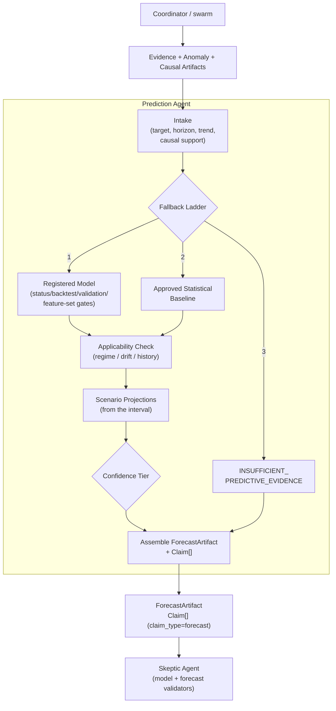

# 01 - Prediction Architecture

## Package layout

```
src/seleric_swarm/agents/prediction/
├── agent.py          PredictionAgent.predict() - the Coordinator boundary
├── graph.py          LangGraph StateGraph (4 nodes)
├── state.py          PredictionState (TypedDict)
├── context.py        PredictionContext + PredictionDeps
├── contracts.py      PredictionRequest/Result, ForecastRun, ScenarioProjection
│                     (+ re-exported ForecastArtifact, Claim)
├── policies.py       config/prediction_policies.yaml accessor
├── prompts.py        system prompt + narrative prompt (no numbers)
├── reasoning.py      ReasoningModel Protocol (text only) + test doubles
├── registries.py     ports: ForecastModelService, FeatureStore,
│                     StatisticalBaselineForecaster (+ reused Skeptic model/drift infra)
├── intake.py         resolve target metric + horizon, history/trend, causal support
├── model_selection.py the fallback ladder
├── applicability.py  regime / in-domain / history-sufficiency check
├── synthesis.py      ForecastArtifact + confidence tier + Claim[] (+ build_insufficient)
├── forecasting/      scenarios (base/optimistic/pessimistic from the interval)
├── a2a.py            thin A2A adapter
├── swarm_bridge.py   SwarmPredictionSpecialist (in-loop delegate)
└── services/         YAML model registry + feature store adapters
```

## LangGraph flow

```
START
  -> load_inputs        (target metric, horizon, history/trend, drift, causal support)
  -> select_forecast     (registered model -> approved baseline -> INSUFFICIENT)
  -> check_applicability  (declared status / regime shift / history sufficiency / drift)
  -> assemble            (ForecastArtifact + confidence + scenarios + Claim[])
  -> END
```

## Required Mermaid diagram



## Design principles

1. **Numbers only from a model or an approved baseline.** `synthesis.finalize`
   always sets `ForecastArtifact.llm_generated = False`. The reasoning model is
   called *after* the artifact exists and only writes `audit["narrative"]`.
2. **The ladder is explicit and audited.** Every reason a rung was skipped lands
   in `result.limitations` + `result.audit["fallback_reasons"]`.
3. **Never a partial number.** No interval + `interval.required` -> `WEAK` and a
   limitation; `INSUFFICIENT` -> no `ForecastArtifact`, no `Claim`.
4. **Deterministic.** No reasoning model -> identical output every run
   (`test_deterministic`).
