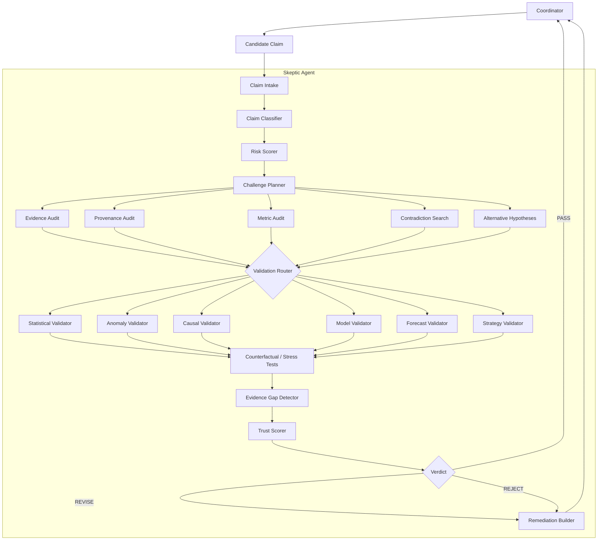

# 01 - Skeptic Architecture

## Package layout

```
src/seleric_swarm/agents/skeptic/
├── agent.py          SkepticAgent.validate_claim() - the Coordinator boundary
├── graph.py          LangGraph StateGraph (the workflow)
├── state.py          SkepticState (TypedDict)
├── context.py        SkepticContext + SkepticDeps + ValidatorOutcome
├── contracts.py      Claim, *Artifact contracts, SkepticVerdict, Challenge, ...
├── resolver.py       request -> fully-loaded SkepticContext
├── policies.py       config/skeptic_policies.yaml accessor
├── prompts.py        system prompt + reasoning-task prompts
├── reasoning.py      ReasoningModel Protocol + LLMPort adapter + test doubles
├── registries.py     Protocols + in-memory impls (evidence, metric semantics,
│                     causal graphs, model registry, incidents, business rules,
│                     causal-validation service, statistical service)
├── evidence_gaps.py  gap aggregation + expected-information-gain ranking
├── a2a.py            thin A2A adapter (protocol concerns only)
├── intake/           claim_parser, claim_classifier, risk_scorer
├── planning/         challenge_planner, validation_router
├── validators/       evidence, provenance, metric, contradiction, statistics,
│                     anomaly, causal, model, forecast, strategy
├── hypothesis/       alternative_generator, falsification
├── stress/           counterfactual, sensitivity
├── scoring/          trust_score, verdict_engine
└── remediation/      task_builder
```

Tests live under `tests/skeptic/` to match the repo's `tests/` convention
(pyproject sets `pythonpath = ["src"]`, no `testpaths`); functionally this is the
`agents/skeptic/tests/` package the master spec describes.

## Design principles

1. **Contracts + deterministic validators + registries + optional LLM.** No
   validator imports an LLM. `SkepticDeps` injects every collaborator as a
   `Protocol`; the defaults are deterministic in-memory implementations.
2. **Partial validators.** `planning/validation_router.select_validators()`
   picks the type-specific subset. Core validators (evidence, provenance,
   metric, contradiction) always run.
3. **Never fake an upstream service.** Missing Diagnostic / Prediction / Strategy
   agents are represented by contracts + a `Protocol` + an in-memory adapter +
   fixtures (`tests/skeptic/conftest.py`), never by a stub that pretends to pass.
4. **Explainable verdict.** `verdict_engine.decide_verdict()` returns the list of
   reasons; it lands in `SkepticVerdict.audit["verdict_reasons"]`.

## LangGraph flow (`graph.py`)

```
START
  -> load_claim
  -> classify_claim          (never silently upgrades to a stronger type)
  -> score_risk              (0..1 score + R0..R5 class, weights in config)
  -> build_plan              (challenge plan + validator selection)
  -> load_evidence
  -> core_audits             (evidence / provenance / metric / contradiction)
  -> generate_alternatives   (constrained; capped by policy)
  -> type_validators         (statistical | anomaly | causal | model | forecast | strategy)
  -> stress                  (counterfactual + sensitivity; emits gaps, never numbers)
  -> detect_gaps             (aggregate + EIG-rank)
  -> calculate_trust         (weighted profile per claim type; no LLM confidence)
  -> determine_verdict
        --PASS--> finalize
        --REVISE / REJECT--> build_remediation -> finalize
  -> END
```

## Required Mermaid diagram



In `graph.py` the `ROUTER` fan-out is executed inside a single `type_validators`
node (deterministic ordering, no `Send` fan-out) - the router *logic* is
`validation_router.select_validators`. The diagram shows the conceptual shape.
